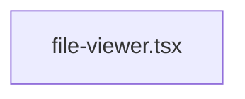

# FileViewer

Componente sencillo para visualizar archivos de manera individual. Normalmente se utiliza junto al `FileBrowser` para mostrar una imagen o video seleccionado.

Estructura mínima:

Este módulo podrá ampliarse con soporte para zoom, navegaciones o anotaciones en el futuro.
