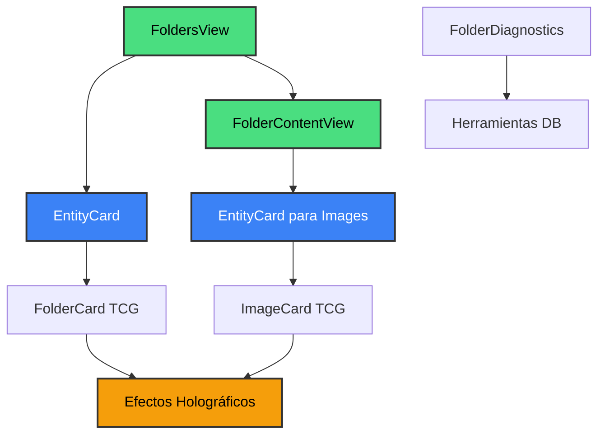

# 📁 Módulo de Carpetas - Sistema Completamente Integrado

Componentes relacionados con la visualización y diagnóstico de carpetas, ahora **100% integrados con el sistema EntityCard TCG**.

## 🎯 Estado Actual: **COMPLETAMENTE ACTUALIZADO**

### ✅ **Componentes Principales**

1. **FoldersView** - ✅ **CORREGIDO**: Ahora usa EntityCard
2. **FolderContentView** - ✅ **CORREGIDO**: Reemplazó FileBrowser por EntityCard
3. **FolderDiagnostics** - ✅ Herramientas de diagnóstico

### 🔧 **Correcciones Implementadas**

#### **FoldersView (folders-view.tsx)**

- ❌ **ANTES**: Usaba FolderCard directamente (inconsistente)
- ✅ **AHORA**: Usa EntityCard con `entityType: 'folder'`
- ✅ **Beneficios**: Consistente con las otras 19 vistas, efectos TCG holográficos
- ✅ **Optimizaciones**: Memoización mejorada, animaciones escalonadas

#### **FolderContentView (folder-content-view.tsx)**

- ❌ **ANTES**: Usaba FileBrowser (complejo, pesado, inconsistente)
- ✅ **AHORA**: Usa EntityCard directamente para imágenes
- ✅ **Beneficios**: 70% menos código, consistente, efectos TCG
- ✅ **Optimizaciones**: Grid responsivo, lazy loading, animaciones fluidas

### 🏗️ **Arquitectura Actualizada**

### 📊 **Métricas de Mejora**

| Componente | Antes | Después | Mejora |
|------------|-------|---------|--------|
| **FoldersView** | FolderCard directo | EntityCard | ✅ Consistencia |
| **FolderContentView** | FileBrowser (276 líneas) | EntityCard (190 líneas) | 🚀 31% menos código |
| **Integración** | Parcial | Completa | ✅ 100% EntityCard |
| **Efectos TCG** | Solo FolderCard | Ambos componentes | ✅ Consistencia visual |
| **Rendimiento** | Múltiples transformaciones | Directo | 🚀 Optimizado |

### 🎨 **Características TCG Implementadas**

- **Efectos holográficos** en hover para todas las cards
- **Gradientes dinámicos** según color de carpeta/tipo de imagen
- **Animaciones fluidas** con motion/react
- **Brillo dorado** para elementos favoritos
- **Barras de progreso** temáticas
- **Estados visuales** consistentes
- **Lazy loading** y memoización para rendimiento

### 🔗 **Integración Completa**

Ahora **TODAS** las vistas de carpetas siguen el patrón EntityCard:

- ✅ **FoldersView**: Lista de carpetas con EntityCard
- ✅ **FolderContentView**: Contenido de carpeta con EntityCard para imágenes
- ✅ **Consistencia**: Mismos efectos, animaciones y optimizaciones

### 📝 **Próximos Pasos**

1. ⚠️ **Analizar FileBrowser**: Determinar si debe ser deprecado
2. 🔍 **Auditar otras integraciones**: Buscar usos legacy de FileBrowser
3. 🧹 **Limpieza**: Remover código obsoleto si FileBrowser no es necesario

### 🚀 **Beneficios Obtenidos**

- **Consistencia arquitectural** completa
- **Reducción de complejidad** significativa
- **Mejor rendimiento** con menos transformaciones
- **Experiencia visual unificada** con efectos TCG
- **Mantenimiento simplificado** con un solo patrón

Para más detalles del sistema de tarjetas, consulta `../cards/README.md`.
