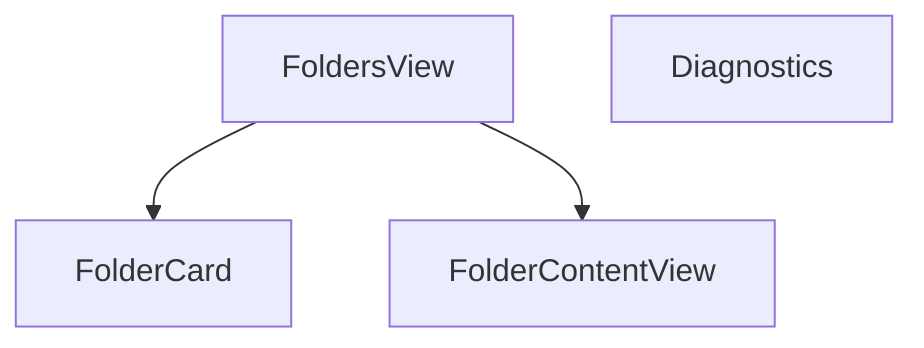

# Módulo de Carpetas

Componentes relacionados con la visualización y diagnóstico de carpetas.

## Submódulos

- **views/**: Vistas principales como `FoldersView` y `FolderContentView`.
- **diagnostics/**: Herramientas para revisar la integridad de carpetas.

Para detalles del sistema de tarjetas consulta `views/README.md`.
