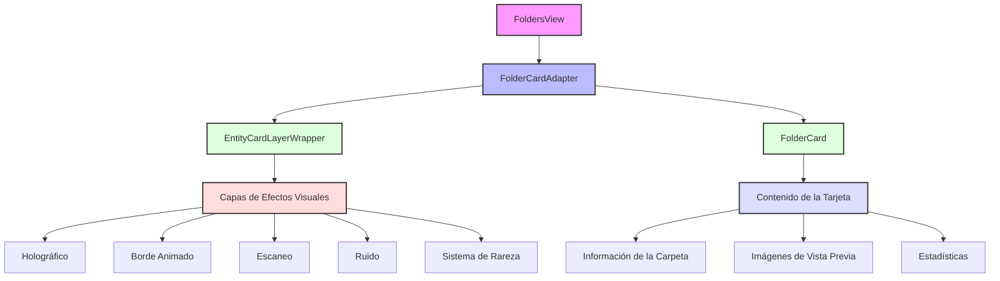

# Sistema de Tarjetas de Entidades

Este módulo implementa un sistema de tarjetas para visualizar diferentes tipos de entidades (carpetas, imágenes, etc.) con efectos visuales avanzados.

## Arquitectura

## Componentes Principales

1. **FoldersView**: Componente principal que muestra la lista de carpetas.
2. **FolderCardAdapter**: Adaptador que conecta el sistema de tarjetas de entidades con las carpetas.
3. **EntityCardLayerWrapper**: Wrapper que maneja las capas visuales y efectos.
4. **FolderCard**: Componente específico para mostrar la información de carpetas.

## Sistema de Capas

El sistema de tarjetas utiliza un enfoque de capas para aplicar diferentes efectos visuales:

1. **Capa Base**: Contenido fundamental de la tarjeta
2. **Capa de Efectos**: Efectos visuales como brillo, sombras, etc.
3. **Capa Holográfica**: Efecto holográfico que responde al movimiento
4. **Capa de Borde**: Bordes animados o estilizados
5. **Capa de Filtro**: Aplicación de filtros visuales adicionales

## Sistema de Rareza

Las carpetas muestran diferentes niveles de rareza basados en el número de imágenes:

- **Básica** (< 20 imágenes)
- **Notable** (20-49 imágenes)
- **Avanzada** (50-99 imágenes)
- **Premium** (100+ imágenes)

Cada nivel de rareza tiene su propio conjunto de colores y efectos visuales.
