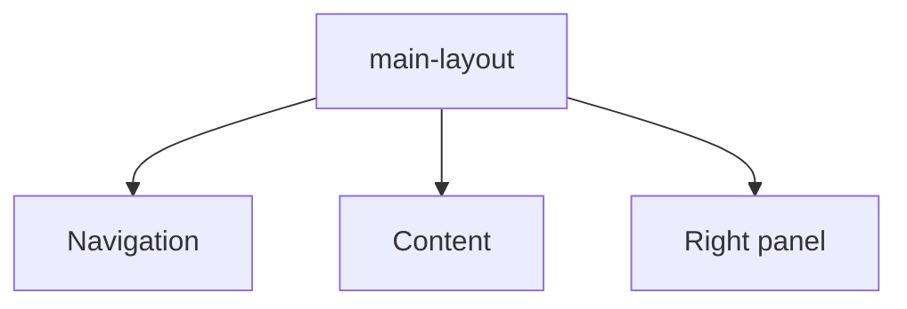

# Main layout

This layout defines the base structure of the application with side panels and a central container.

The key files are the following:

- **main-layout.tsx**: Layout component with the navigation panel and the right panel.
- **nav-panel-collapsed.css** and **right-panel-collapsed.css**: Styles for collapsed states.

---

## Critical requirement for virtualized grids (FileBrowser)

All ancestors of the central area, including CentralPanel, ResizablePanel, and PanelGroup, must have the following classes:

- `h-full w-full min-h-0 min-w-0 flex-1 flex flex-col`

Virtualized components such as FileBrowser need a valid size.

Without these classes, the grid can fail size calculation and show errors or skeletons.

If an ancestor omits these classes, the grid can report `containerWidth=0`.

### Good practices

Inspect the layout chain when you add new wrappers.

Document any exception or special layout.

Check this README and the FileBrowser README when integration is unclear.
