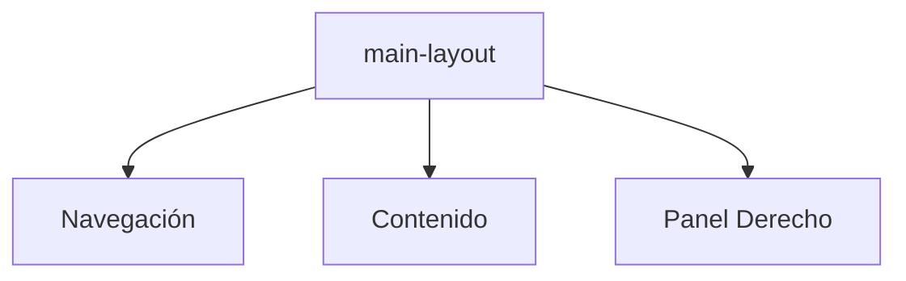

# Layout Principal

Define la estructura base de la aplicación con paneles laterales y contenedor central.

Archivos clave:

- **main-layout.tsx**: Componente de layout con panel de navegación y panel derecho.
- **nav-panel-collapsed.css** y **right-panel-collapsed.css**: Estilos para estados colapsados.

---

## ⚠️ Requerimiento crítico para grids virtualizados (FileBrowser, etc.)

> **Todos los ancestros del área central (CentralPanel, ResizablePanel, PanelGroup, etc.) deben tener:**
>
> - `h-full w-full min-h-0 min-w-0 flex-1 flex flex-col`
>
> Esto es indispensable para que los componentes virtualizados (como FileBrowser) reciban un tamaño válido y no caigan en fallback o errores de containerWidth=0.
>
> Si algún ancestro omite estas clases, el grid puede fallar en el cálculo de tamaño y mostrar errores o skeletons.

### Buenas prácticas

- Revisar siempre la cadena de layout al agregar nuevos wrappers.
- Documentar cualquier excepción o layout especial.
- Consultar este README y el de FileBrowser ante dudas de integración.
