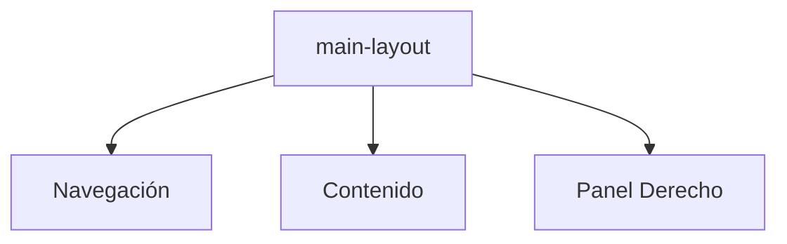

# Layout Principal

Define la estructura base de la aplicación con paneles laterales y contenedor central.

Archivos clave:

- **main-layout.tsx**: Componente de layout con panel de navegación y panel derecho.
- **nav-panel-collapsed.css** y **right-panel-collapsed.css**: Estilos para estados colapsados.

