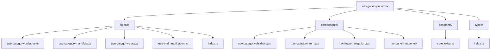

# Navigation component

This component provides the main application navigation.

The user can move between views and content categories.

## Structure



## Components

### NavPanel

This main component integrates all navigation elements.

### Hooks

The following hooks support the panel:

- **useCategoryCollapse**: Manages category collapse state.
- **useCategoryHandlers**: Provides handlers for category interactions.
- **useCategoryStats**: Calculates statistics for categories.
- **useMainNavigation**: Manages the main navigation.

### Auxiliary components

The following components support the panel:

- **NavCategoryChildren**: Shows category children in list or grid view.
- **NavCategoryItem**: Represents a category item.
- **NavMainNavigation**: Shows the main navigation.
- **NavPanelHeader**: Navigation panel header with collapsed and expanded modes.

## Key features

The panel provides the following features:

- **Collapsible panel**: The full panel can collapse to maximize workspace.
- **Flexible category views**: Subcategories can display in list or grid mode.
- **Dark and light mode**: Integration with the theme system.
- **Informative tooltips**: Extra information on hover.
- **Collapsible categories**: Each category can collapse on its own.

## Recent improvements

### NavPanelHeader

The header includes the following improvements:

- **Adaptive layout**: Vertical reorder of elements when the panel is collapsed.
- **Prominent avatar**: In collapsed mode, the user avatar sits at the top.
- **Accessible controls**: Control buttons stay clearly separated in collapsed mode.

### NavCategoryChildren

The children list includes the following improvements:

- **View switch**: Toggle between a vertical list and a grid.
- **Item counters**: Shows the item count for each category.
- **Tag-optimized layout**: Specialized display for Tags with color codes.
- **Interactive items**: All items have clear hover and selected states.

## Types

The module defines the following types:

- **CategoryItem**: Represents a category item.
- **CategoryChild**: Represents a child item in a category.
- **NavPanelProps**: Props for the NavPanel component.
- **ViewMode**: Defines the display mode (`'list' | 'grid'`) for category items.

## Constants

The module defines the following constant:

- **NAVIGATION_CATEGORIES**: Defines the main categories of the navigation panel.

## Usage example

```tsx
import { NavPanel } from '@/components/navigation/navigation-panel';
import { getNavigationData } from '@/components/navigation/actions/navigation.actions';

export default async function Layout({ children }: { children: React.ReactNode }) {
	const navigationData = await getNavigationData();

	return (
		<div className="flex h-screen">
			<aside className="w-64 border-r">
				<NavPanel initialData={navigationData} />
			</aside>
			<main className="flex-1">{children}</main>
		</div>
	);
}
```

## Display configuration

The component lets you customize how items display:

```tsx
// Switch display modes
<Button onClick={() => setViewMode(viewMode === 'list' ? 'grid' : 'list')}>
  {viewMode === 'list' ? <Grid /> : <List />}
</Button>

// Collapse or expand the panel
<Button onClick={onToggleCollapse}>
  {isCollapsed ? <ChevronRight /> : <ChevronLeft />}
</Button>
```
