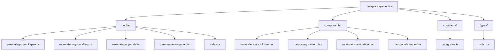

# Componente de Navegación

Este componente proporciona la navegación principal de la aplicación, permitiendo al usuario navegar entre diferentes vistas y categorías de contenido.

## Estructura



## Componentes

### NavPanel

Componente principal que integra todos los elementos de navegación.

### Hooks

- **useCategoryCollapse**: Maneja el estado de colapso de las categorías.
- **useCategoryHandlers**: Proporciona manejadores para interacciones con categorías.
- **useCategoryStats**: Calcula estadísticas para las categorías.
- **useMainNavigation**: Maneja la navegación principal.

### Componentes Auxiliares

- **NavCategoryChildren**: Muestra los elementos hijos de una categoría.
- **NavCategoryItem**: Representa un elemento de categoría.
- **NavMainNavigation**: Muestra la navegación principal.
- **NavPanelHeader**: Encabezado del panel de navegación.

## Tipos

- **CategoryItem**: Representa un elemento de categoría.
- **CategoryChild**: Representa un elemento hijo dentro de una categoría.
- **NavPanelProps**: Props para el componente NavPanel.

## Constantes

- **NAVIGATION_CATEGORIES**: Define las categorías principales del panel de navegación.

## Ejemplo de Uso

```tsx
import { NavPanel } from '@/components/navigation/navigation-panel';
import { getNavigationData } from '@/components/navigation/actions/navigation.actions';

export default async function Layout({ children }: { children: React.ReactNode }) {
  const navigationData = await getNavigationData();

  return (
    <div className="flex h-screen">
      <aside className="w-64 border-r">
        <NavPanel initialData={navigationData} />
      </aside>
      <main className="flex-1">
        {children}
      </main>
    </div>
  );
}
```