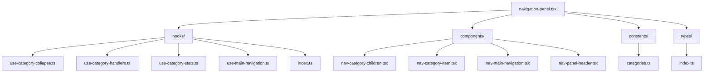

# Componente de Navegación

Este componente proporciona la navegación principal de la aplicación, permitiendo al usuario navegar entre diferentes vistas y categorías de contenido.

## Estructura



## Componentes

### NavPanel

Componente principal que integra todos los elementos de navegación.

### Hooks

- **useCategoryCollapse**: Maneja el estado de colapso de las categorías.
- **useCategoryHandlers**: Proporciona manejadores para interacciones con categorías.
- **useCategoryStats**: Calcula estadísticas para las categorías.
- **useMainNavigation**: Maneja la navegación principal.

### Componentes Auxiliares

- **NavCategoryChildren**: Muestra los elementos hijos de una categoría con opciones de visualización (lista o cuadrícula).
- **NavCategoryItem**: Representa un elemento de categoría.
- **NavMainNavigation**: Muestra la navegación principal.
- **NavPanelHeader**: Encabezado del panel de navegación con soporte para modo colapsado/expandido.

## Características Clave

- **Panel Colapsable**: El panel completo puede colapsarse para maximizar el espacio de trabajo.
- **Vistas de Categorías Flexibles**: Las subcategorías pueden visualizarse en modo lista o cuadrícula.
- **Modo Oscuro/Claro**: Integración con el sistema de temas.
- **Tooltips Informativos**: Proporciona información adicional al pasar el cursor.
- **Categorías Colapsables**: Cada categoría puede contraerse individualmente.

## Mejoras Recientes

### NavPanelHeader

- **Diseño Adaptativo**: Reordenamiento vertical de elementos cuando el panel está colapsado.
- **Avatar Prominente**: En modo colapsado, el avatar del usuario se coloca en la parte superior.
- **Controles Accesibles**: Botones de control claramente separados en modo colapsado.

### NavCategoryChildren

- **Cambio de Vistas**: Permite alternar entre vista de lista vertical y vista de cuadrícula.
- **Contadores de Elementos**: Muestra el número de elementos de cada categoría.
- **Diseño Optimizado para Etiquetas**: Visualización especializada para etiquetas con códigos de color.
- **Elementos Interactivos**: Todos los elementos tienen estados hover y seleccionados claramente definidos.

## Tipos

- **CategoryItem**: Representa un elemento de categoría.
- **CategoryChild**: Representa un elemento hijo dentro de una categoría.
- **NavPanelProps**: Props para el componente NavPanel.
- **ViewMode**: Define el modo de visualización ('list' | 'grid') para elementos de categoría.

## Constantes

- **NAVIGATION_CATEGORIES**: Define las categorías principales del panel de navegación.

## Ejemplo de Uso

```tsx
import { NavPanel } from '@/components/navigation/navigation-panel';
import { getNavigationData } from '@/components/navigation/actions/navigation.actions';

export default async function Layout({ children }: { children: React.ReactNode }) {
	const navigationData = await getNavigationData();

	return (
		<div className="flex h-screen">
			<aside className="w-64 border-r">
				<NavPanel initialData={navigationData} />
			</aside>
			<main className="flex-1">{children}</main>
		</div>
	);
}
```

## Configuración de Visualización

El componente permite personalizar cómo se visualizan los elementos:

```tsx
// Cambiar entre modos de visualización
<Button onClick={() => setViewMode(viewMode === 'list' ? 'grid' : 'list')}>
  {viewMode === 'list' ? <Grid /> : <List />}
</Button>

// Colapsar/expandir panel
<Button onClick={onToggleCollapse}>
  {isCollapsed ? <ChevronRight /> : <ChevronLeft />}
</Button>
```
