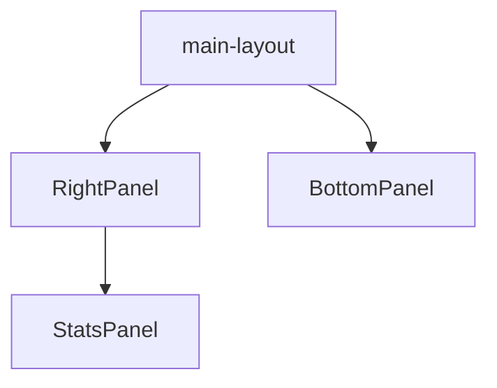

# Application panels

This set of side panels supports the main layout and complementary modules.

## Folders

The directory includes the following folders:

- **bottom-panel/**: Bottom panel with contextual information.
- **right-panel/**: Right side panel, usually with extra tools.
- **stats/**: Statistics panel with client and server components.

