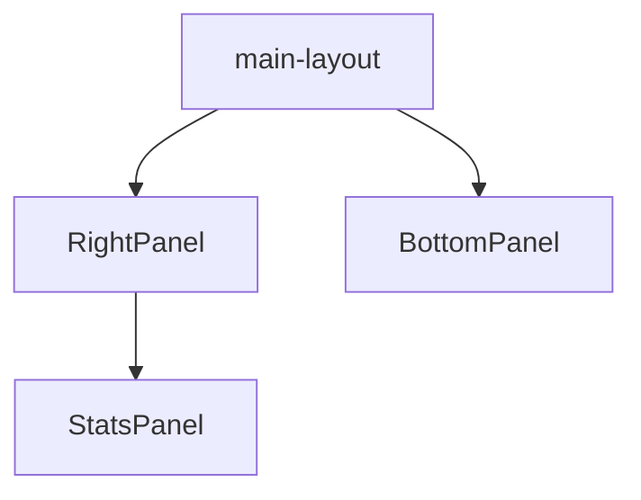

# Paneles de la Aplicación

Conjunto de paneles laterales utilizados en el layout principal y módulos complementarios.

## Carpetas

- **bottom-panel/**: Panel inferior con información contextual.
- **right-panel/**: Panel lateral derecho, usualmente con herramientas adicionales.
- **stats/**: Panel de estadísticas con componentes cliente/servidor.

