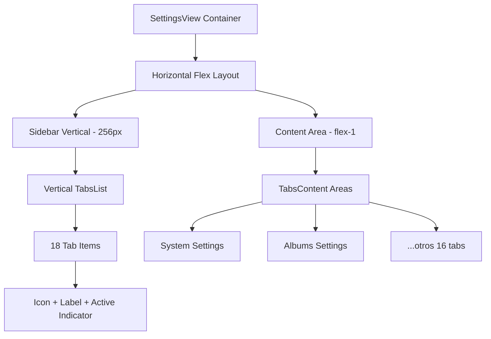
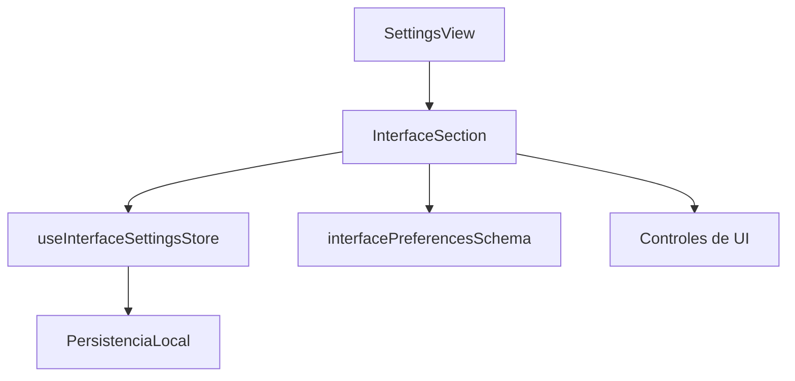

# Módulo Settings

## Descripción General

El módulo Settings proporciona una interfaz completa para la gestión y configuración de diferentes entidades y funcionalidades de la aplicación. Está diseñado de forma modular, con componentes específicos para cada tipo de entidad, todos accesibles a través de una **interfaz de navegación vertical** que mejora la experiencia de usuario.

## 🎨 **ACTUALIZACIÓN: Layout Vertical (Diciembre 2024)**

### ✅ **Transformación Completada**

Se ha rediseñado completamente el componente `SettingsView` de un layout horizontal de pestañas a un **diseño vertical tipo sidebar** más moderno y funcional.

### 🔄 **Layout Architecture**



### 🎯 **Características del Nuevo Diseño**

#### **Sidebar Vertical**

- ✅ Ancho fijo de 256px (`w-64`)
- ✅ Border derecho sutil (`border-r-2 border-border/20`)
- ✅ Fondo semi-transparente con blur (`bg-background/50 backdrop-blur-sm`)
- ✅ Scroll interno si necesario

#### **Tab Design Mejorado**

- ✅ Iconos coloreados según esquema temático
- ✅ Labels con truncado inteligente
- ✅ Indicador visual del estado activo (barra coloreada)
- ✅ Animaciones suaves y micro-interacciones

#### **Responsive & Accessibility**

- ✅ Grid adaptativo (1 col mobile / 2 cols XL)
- ✅ Event listener preservado para navegación programática
- 🔄 **TODO**: Keyboard navigation y tooltips

## Estructura General

```
src/components/settings/
├── settings-view.tsx                  # Componente principal que integra todos los módulos
├── settings-view/                     # Documentación del componente principal
│   └── README.md
├── @progress.md                       # Seguimiento del estado de documentación
├── @toast-service.md                  # Documentación del servicio de notificaciones
├── README.md                          # Este archivo (documentación general)
├── albums/                            # Configuración de álbumes
│   ├── albums-settings.tsx
│   └── ...
├── collections/                       # Configuración de colecciones
│   ├── collections-settings.tsx
│   └── ...
├── concepts/                          # Configuración de conceptos
│   ├── concepts-settings.tsx
│   └── ...
├── notes/                             # Configuración de notas
│   ├── notes-settings.tsx
│   └── ...
├── tags/                              # Configuración de etiquetas
│   ├── tags-settings.tsx
│   └── ...
├── system/                            # Configuración del sistema
│   ├── system-settings.tsx
│   └── ...
└── uploaded-images/                   # Configuración de imágenes subidas
    ├── uploaded-images-settings.tsx
    └── ...
```

## Diagrama de Arquitectura

```mermaid
graph TD
    A[Settings View] --> B[Módulos de Configuración]

    B --> C1[System Settings]
    B --> C2[Entities Cards Settings]
    B --> C3[Collections Settings]
    B --> C4[Tags Settings]
    B --> C5[Albums Settings]
    B --> C6[Characters Settings]
    B --> C7[World Items Settings]
    B --> C8[Places Settings]
    B --> C9[Concepts Settings]
    B --> C10[Prompts Settings]
    B --> C11[Notes Settings]
    B --> C12[Uploaded Images Settings]
    B --> C13[Thumbnails Settings]
    B --> C14[Folders Settings]
    B --> C15[Shortcuts Settings]
    B --> C16[Profiles Settings]

    C1 --> D1[System Stats]
    C1 --> D2[System Maintenance]

    C2 --> D3[Visual Defaults]

    C3 --> E1[Collections List]
    C3 --> E2[Collection Form]

    C4 --> F1[Tags List]
    C4 --> F2[Tag Form]

    C12 --> G1[Images Stats]
    C12 --> G2[Upload Interface]
    C12 --> G3[Storage Options]
```



## Componentes Principales

Cada módulo de configuración sigue una estructura similar:

1. **Componente principal** (`*-settings.tsx`): Maneja la lógica de estado, carga de datos y presentación.
2. **Formulario de creación/edición** (`create-*-form.tsx`): Componente para la creación y edición de entidades.
3. **Documentación** (`README.md`): Detalles sobre el módulo, su estructura y uso.

## Características Comunes

- **Interfaz unificada**: Todos los módulos mantienen un estilo visual consistente.
- **Server Actions**: Uso de server actions para operaciones de escritura.
- **Notificaciones**: Integración con el servicio de notificaciones toast.
- **Formularios validados**: Validación con zod para asegurar la integridad de los datos.
- **Funcionalidad de favoritos**: Posibilidad de marcar entidades como favoritas.
- **Filtros avanzados**: Capacidad de filtrar por diferentes criterios.

## Integración con Server Actions

Los componentes utilizan server actions para operaciones de servidor:

```typescript
// Ejemplo de integración con server actions
const handleCreate = async (data) => {
  try {
    const result = await createEntity(data);
    if (result.success) {
      toastService.success('Entidad creada correctamente');
      // Actualizar estado local
    } else {
      toastService.error(result.error || 'Error al crear la entidad');
    }
  } catch (error) {
    // Manejar errores
  }
};
```

## Servicios Compartidos

- **Toast Service**: Proporciona notificaciones consistentes en toda la aplicación.
- **Logger Service**: Registro estructurado de eventos y errores.

## Funcionamiento Básico

1. El usuario navega a la pantalla de configuración (`settings-view.tsx`).
2. Selecciona una pestaña correspondiente a la entidad que desea gestionar.
3. El componente de configuración específico carga los datos existentes.
4. El usuario puede crear, editar, eliminar o filtrar entidades.
5. Las operaciones se realizan a través de server actions y se muestran notificaciones de éxito/error.

## Ejemplo de Uso

```tsx
// Incorporación del módulo Settings en una aplicación
import { SettingsView } from '@/components/settings/settings-view';

export default function SettingsPage() {
  return (
    <div className="container p-0 h-full">
      <SettingsView />
    </div>
  );
}
```

## 🆕 InterfaceSection (Sección de Interfaz)

Permite a los usuarios personalizar la apariencia de la aplicación: tipografía, tema, animaciones y otros aspectos visuales.

### Estructura y flujo



### Ejemplo de uso

```tsx
import InterfaceSection from './interface-section';

<InterfaceSection />
```

### Best practices

- Validar siempre con Zod antes de persistir cambios.
- Usar el store Zustand para reactividad y persistencia.
- Documentar cualquier extensión de preferencias en los tipos y el schema.

> Última actualización: 2025-06-17

## Mejores Prácticas

- **Consistencia**: Mantener la consistencia visual y funcional entre todos los módulos.
- **Validación**: Implementar validación de formularios para todos los datos de entrada.
- **Feedback**: Proporcionar feedback claro al usuario sobre las operaciones realizadas.
- **Rendimiento**: Optimizar el rendimiento cargando solo los datos necesarios.
- **Accesibilidad**: Asegurar que todos los componentes sean accesibles según WCAG.

## Notas de Desarrollo

- Los módulos comparten una arquitectura común pero cada uno tiene sus particularidades.
- Para extender la funcionalidad, seguir los patrones establecidos y mantener la consistencia.
- Todos los módulos utilizan la misma lógica de notificaciones a través del servicio de toast.

# Settings Components 🛠️

Componentes para la configuración y personalización de la interfaz de usuario del sistema de gestión de imágenes.

## 📁 Estructura

```
settings/
├── interface-section.tsx    # Configuración de interfaz y FileBrowser
├── README.md               # Esta documentación
└── [otros componentes]     # Futuras secciones de configuración
```

## 🎛️ InterfaceSection

Componente principal para configurar todos los aspectos visuales y de comportamiento de la interfaz.

### ✨ Características

#### 🎨 Configuración General
- **Tipografía**: Sistema, Serif, Monoespaciada, Redondeada
- **Tamaño de fuente**: Pequeño, Mediano, Grande
- **Tema**: Sistema, Claro, Oscuro
- **Animaciones**: Habilitadas/Deshabilitadas
- **Thumbnails**: Configuración de aspect ratio, bordes, animaciones

#### 👁️ Configuración del FileBrowser

##### 📋 General
- Vista por defecto (Grid, Cards, Mosaico, Lista)
- Elementos por lote (10-200)
- Carga progresiva
- Transiciones entre vistas
- Selección múltiple
- Arrastrar y soltar
- Mostrar contador de elementos
- Mostrar tamaño total

##### 🔲 Vista Grid
- **Columnas**: Mínimo (1-10), Máximo (2-12)
- **Tamaño**: Elemento (80-400px), Espaciado (0-32px)
- **Aspecto**: Relación de aspecto (0.5-3.0)
- **Interacción**: Info al hover, Animaciones hover

##### 🗃️ Vista Cards
- **Columnas**: Mínimo (1-6), Máximo (2-8)
- **Dimensiones**: Ancho (200-600px), Alto (250-800px)
- **Espaciado**: Gap entre tarjetas (8-48px)
- **Contenido**: Metadatos, Info técnica, Badges
- **Preview**: Tamaño (Pequeño, Mediano, Grande)

##### 🧱 Vista Masonry/Mosaico
- **Columnas**: Mínimo (2-8), Máximo (3-12)
- **Dimensiones**: Ancho columna (120-400px)
- **Espaciado**: Gap columnas (2-24px), Gap filas (2-24px)
- **Alturas**: Máxima (200-800px), Mínima (80-300px)
- **Comportamiento**: Respetar aspect ratio, Balanceo automático

##### 📋 Vista List
- **Filas**: Altura (40-120px), Gap (0-16px)
- **Thumbnails**: Mostrar/Ocultar, Tamaño (Pequeño, Mediano, Grande)
- **Columnas visibles**:
  - Nombre, Tamaño, Fecha Modificación
  - Fecha Creación, Tipo, Dimensiones, Etiquetas
- **Visualización**: Líneas zebra, Modo compacto

##### ⚡ Rendimiento
- **Virtualización**: Habilitada/Deshabilitada
- **Pre-carga**: Elementos (5-100)
- **Cache**: Habilitado, Límite (50-1000)
- **Calidad**: Thumbnails (Baja, Media, Alta)

### 🔧 Uso

```tsx
import InterfaceSection from '@/components/settings/interface-section';

function SettingsPage() {
  return (
    <div className="space-y-6">
      <InterfaceSection />
    </div>
  );
}
```

### 🏗️ Arquitectura

#### 📊 Store Integration
- **Zustand Store**: `useInterfaceSettingsStore`
- **Persistencia**: LocalStorage automática
- **Validación**: Zod schema en tiempo real
- **Reactividad**: Cambios aplicados inmediatamente

#### 🎯 Helpers
```tsx
// Actualizar configuración general del FileBrowser
updateFileBrowserConfig(section: string, key: string, value: any)

// Actualizar configuración de vista específica
updateViewConfig(viewType: 'grid'|'cards'|'masonry'|'list', key: string, value: any)

// Actualizar columnas visibles en vista lista
updateListColumn(column: string, visible: boolean)
```

#### 🔑 IDs Únicos
Usa `useId()` para generar IDs únicos para componentes Switch y evitar conflictos.

### 📱 UI/UX

#### 🎨 Componentes UI
- **Cards**: Secciones organizadas con headers
- **Tabs**: Navegación entre configuraciones de vistas
- **Switches**: Controles booleanos
- **Inputs**: Valores numéricos con validación
- **Selects**: Opciones predefinidas
- **Labels**: Asociación semántica con controles

#### 🎯 Iconografía
- **Settings**: Configuración general
- **Eye**: Visor de archivos
- **Grid**: Vista grilla
- **LayoutGrid**: Vista cards
- **Columns**: Vista mosaico
- **List**: Vista lista
- **Zap**: Rendimiento

### 🔄 Tipos y Validación

#### 📋 Tipos Principales
```typescript
interface FileBrowserConfig {
  views: {
    grid: GridViewConfig;
    cards: CardsViewConfig;
    masonry: MasonryViewConfig;
    list: ListViewConfig;
  };
  general: GeneralConfig;
  performance: PerformanceConfig;
}
```

#### ✅ Validación Zod
- Rangos numéricos validados
- Enums para opciones predefinidas
- Validación en tiempo real
- Fallback a valores por defecto

### 🎯 Configuraciones por Vista

#### 🔲 Grid (Óptima para navegación rápida)
- **Propósito**: Vista general rápida de imágenes
- **Casos de uso**: Navegación, selección múltiple
- **Optimizaciones**: Aspect ratio consistente, hover info

#### 🗃️ Cards (Rica en información)
- **Propósito**: Vista detallada con metadatos
- **Casos de uso**: Revisión de contenido, organización
- **Optimizaciones**: Badges, info técnica, previews grandes

#### 🧱 Masonry (Estética visual)
- **Propósito**: Presentación visual atractiva
- **Casos de uso**: Portfolios, galerías, inspiración
- **Optimizaciones**: Aspect ratio natural, balanceo automático

#### 📋 List (Eficiencia de datos)
- **Propósito**: Vista tabular con información detallada
- **Casos de uso**: Gestión de archivos, análisis de datos
- **Optimizaciones**: Columnas configurables, modo compacto

### 🚀 Optimizaciones de Rendimiento

#### ⚡ Virtualización
- **Propósito**: Renderizar solo elementos visibles
- **Beneficio**: Manejo de miles de imágenes sin lag
- **Configuración**: Elementos de pre-carga ajustables

#### 🗄️ Cache de Thumbnails
- **Propósito**: Evitar re-generación de miniaturas
- **Beneficio**: Navegación más fluida
- **Configuración**: Límite de cache y calidad ajustables

#### 📦 Carga Progresiva
- **Propósito**: Cargar contenido en lotes
- **Beneficio**: Tiempo de carga inicial reducido
- **Configuración**: Tamaño de lote personalizable

### 🎨 Personalización Avanzada

#### 🖼️ Thumbnails
- **Bordes**: Configurables por vista (0-32px)
- **Animaciones**: Habilitables/Deshabilitables
- **Aspect Ratio**: Respeto al original o forzado
- **Rendimiento**: Modo ultra performance

#### 🎭 Animaciones
- **Transiciones**: Entre cambios de vista
- **Hover**: Efectos de interacción
- **Performance**: Deshabilitables para dispositivos lentos

### 📊 Valores por Defecto

```typescript
const defaultFileBrowserConfig = {
  views: {
    grid: { minColumns: 4, maxColumns: 8, itemSize: 160, gap: 8 },
    cards: { minColumns: 2, maxColumns: 4, cardWidth: 320, cardHeight: 400 },
    masonry: { minColumns: 3, maxColumns: 6, columnWidth: 200 },
    list: { rowHeight: 60, showThumbnails: true, thumbnailSize: 'small' }
  },
  general: { defaultViewMode: 'grid', itemsPerBatch: 50 },
  performance: { enableVirtualization: true, thumbnailQuality: 'medium' }
};
```

### 🔮 Casos de Uso Específicos

#### 📸 Fotógrafo Profesional
- **Grid**: 6-8 columnas, info al hover
- **Cards**: Metadatos completos, preview grande
- **Performance**: Alta calidad, cache amplio

#### 🎨 Diseñador Gráfico
- **Masonry**: Aspect ratio natural, balanceo automático
- **Cards**: Badges de proyectos, info técnica
- **Performance**: Calidad alta, animaciones habilitadas

#### 📊 Gestor de Contenido
- **List**: Todas las columnas visibles, modo compacto
- **Grid**: Muchas columnas, sin animaciones
- **Performance**: Virtualización, carga rápida

### 🛠️ Desarrollo y Extensión

#### 🔧 Agregar Nueva Vista
1. Definir tipos en `types.ts`
2. Agregar schema en `interface.schema.ts`
3. Configurar valores por defecto en `store.ts`
4. Implementar tab en `InterfaceSection`

#### 📋 Agregar Nueva Configuración
1. Extender interfaces existentes
2. Actualizar schemas de validación
3. Agregar controles UI
4. Documentar casos de uso

## 🎯 Próximas Mejoras

- [ ] **Presets**: Configuraciones predefinidas por tipo de usuario
- [ ] **Exportar/Importar**: Configuraciones entre dispositivos
- [ ] **Temas personalizados**: Colores y estilos avanzados
- [ ] **Shortcuts**: Atajos de teclado configurables
- [ ] **Vista híbrida**: Combinación de vistas en pantalla
- [ ] **Configuración por carpeta**: Settings específicos por ubicación

---

*Documentación actualizada para la versión con configuración completa del FileBrowser* 🚀
