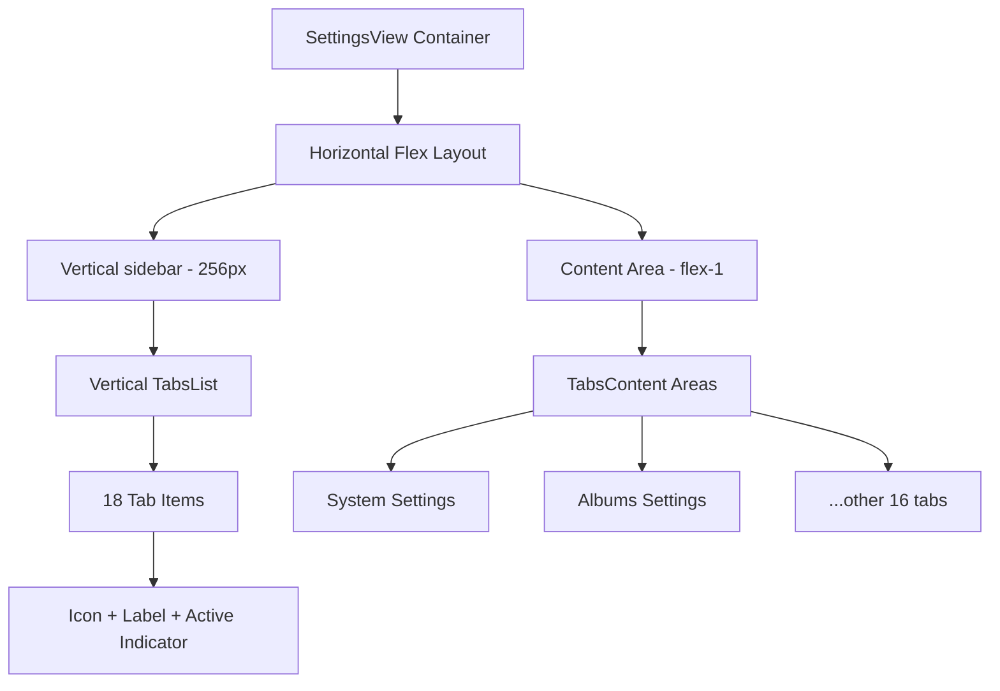
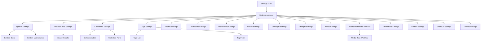
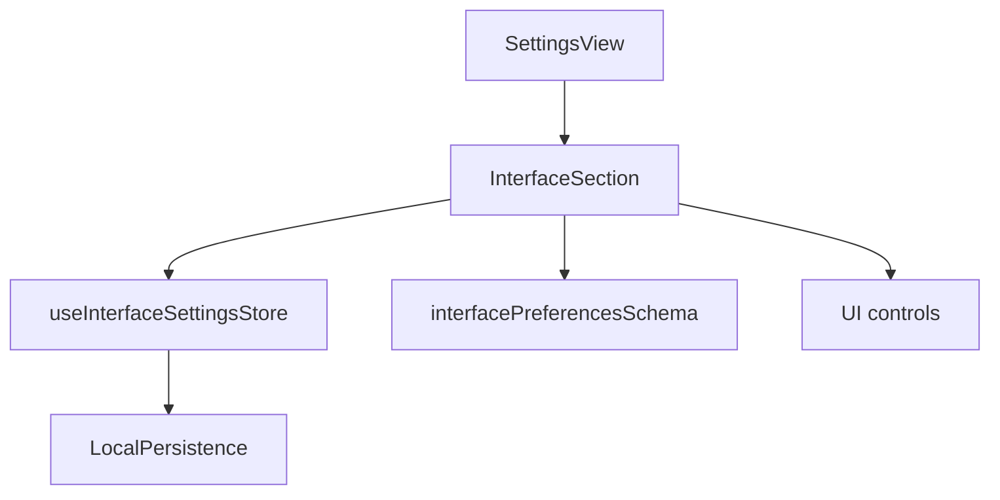

# Settings module

## Overview

The Settings module provides a complete interface for management and configuration of different entities and features of the application.

The module is modular, with specific components for each entity type.

All components are accessible through a **vertical navigation interface** that improves the user experience.

## Update: vertical layout (December 2024)

### Completed transformation

The `SettingsView` component was fully redesigned from a horizontal tab layout to a more modern and functional **vertical sidebar design**.

### Layout architecture



### Features of the new design

#### Vertical sidebar

The sidebar includes the following features:

- Fixed width of 256px (`w-64`)
- Subtle right border (`border-r-2 border-border/20`)
- Semi-transparent background with blur (`bg-background/50 backdrop-blur-sm`)
- Internal scroll if needed

#### Improved tab design

The tabs include the following features:

- Colored icons by thematic scheme
- Labels with intelligent truncation
- Visual indicator of the active state (colored bar)
- Smooth animations and micro-interactions

#### Responsive and accessibility

The layout includes the following features:

- Adaptive grid (1 col mobile / 2 cols XL)
- Preserved event listener for programmatic navigation
- **TODO**: Keyboard navigation and tooltips

## General structure

```
src/components/settings/
├── settings-view.tsx                  # Main component that integrates all modules
├── settings-view/                     # Documentation of the main component
│   └── README.md
├── @progress.md                       # Documentation status tracking
├── @toast-service.md                  # Notification service documentation
├── README.md                          # This file (general documentation)
├── albums/                            # Album settings
│   ├── albums-settings.tsx
│   └── ...
├── collections/                       # Collection settings
│   ├── collections-settings.tsx
│   └── ...
├── concepts/                          # Concept settings
│   ├── concepts-settings.tsx
│   └── ...
├── notes/                             # Note settings
│   ├── notes-settings.tsx
│   └── ...
├── tags/                              # Tag settings
│   ├── tags-settings.tsx
│   └── ...
├── system/                            # System settings
│   ├── system-settings.tsx
│   └── ...
└── media/                             # Media settings
    ├── uploaded-images-settings.tsx     # Points to the authorized explorer
    └── ...
```

## Architecture diagram



## Main components

Each settings module follows a similar structure.

The structure includes the following parts:

1. **Main component** (`*-settings.tsx`): Handles state logic, data load, and presentation.
2. **Create/edit form** (`create-*-form.tsx`): Component for create and edit of entities.
3. **Documentation** (`README.md`): Details about the module, its structure, and use.

## Common features

The modules share the following features:

- **Unified interface**: All modules keep a consistent visual style.
- **Routes**: Use of HTTP routes for write operations. Routes call services.
- **Notifications**: Integration with the toast notification service.
- **Validated forms**: Validation with zod to ensure data integrity.
- **Favorite functionality**: Ability to mark entities as Favorites.
- **Advanced filters**: Ability to filter by different criteria.

## Integration with routes

The components use HTTP routes for server operations.

Routes call services.

```typescript
// Example of integration with routes
const handleCreate = async (data) => {
	try {
		const result = await createEntity(data);
		if (result.success) {
			toastService.success('Entity created successfully');
			// Update local state
		} else {
			toastService.error(result.error || 'Error creating the entity');
		}
	} catch (error) {
		// Handle errors
	}
};
```

## Shared services

The modules use the following shared services:

- **Toast Service**: Provides consistent notifications across the application.
- **Logger Service**: Structured logging of events and errors.

## Basic operation

The user navigates to the settings screen (`settings-view.tsx`).

The user selects a tab that matches the entity to manage.

The specific settings component loads the existing data.

The user can create, edit, delete, or filter entities.

Operations run through routes and show success or error notifications.

## Usage example

```tsx
// Inclusion of the Settings module in an application
import { SettingsView } from '@/components/settings/settings-view';

export default function SettingsPage() {
	return (
		<div className="container p-0 h-full">
			<SettingsView />
		</div>
	);
}
```

## InterfaceSection (interface section)

This section lets users customize the application appearance: typography, theme, animations, and other visual aspects.

### Structure and flow



### Usage example

```tsx
import InterfaceSection from './interface-section';

<InterfaceSection />;
```

### Best practices

Always validate with Zod before you persist changes.

Use the Zustand store for reactivity and persistence.

Document any preference extension in the types and the schema.

> Last update: 2025-06-17

## Best practices

The following practices apply to all modules:

- **Consistency**: Keep visual and functional consistency across all modules.
- **Validation**: Implement form validation for all input data.
- **Feedback**: Provide clear feedback to the user about completed operations.
- **Performance**: Optimize performance by loading only the needed data.
- **Accessibility**: Ensure that all components are accessible according to WCAG.

## Development notes

The modules share a common architecture, but each one has its particulars.

To extend functionality, follow the established patterns and keep consistency.

All modules use the same notification logic through the toast service.

# Settings components

These components configure and customize the user interface of the media management system.

## Structure

```
settings/
├── interface-section.tsx    # Interface and FileBrowser settings
├── README.md               # This documentation
└── [other components]     # Future settings sections
```

## InterfaceSection

This main component configures all visual and behavior aspects of the interface.

### Features

#### General configuration

The general settings include the following options:

- **Typography**: System, Serif, Monospaced, Rounded
- **Font size**: Small, Medium, Large
- **Theme**: System, Light, Dark
- **Animations**: Enabled or disabled
- **Thumbnails**: Configuration of aspect ratio, borders, animations

#### FileBrowser configuration

##### General

The general FileBrowser settings include the following options:

- Default view (Grid, Cards, Mosaic, List)
- Items per batch (10-200)
- Progressive load
- Transitions between views
- Multi-select
- Drag and drop
- Show item counter
- Show total size

##### Grid view

The grid view includes the following options:

- **Columns**: Minimum (1-10), Maximum (2-12)
- **Size**: Item (80-400px), Spacing (0-32px)
- **Aspect**: Aspect ratio (0.5-3.0)
- **Interaction**: Info on hover, hover animations

##### Cards view

The cards view includes the following options:

- **Columns**: Minimum (1-6), Maximum (2-8)
- **Dimensions**: Width (200-600px), Height (250-800px)
- **Spacing**: Gap between cards (8-48px)
- **Content**: Metadata, technical info, badges
- **Preview**: Size (Small, Medium, Large)

##### Masonry/mosaic view

The masonry view includes the following options:

- **Columns**: Minimum (2-8), Maximum (3-12)
- **Dimensions**: Column width (120-400px)
- **Spacing**: Column gap (2-24px), row gap (2-24px)
- **Heights**: Maximum (200-800px), Minimum (80-300px)
- **Behavior**: Respect aspect ratio, automatic balancing

##### List view

The list view includes the following options:

- **Rows**: Height (40-120px), Gap (0-16px)
- **Thumbnails**: Show or hide, size (Small, Medium, Large)
- **Visible columns**:
  - Name, Size, Modified Date
  - Created Date, Type, Dimensions, Tags
- **Display**: Zebra lines, compact mode

##### Performance

The performance settings include the following options:

- **Virtualization**: Enabled or disabled
- **Preload**: Items (5-100)
- **Cache**: Enabled, limit (50-1000)
- **Quality**: Thumbnails (Low, Medium, High)

### Use

```tsx
import InterfaceSection from '@/components/settings/interface-section';

function SettingsPage() {
	return (
		<div className="space-y-6">
			<InterfaceSection />
		</div>
	);
}
```

### Architecture

#### Store integration

The section integrates with the following store features:

- **Zustand Store**: `useInterfaceSettingsStore`
- **Persistence**: Automatic LocalStorage
- **Validation**: Zod schema in real time
- **Reactivity**: Changes applied immediately

#### Helpers

```tsx
// Update general FileBrowser configuration
updateFileBrowserConfig(section: string, key: string, value: any)

// Update configuration of a specific view
updateViewConfig(viewType: 'grid'|'cards'|'masonry'|'list', key: string, value: any)

// Update visible columns in list view
updateListColumn(column: string, visible: boolean)
```

#### Unique IDs

Use `useId()` to generate unique IDs for Switch components and avoid conflicts.

### UI/UX

#### UI components

The section uses the following UI components:

- **Cards**: Organized sections with headers
- **Tabs**: Navigation between view settings
- **Switches**: Boolean controls
- **Inputs**: Numeric values with validation
- **Selects**: Predefined options
- **Labels**: Semantic association with controls

#### Iconography

The section uses the following icons:

- **Settings**: General configuration
- **Eye**: File viewer
- **Grid**: Grid view
- **LayoutGrid**: Cards view
- **Columns**: Mosaic view
- **List**: List view
- **Zap**: Performance

### Types and validation

#### Main types

```typescript
interface FileBrowserConfig {
	views: {
		grid: GridViewConfig;
		cards: CardsViewConfig;
		masonry: MasonryViewConfig;
		list: ListViewConfig;
	};
	general: GeneralConfig;
	performance: PerformanceConfig;
}
```

#### Zod validation

The schema provides the following validation:

- Validated numeric ranges
- Enums for predefined options
- Real-time validation
- Fallback to default values

### Configurations by view

#### Grid (optimal for fast navigation)

- **Purpose**: Fast general view of images
- **Use cases**: Navigation, multi-select
- **Optimizations**: Consistent aspect ratio, hover info

#### Cards (rich in information)

- **Purpose**: Detailed view with metadata
- **Use cases**: Content review, organization
- **Optimizations**: Badges, technical info, large previews

#### Masonry (visual aesthetic)

- **Purpose**: Attractive visual presentation
- **Use cases**: Portfolios, galleries, inspiration
- **Optimizations**: Natural aspect ratio, automatic balancing

#### List (data efficiency)

- **Purpose**: Tabular view with detailed information
- **Use cases**: File management, data analysis
- **Optimizations**: Configurable columns, compact mode

### Performance optimizations

#### Virtualization

- **Purpose**: Render only visible items
- **Benefit**: Handling of thousands of images without lag
- **Configuration**: Adjustable preload items

#### Thumbnail cache

- **Purpose**: Avoid thumbnail regeneration
- **Benefit**: Smoother navigation
- **Configuration**: Adjustable cache limit and quality

#### Progressive load

- **Purpose**: Load content in batches
- **Benefit**: Reduced initial load time
- **Configuration**: Customizable batch size

### Advanced customization

#### Thumbnails

The thumbnail settings include the following options:

- **Borders**: Configurable by view (0-32px)
- **Animations**: Enable or disable
- **Aspect Ratio**: Respect the original or force it
- **Performance**: Ultra performance mode

#### Animations

The animation settings include the following options:

- **Transitions**: Between view changes
- **Hover**: Interaction effects
- **Performance**: Disable for slow devices

### Default values

```typescript
const defaultFileBrowserConfig = {
	views: {
		grid: { minColumns: 4, maxColumns: 8, itemSize: 160, gap: 8 },
		cards: { minColumns: 2, maxColumns: 4, cardWidth: 320, cardHeight: 400 },
		masonry: { minColumns: 3, maxColumns: 6, columnWidth: 200 },
		list: { rowHeight: 60, showThumbnails: true, thumbnailSize: 'small' },
	},
	general: { defaultViewMode: 'grid', itemsPerBatch: 50 },
	performance: { enableVirtualization: true, thumbnailQuality: 'medium' },
};
```

### Specific use cases

#### Professional photographer

- **Grid**: 6-8 columns, info on hover
- **Cards**: Complete metadata, large preview
- **Performance**: High quality, wide cache

#### Graphic designer

- **Masonry**: Natural aspect ratio, automatic balancing
- **Cards**: Project badges, technical info
- **Performance**: High quality, animations enabled

#### Content manager

- **List**: All columns visible, compact mode
- **Grid**: Many columns, no animations
- **Performance**: Virtualization, fast load

### Development and extension

#### Add a new view

Define types in `types.ts`.

Add the schema in `interface.schema.ts`.

Configure default values in `store.ts`.

Implement the tab in `InterfaceSection`.

#### Add a new setting

Extend the existing interfaces.

Update the validation schemas.

Add UI controls.

Document the use cases.

## Planned improvements

The following improvements are planned:

- [ ] **Presets**: Predefined configurations by user type
- [ ] **Export/Import**: Configurations between devices
- [ ] **Custom themes**: Advanced colors and styles
- [ ] **Shortcuts**: Configurable keyboard shortcuts
- [ ] **Hybrid view**: Combination of views on screen
- [ ] **Per-folder configuration**: Specific settings by location

---

_Documentation updated for the version with complete FileBrowser configuration_
