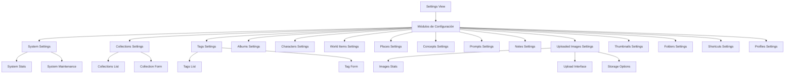

# Módulo Settings

## Descripción General

El módulo Settings proporciona una interfaz completa para la gestión y configuración de diferentes entidades y funcionalidades de la aplicación. Está diseñado de forma modular, con componentes específicos para cada tipo de entidad, todos accesibles a través de una interfaz de navegación por pestañas.

## Estructura General

```
src/components/settings/
├── settings-view.tsx                  # Componente principal que integra todos los módulos
├── settings-view/                     # Documentación del componente principal
│   └── README.md
├── @progress.md                       # Seguimiento del estado de documentación
├── @toast-service.md                  # Documentación del servicio de notificaciones
├── README.md                          # Este archivo (documentación general)
├── albums/                            # Configuración de álbumes
│   ├── albums-settings.tsx
│   └── ...
├── collections/                       # Configuración de colecciones
│   ├── collections-settings.tsx
│   └── ...
├── concepts/                          # Configuración de conceptos
│   ├── concepts-settings.tsx
│   └── ...
├── notes/                             # Configuración de notas
│   ├── notes-settings.tsx
│   └── ...
├── tags/                              # Configuración de etiquetas
│   ├── tags-settings.tsx
│   └── ...
├── system/                            # Configuración del sistema
│   ├── system-settings.tsx
│   └── ...
└── uploaded-images/                   # Configuración de imágenes subidas
    ├── uploaded-images-settings.tsx
    └── ...
```

## Diagrama de Arquitectura



## Componentes Principales

Cada módulo de configuración sigue una estructura similar:

1. **Componente principal** (`*-settings.tsx`): Maneja la lógica de estado, carga de datos y presentación.
2. **Formulario de creación/edición** (`create-*-form.tsx`): Componente para la creación y edición de entidades.
3. **Documentación** (`README.md`): Detalles sobre el módulo, su estructura y uso.

## Características Comunes

- **Interfaz unificada**: Todos los módulos mantienen un estilo visual consistente.
- **Server Actions**: Uso de server actions para operaciones de escritura.
- **Notificaciones**: Integración con el servicio de notificaciones toast.
- **Formularios validados**: Validación con zod para asegurar la integridad de los datos.
- **Funcionalidad de favoritos**: Posibilidad de marcar entidades como favoritas.
- **Filtros avanzados**: Capacidad de filtrar por diferentes criterios.

## Integración con Server Actions

Los componentes utilizan server actions para operaciones de servidor:

```typescript
// Ejemplo de integración con server actions
const handleCreate = async (data) => {
  try {
    const result = await createEntity(data);
    if (result.success) {
      toastService.success('Entidad creada correctamente');
      // Actualizar estado local
    } else {
      toastService.error(result.error || 'Error al crear la entidad');
    }
  } catch (error) {
    // Manejar errores
  }
};
```

## Servicios Compartidos

- **Toast Service**: Proporciona notificaciones consistentes en toda la aplicación.
- **Logger Service**: Registro estructurado de eventos y errores.

## Funcionamiento Básico

1. El usuario navega a la pantalla de configuración (`settings-view.tsx`).
2. Selecciona una pestaña correspondiente a la entidad que desea gestionar.
3. El componente de configuración específico carga los datos existentes.
4. El usuario puede crear, editar, eliminar o filtrar entidades.
5. Las operaciones se realizan a través de server actions y se muestran notificaciones de éxito/error.

## Ejemplo de Uso

```tsx
// Incorporación del módulo Settings en una aplicación
import { SettingsView } from '@/components/settings/settings-view';

export default function SettingsPage() {
  return (
    <div className="container p-0 h-full">
      <SettingsView />
    </div>
  );
}
```

## Mejores Prácticas

- **Consistencia**: Mantener la consistencia visual y funcional entre todos los módulos.
- **Validación**: Implementar validación de formularios para todos los datos de entrada.
- **Feedback**: Proporcionar feedback claro al usuario sobre las operaciones realizadas.
- **Rendimiento**: Optimizar el rendimiento cargando solo los datos necesarios.
- **Accesibilidad**: Asegurar que todos los componentes sean accesibles según WCAG.

## Notas de Desarrollo

- Los módulos comparten una arquitectura común pero cada uno tiene sus particularidades.
- Para extender la funcionalidad, seguir los patrones establecidos y mantener la consistencia.
- Todos los módulos utilizan la misma lógica de notificaciones a través del servicio de toast.