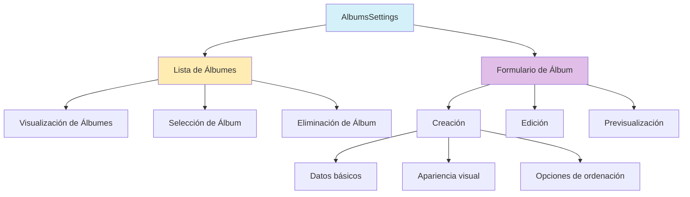
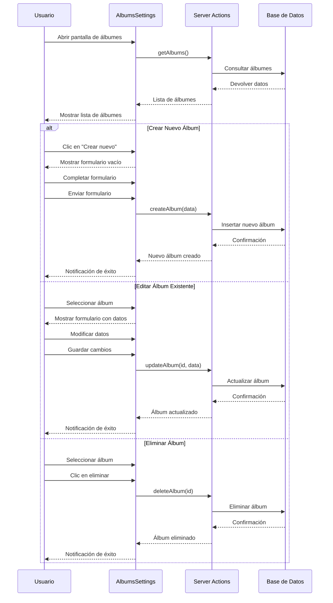

# Módulo de Álbumes

## Descripción

El módulo de Álbumes permite crear, gestionar y organizar álbumes para agrupar imágenes relacionadas. Los álbumes son una forma intuitiva de clasificar imágenes según criterios definidos por el usuario, como eventos, temas o proyectos.

## Estructura General



## Componentes Principales

### AlbumsSettings

Componente principal que gestiona la interfaz de usuario para el manejo de álbumes, incluyendo la lista y el formulario.

#### Características clave:
- **Carga asíncrona** de datos desde la base de datos
- **Manejo de estados de carga y error**
- **Estadísticas en tiempo real** sobre álbumes e imágenes
- **Vista dividida** con lista a la izquierda y formulario a la derecha
- **Acciones contextuales** para editar, eliminar y crear álbumes

### CreateAlbumForm

Formulario para crear y editar álbumes, con validación y opciones de personalización.

#### Características clave:
- **Validación con Zod** para garantizar datos consistentes
- **Selección de emoji** personalizado para cada álbum
- **Selector de color** para personalizar la apariencia del álbum
- **Opciones de ordenación** para definir cómo se presentan las imágenes
- **Previsualización** para ver cómo quedará el álbum
- **Modo adaptativo** para creación o edición

## Flujo de Trabajo



## Modelo de Datos

### Album

```typescript
interface Album {
  id: string;
  name: string;
  description?: string;
  emoji: string;
  color: string;
  sortBy: string;
  filters: string;
  category?: string;
  rarity?: string;
  texture?: string;
  createdAt: Date;
  updatedAt: Date;
  userId: string;
}

// Extensión con estadísticas
interface AlbumWithStats extends Album {
  _count?: {
    images: number;
  };
  totalSize?: number;
}
```

## Server Actions

### getAlbums

```typescript
// Obtiene todos los álbumes del usuario actual con estadísticas
async function getAlbums(): Promise<AlbumWithStats[]>
```

### createAlbum

```typescript
// Crea un nuevo álbum
async function createAlbum(data: FormData): Promise<Album>
```

### updateAlbum

```typescript
// Actualiza un álbum existente
async function updateAlbum(id: string, data: FormData): Promise<Album>
```

### deleteAlbum

```typescript
// Elimina un álbum
async function deleteAlbum(id: string): Promise<void>
```

## Guía de Uso

### Crear un nuevo álbum

1. En la pantalla de configuración, selecciona la pestaña "Álbumes"
2. Haz clic en el botón "+" para crear un nuevo álbum
3. Completa los campos requeridos:
   - Nombre: Un nombre descriptivo para el álbum
   - Emoji: Un icono representativo para el álbum
   - Color: Un color para identificar visualmente el álbum
4. Opcionalmente, añade:
   - Descripción: Una breve explicación del propósito del álbum
   - Categoría: Clasificación del álbum (eventos, viajes, etc.)
   - Criterio de ordenación: Cómo se organizarán las imágenes
5. Haz clic en "Crear álbum" para guardar

### Editar un álbum existente

1. En la lista de álbumes, selecciona el álbum que deseas editar
2. Modifica los campos necesarios en el formulario que aparece
3. Haz clic en "Guardar cambios" para actualizar el álbum

### Eliminar un álbum

1. En la lista de álbumes, selecciona el álbum que deseas eliminar
2. Haz clic en el botón de papelera
3. Confirma la eliminación

> **Nota:** Eliminar un álbum no elimina las imágenes contenidas en él, solo su agrupación.

## Opciones de Ordenación

El álbum permite definir cómo se ordenarán las imágenes dentro de él:

- **Por nombre**: Orden alfabético por nombre de archivo
- **Por fecha de creación**: Las más recientes primero o últimas
- **Por fecha de captura**: Según los metadatos EXIF (si están disponibles)
- **Por tamaño**: De mayor a menor o viceversa
- **Personalizado**: Orden definido manualmente por el usuario

## Integración con otros componentes

El módulo de Álbumes está diseñado para integrarse con otros componentes del sistema:

- **Visor de Imágenes**: Posibilidad de navegar por las imágenes de un álbum
- **Galerías**: Visualización de álbumes en diferentes formatos de galería
- **Exportación**: Opción para exportar álbumes completos
- **Compartir**: Funcionalidad para compartir álbumes con otros usuarios
- **Importación**: Capacidad para importar imágenes directamente a un álbum

## Mejores Prácticas

1. **Nombres descriptivos**: Utiliza nombres claros que describan el contenido del álbum
2. **Organización temática**: Crea álbumes con un tema o propósito específico
3. **Emojis representativos**: Selecciona emojis que reflejen el contenido del álbum
4. **Descripciones útiles**: Añade descripciones informativas para facilitar la búsqueda
5. **Categorización**: Utiliza la categorización para organizar álbumes similares
6. **Actualización regular**: Mantén los álbumes actualizados con nuevo contenido relevante