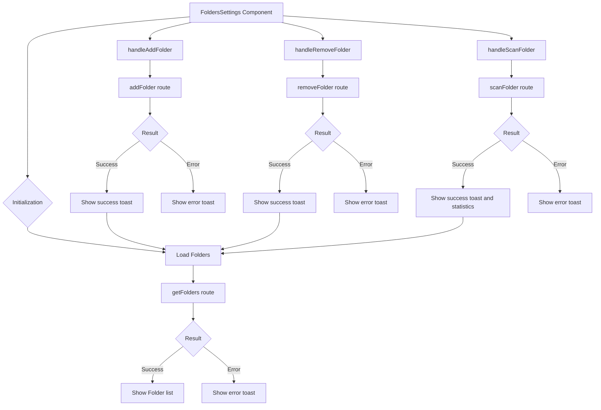
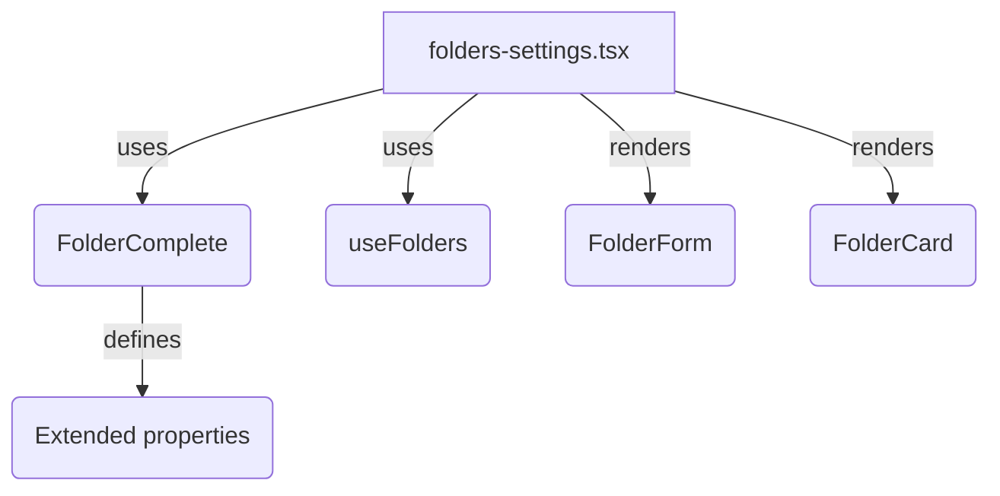

# Folders settings module

## Description

The Folders Settings module provides an interface that manages and configures image Folders that the application monitors.

The module lets you add, remove, and configure filesystem Folders that the scanner uses to import images automatically.

## File structure

```
src/components/settings/folders/
├── folders-settings.tsx   # Main component with the user interface
└── README.md              # Module documentation
```

## Flow diagram



## Features

The module provides the following features:

- **Image Folder management**:
  - Add new Folders for monitoring
  - Remove existing Folders
  - View statistics for each Folder (total files, detected images)

- **Scan and import**:
  - Manual scan of specific Folders
  - Automatic import of new images
  - Progress display during the scan

- **Option configuration**:
  - Recursion (include subfolders)
  - Filter by file type
  - Exclusion of specific files
  - Automatic change monitoring

- **Statistics display**:
  - Total of monitored Folders
  - Disk space used
  - Total number of detected files
  - Distribution by file type

## Integration with routes

The component uses HTTP routes for filesystem operations.

Routes call services.

The operations include the following functions:

- `getFolders`: Gets the list of monitored Folders
- `addFolder`: Adds a new Folder to the system
- `removeFolder`: Removes a Folder from the system
- `scanFolder`: Scans a Folder for new images

## Usage example

```tsx
// In a page or layout
import { FoldersSettings } from '@/components/settings/folders/folders-settings';

export default function FoldersPage() {
	return (
		<div className="container mx-auto p-4">
			<h1 className="text-xl font-bold mb-4">Folder Settings</h1>
			<FoldersSettings />
		</div>
	);
}
```

## Services used

The component uses the following services:

- **ToastService**: Success and error notifications for operations
- **FileSystemService**: Interaction with the filesystem
- **ImageProcessingService**: Processing of detected images

## Folder operations

The component implements several actions that manage Folders:

```typescript
// Example action that scans a Folder
const handleScanFolder = async (folderId: string) => {
	try {
		setScanning(folderId);
		const result = await scanFolder(folderId);

		if (result.success) {
			toastService.success(`Found ${result.stats.newFiles} new files`);
			loadFolders(); // Reload statistics
		} else {
			toastService.error(result.error || 'Error scanning the folder');
		}
	} catch (error) {
		toastService.error('Error scanning the folder');
	} finally {
		setScanning(null);
	}
};
```

## Implementation notes

Access to the filesystem requires user permissions.

Scan operations can be resource intensive.

The component implements robust error handling for file-access problems.

The component provides visual feedback during long operations.

Statistics refresh automatically after each operation.

# Folder settings (`folders-settings.tsx`)

## Migration to canonical types

This module and its hooks migrated in June 2024 to use only the canonical `FolderComplete` type.

The migration removed any legacy reference to `ExtendedFolder`.

This change guarantees consistency, type safety, and future compatibility.

## Structure and main flow

The main flow includes the following steps:

- **Folder load:** The `useFolders` hook gets all Folders and stores them as `FolderComplete[]`.
- **Selection and edit:** When a Folder is selected, the detail shows and you can edit it with the canonical form.
- **Create and update:** Handlers always use `FolderComplete` and update global state after each operation.
- **Delete and reindex:** Handlers delete or reindex Folders and update state.

## Relation diagram



## Usage example

```tsx
<FoldersSettings />
```

## Notes

All data and props use `FolderComplete`.

Any legacy import or type assertion was removed.

Documentation and migration follow the workspace rules.

---

_Updated: June 2024_
