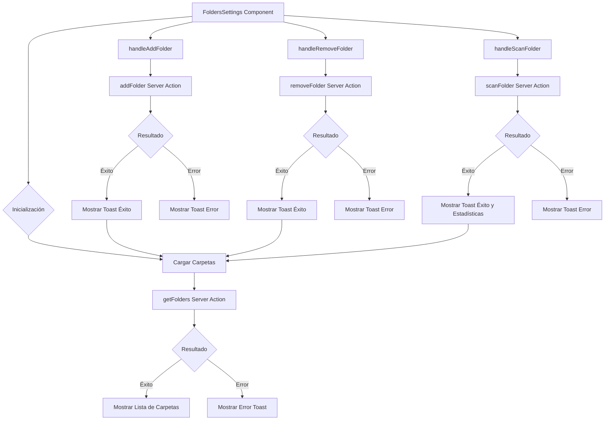
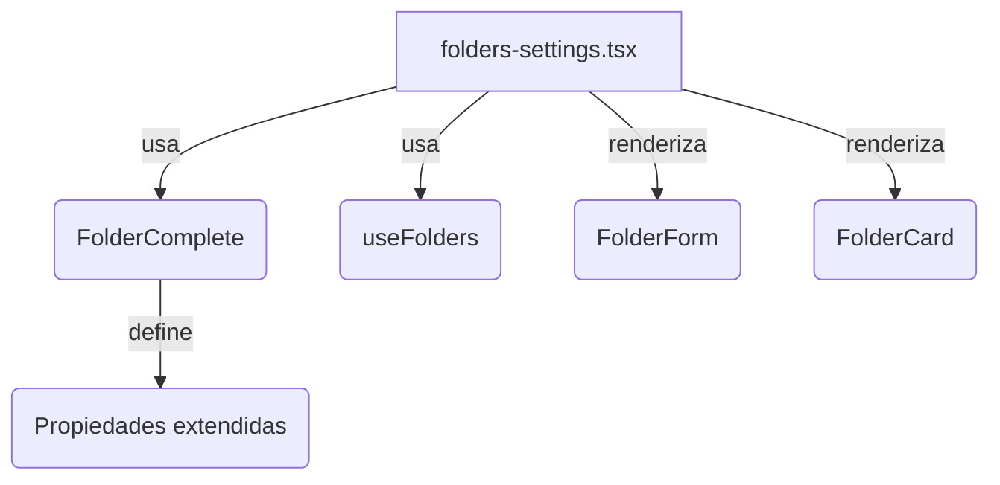

# Módulo Folders Settings

## Descripción

El módulo Folders Settings proporciona una interfaz para gestionar y configurar las carpetas de imágenes monitoreadas por la aplicación. Permite añadir, eliminar y configurar carpetas del sistema de archivos que serán escaneadas para importar imágenes automáticamente.

## Estructura de Archivos

```
src/components/settings/folders/
├── folders-settings.tsx   # Componente principal con la interfaz de usuario
└── README.md              # Documentación del módulo
```

## Diagrama de Flujo



## Características

- **Gestión de Carpetas de Imágenes**:
  - Añadir nuevas carpetas para monitoreo
  - Eliminar carpetas existentes
  - Ver estadísticas de cada carpeta (total de archivos, imágenes detectadas, etc.)

- **Escaneo e Importación**:
  - Escaneo manual de carpetas específicas
  - Importación automática de nuevas imágenes
  - Visualización de progreso durante el escaneo

- **Configuración de Opciones**:
  - Recursividad (incluir subcarpetas)
  - Filtrado por tipo de archivo
  - Exclusión de archivos específicos
  - Monitoreo automático de cambios

- **Visualización de Estadísticas**:
  - Total de carpetas monitoreadas
  - Espacio en disco utilizado
  - Número total de archivos detectados
  - Distribución por tipo de archivo

## Integración con Server Actions

El componente utiliza server actions para operaciones del sistema de archivos:

- `getFolders`: Obtiene la lista de carpetas monitoreadas
- `addFolder`: Añade una nueva carpeta al sistema
- `removeFolder`: Elimina una carpeta del sistema
- `scanFolder`: Escanea una carpeta en busca de nuevas imágenes

## Ejemplo de Uso

```tsx
// En una página o layout
import { FoldersSettings } from '@/components/settings/folders/folders-settings';

export default function FoldersPage() {
	return (
		<div className="container mx-auto p-4">
			<h1 className="text-xl font-bold mb-4">Configuración de Carpetas</h1>
			<FoldersSettings />
		</div>
	);
}
```

## Servicios Utilizados

- **ToastService**: Para notificaciones de éxito/error en operaciones
- **FileSystemService**: Para interactuar con el sistema de archivos
- **ImageProcessingService**: Para procesar imágenes detectadas

## Operaciones de Carpetas

El componente implementa varias acciones para gestionar carpetas:

```typescript
// Ejemplo de acción para escanear una carpeta
const handleScanFolder = async (folderId: string) => {
	try {
		setScanning(folderId);
		const result = await scanFolder(folderId);

		if (result.success) {
			toastService.success(`Se han encontrado ${result.stats.newFiles} archivos nuevos`);
			loadFolders(); // Recargar estadísticas
		} else {
			toastService.error(result.error || 'Error al escanear la carpeta');
		}
	} catch (error) {
		toastService.error('Error al escanear la carpeta');
	} finally {
		setScanning(null);
	}
};
```

## Notas de Implementación

- El acceso al sistema de archivos requiere permisos del usuario
- Las operaciones de escaneo pueden ser intensivas en recursos
- Se implementa gestión de errores robusta para problemas de acceso a archivos
- El componente proporciona feedback visual durante operaciones largas
- Las estadísticas se actualizan automáticamente tras cada operación

# 📄 Settings de Carpetas (`folders-settings.tsx`)

## 📁 Migración a Tipos Canónicos

Este módulo y sus hooks han sido migrados en junio 2024 para usar exclusivamente el tipo canónico `FolderComplete`, eliminando cualquier referencia legacy a `ExtendedFolder`. Esto garantiza consistencia, type safety y compatibilidad futura.

## 📚 Estructura y Flujo Principal

- **Carga de carpetas:** Se obtienen todas las carpetas usando el hook `useFolders` y se almacenan en el estado como `FolderComplete[]`.
- **Selección y edición:** Al seleccionar una carpeta, se muestra el detalle y se puede editar usando el formulario canónico.
- **Creación y actualización:** Los handlers usan siempre `FolderComplete` y actualizan el estado global tras cada operación.
- **Eliminación y reindexado:** Los handlers eliminan o reindexan carpetas y actualizan el estado.

## 🔗 Diagrama de Relaciones



## 🧩 Ejemplo de Uso

```tsx
<FoldersSettings />
```

## 🚦 Notas

- Todos los datos y props usan `FolderComplete`.
- Se eliminó cualquier import o type assertion legacy.
- Documentación y migración conforme a las reglas del workspace.

---

_Actualizado: junio 2024_
