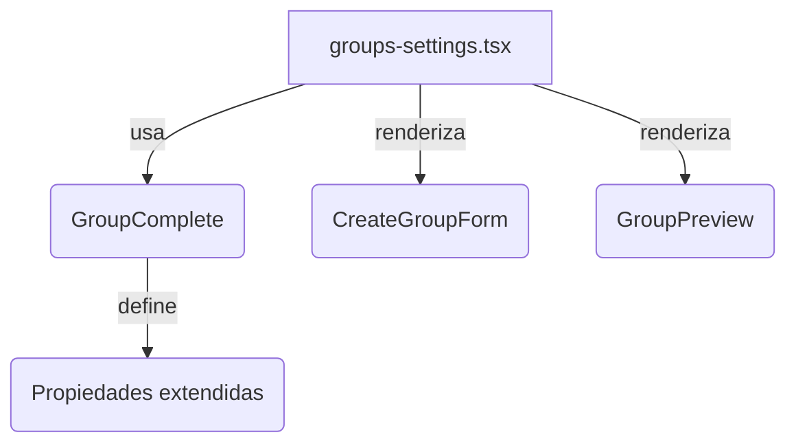

# 📄 Settings de Grupos (`groups-settings.tsx`)

## 👥 Migración a Tipos Canónicos
Este módulo ha sido migrado en junio 2024 para usar exclusivamente el tipo canónico `GroupComplete`, eliminando cualquier referencia legacy a `GroupWithStats`. Esto garantiza consistencia, type safety y compatibilidad futura.

## 📚 Estructura y Flujo Principal
- **Carga de grupos:** Se obtienen todos los grupos usando el action `getGroups` y se almacenan en el estado como `GroupComplete[]`.
- **Selección y edición:** Al seleccionar un grupo, se muestra el detalle y se puede editar usando el formulario canónico.
- **Creación y actualización:** Los handlers usan siempre `GroupComplete` y actualizan el estado global tras cada operación.
- **Eliminación:** El handler elimina el grupo y actualiza el estado.

## 🔗 Diagrama de Relaciones


## 🧩 Ejemplo de Uso
```tsx
<GroupsSettings />
```

## 🚦 Notas
- Todos los datos y props usan `GroupComplete`.
- Se eliminó cualquier import o type assertion legacy.
- Documentación y migración conforme a las reglas del workspace.

---
_Actualizado: junio 2024_