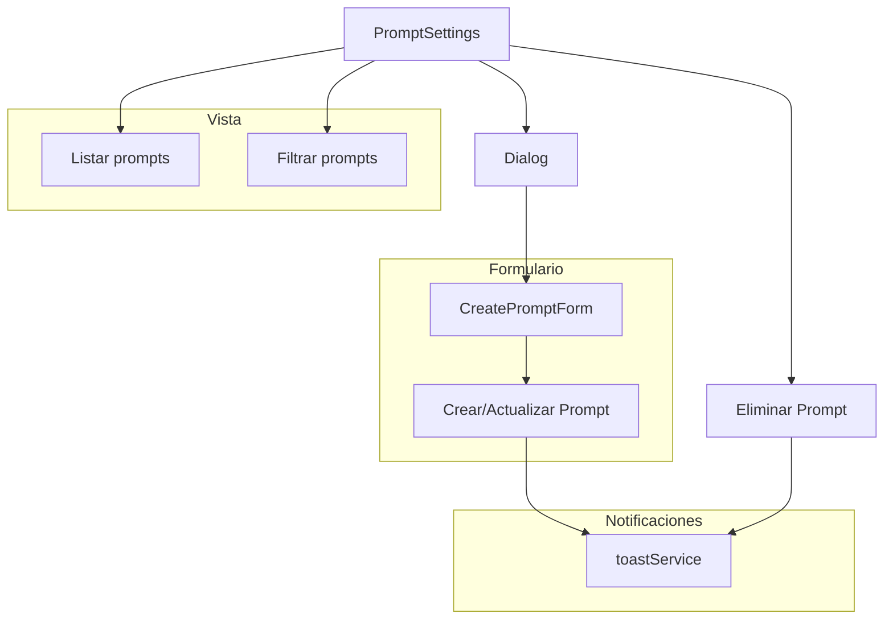

# Módulo de Configuración de Prompts

## Descripción

El módulo de configuración de Prompts permite gestionar los prompts utilizados en la aplicación para generar contenido con IA. Los prompts son plantillas de texto predefinidas que pueden incluir parámetros dinámicos y estar asociados a diferentes categorías.

## Estructura de Archivos

```
src/components/settings/prompts/
├── README.md                   # Documentación del módulo
├── prompt-settings.tsx         # Componente principal de configuración
├── create-prompt-form.tsx      # Formulario para crear/editar prompts
└── prompt-preview.tsx          # Componente para previsualizar prompts
```

## Diagrama de Flujo



## Funcionalidades

### Componente PromptSettings
- Listado de prompts en formato cuadrícula o lista
- Búsqueda por texto en nombre y descripción
- Filtrado por categoría
- Filtrado por favoritos
- Acciones para crear, editar y eliminar prompts

### Formulario de Prompts (CreatePromptForm)
- Campos para nombre, descripción, contenido, categoría, modelo, etc.
- Selección de emoji representativo
- Selector de color
- Opción para marcar como favorito
- Vista previa en tiempo real (opcional)

## Integración con Server Actions

El módulo utiliza las siguientes server actions:
- `getPrompts()` - Para obtener todos los prompts del sistema
- `createPrompt(data)` - Para crear un nuevo prompt
- `updatePrompt(id, data)` - Para actualizar un prompt existente
- `deletePrompt(id)` - Para eliminar un prompt

## Notificaciones

El módulo utiliza `toastService` para mostrar notificaciones al usuario sobre el resultado de las operaciones:
- Éxito al crear/actualizar/eliminar prompts
- Errores en las operaciones

## Ejemplo de Uso

```tsx
// En un componente de configuración general
import { PromptSettings } from '@/components/settings/prompts/prompt-settings';

export function SettingsPage() {
  return (
    <div>
      <h1>Configuración</h1>
      <PromptSettings />
    </div>
  );
}
```

## Estilos y UX

- Usa componentes de Shadcn/UI para mantener consistencia visual
- La interfaz es responsiva, adaptándose a diferentes tamaños de pantalla
- Los prompts favoritos se destacan con un icono de estrella
- La vista de cuadrícula muestra tarjetas con información visual (emoji, color)
- La vista de lista permite ver más prompts en espacios reducidos