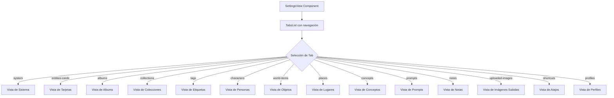

# Componente Settings View

## Descripción

El componente `SettingsView` es el punto central de la sección de configuración de la aplicación, proporcionando una interfaz de navegación por pestañas que organiza y presenta todos los componentes de configuración disponibles en la aplicación.

## Estructura de Archivos

```
src/components/settings/
├── settings-view.tsx          # Componente principal de la vista de configuración
└── settings-view/
    └── README.md              # Documentación del componente
```

## Diagrama de Flujo



## Características

- **Navegación por pestañas**: Proporciona acceso a todos los módulos de configuración mediante un sistema de pestañas.
- **Código mantenible**: Utiliza una estructura de datos para definir las pestañas y evitar la duplicación de código.
- **Diseño responsive**: Se adapta a diferentes tamaños de pantalla, con scroll horizontal en la barra de pestañas.
- **Experiencia visual mejorada**: Iconos y colores específicos para cada sección de configuración.
- **Estado persistente**: Mantiene el estado de la pestaña activa mediante React useState.

## Componentes integrados

El `SettingsView` integra los siguientes componentes de configuración:

- `SystemSettings`: Configuración del sistema
- `EntitiesCardsSection`: Configuración de tarjetas de entidades
- `AlbumsSettings`: Gestión de álbumes
- `CollectionsSettings`: Gestión de colecciones
- `TagsSettings`: Gestión de etiquetas
- `CharactersSettings`: Gestión de personajes
- `WorldItemsSettings`: Gestión de objetos del mundo
- `PlacesSettings`: Gestión de lugares
- `ConceptsSettings`: Gestión de conceptos
- `PromptsSettings`: Gestión de prompts
- `NotesSettings`: Gestión de notas
- `UploadedImagesSettings`: Gestión de imágenes subidas
- `ShortcutsSettings`: Configuración de atajos de teclado
- `ProfilesSettings`: Gestión de perfiles de usuario

## Ejemplo de Uso

```tsx
// En una página o layout
import { SettingsView } from '@/components/settings/settings-view';

export default function SettingsPage() {
  return (
    <div className="container mx-auto h-screen">
      <SettingsView />
    </div>
  );
}
```

## Animaciones y Efectos Visuales

El componente implementa varias animaciones y efectos visuales para mejorar la experiencia de usuario:

- Animaciones de rotación en los iconos al pasar el cursor
- Efecto de escala en las pestañas al interactuar con ellas
- Transiciones suaves en los cambios de estado
- Fondo con efecto de desenfoque (backdrop blur) en la barra de navegación

## Diseño técnico

- Utiliza componentes UI de Shadcn como `Tabs`, `TabsList`, `TabsTrigger` y `TabsContent`
- Implementa estados con React hooks para mantener la pestaña activa
- Define un sistema de colores específico para cada tipo de entidad
- Aplica estilos condicionales mediante la utilidad `cn` para fusionar clases
- Estructura los datos de pestañas como un array de objetos para facilitar el mantenimiento