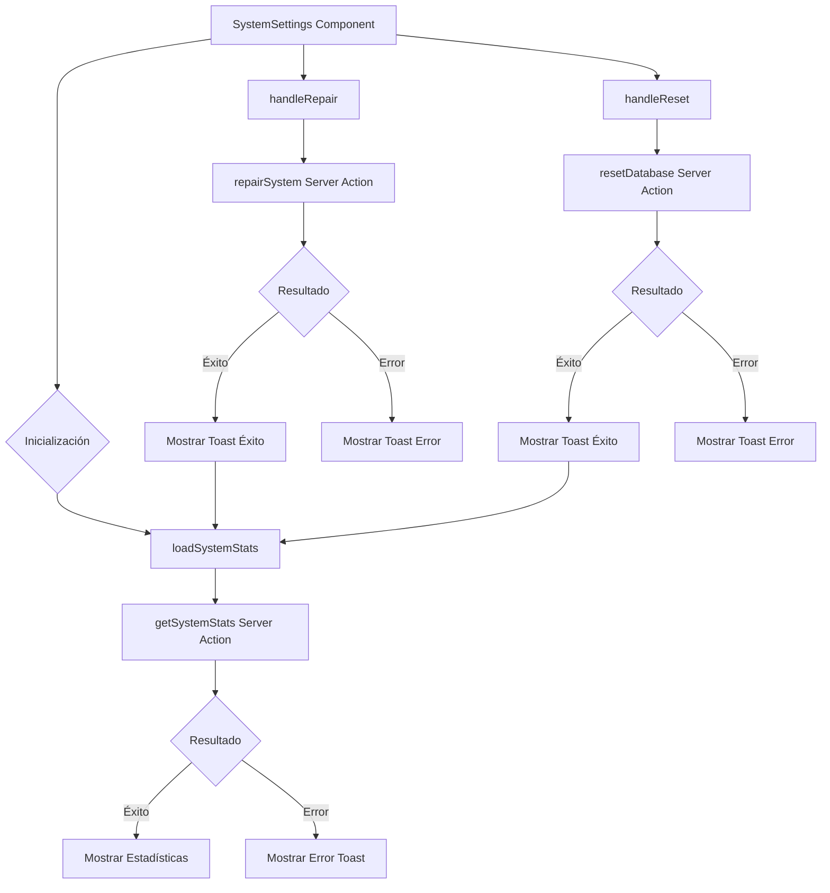

# Módulo System Settings

## Descripción

El módulo System Settings proporciona una interfaz para visualizar estadísticas del sistema y realizar operaciones de mantenimiento como reparación del sistema y reseteo de la base de datos.

## Estructura de Archivos

```
src/components/settings/system/
├── system-settings.tsx     # Componente principal con la interfaz de usuario
└── README.md               # Documentación del módulo
```

## Diagrama de Flujo



## Características

- **Visualización de Estadísticas del Sistema**:
  - Uso de CPU
  - Uso de Memoria
  - Tamaño de Caché
  - Información de la base de datos
  - Información del servidor

- **Operaciones de Mantenimiento**:
  - Reparación del sistema
  - Reseteo de la base de datos (con confirmación)

## Integración con Server Actions

El componente utiliza server actions para operaciones que requieren acceso directo a recursos del servidor:

- `getSystemStats`: Obtiene estadísticas actuales del sistema
- `repairSystem`: Realiza operaciones de reparación/mantenimiento
- `resetDatabase`: Reinicia la base de datos a su estado inicial

## Ejemplo de Uso

```tsx
// En una página o layout
import { SystemSettings } from '@/components/settings/system/system-settings';

export default function SystemPage() {
  return (
    <div className="container mx-auto p-4">
      <h1 className="text-xl font-bold mb-4">Configuración del Sistema</h1>
      <SystemSettings />
    </div>
  );
}
```

## Animaciones

El componente utiliza `motion/react` para animaciones suaves que mejoran la experiencia del usuario al cargar los datos y mostrar las estadísticas.

## Servicios Utilizados

- **ToastService**: Para notificaciones de éxito/error en operaciones
- **ServerLogger**: Para registro de errores y eventos en el servidor

## Notas de Implementación

- Las estadísticas se actualizan automáticamente cada minuto
- Las operaciones de mantenimiento muestran feedback inmediato al usuario
- Se utilizan confirmaciones para operaciones destructivas
- Los componentes UI provienen de la librería Shadcn/UI