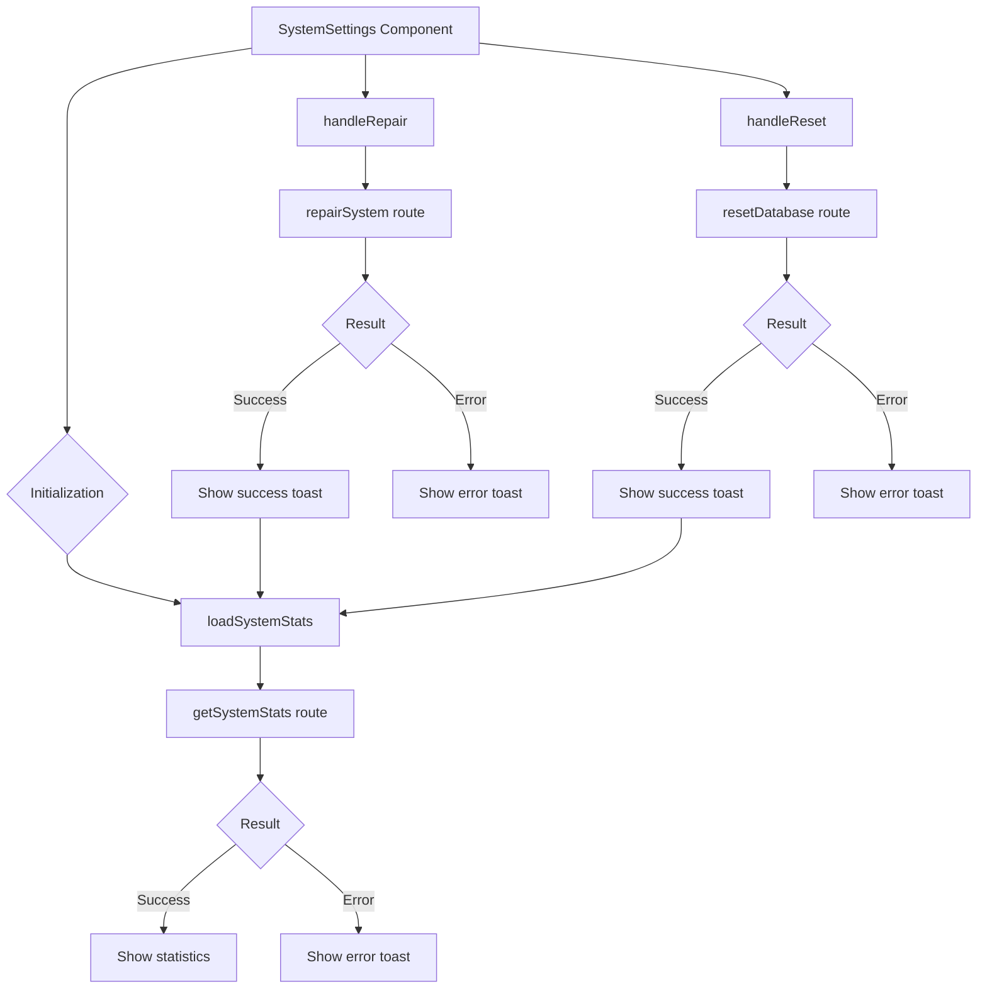

# System settings module

## Description

The System Settings module provides an interface that shows system statistics.

The module also runs maintenance operations such as system repair and database reset.

## File structure

```
src/components/settings/system/
├── system-settings.tsx     # Main component with the user interface
└── README.md               # Module documentation
```

## Flow diagram



## Features

The module provides the following features:

- **System statistics display**:
  - CPU use
  - Memory use
  - Cache size
  - Database information
  - Server information

- **Maintenance operations**:
  - System repair
  - Database reset (with confirmation)

## Integration with routes

The component uses HTTP routes for operations that need direct access to server resources.

The routes include the following operations:

- `getSystemStats`: Gets current system statistics
- `repairSystem`: Runs repair and maintenance operations
- `resetDatabase`: Resets the database to its initial state

## Usage example

```tsx
// In a page or layout
import { SystemSettings } from '@/components/settings/system/system-settings';

export default function SystemPage() {
	return (
		<div className="container mx-auto p-4">
			<h1 className="text-xl font-bold mb-4">System Settings</h1>
			<SystemSettings />
		</div>
	);
}
```

## Animations

The component uses `motion/react` for smooth animations.

The animations improve the experience when data loads and statistics display.

## Services used

The component uses the following services:

- **ToastService**: Success and error notifications for operations
- **ServerLogger**: Server-side logging of errors and events

## Implementation notes

Statistics refresh automatically every minute.

Maintenance operations show immediate feedback to the user.

Destructive operations use confirmations.

The UI components come from the Shadcn/UI library.
