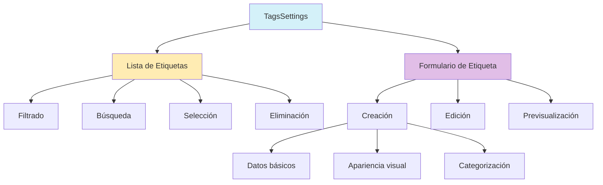
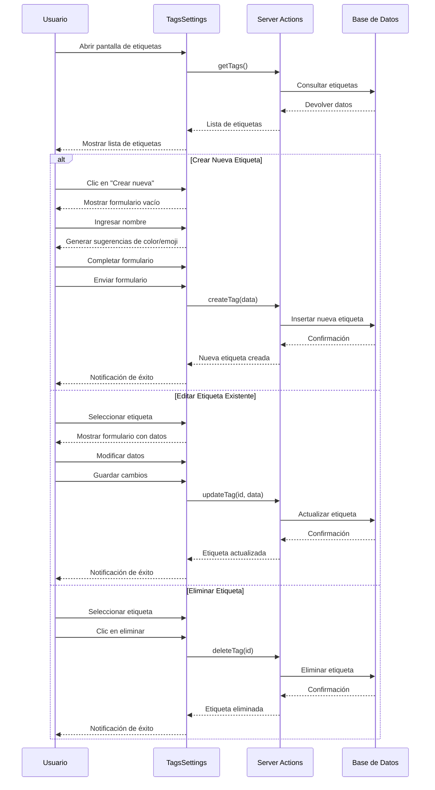

# Módulo de Etiquetas (Tags)

## Descripción

El módulo de Etiquetas permite crear, gestionar y organizar etiquetas que se pueden asociar a imágenes y otros recursos para facilitar su búsqueda, clasificación y organización. Las etiquetas son elementos clave en el sistema de gestión de imágenes, ya que permiten categorizar el contenido de manera flexible y personalizada.

## Estructura General



## Componentes Principales

### TagsSettings

Componente principal que gestiona la interfaz de usuario para el manejo de etiquetas, incluyendo la lista, filtros, y formulario.

#### Características clave:
- **Carga asíncrona** de datos desde la base de datos
- **Manejo de estados de carga y error**
- **Filtrado por categoría** y texto
- **Estadísticas de uso** de cada etiqueta
- **Vista dividida** con lista a la izquierda y formulario a la derecha

### CreateTagForm

Formulario para crear y editar etiquetas, con validación y generación automática de sugerencias.

#### Características clave:
- **Validación con Zod** para garantizar datos consistentes
- **Generación automática** de color y emoji basados en el nombre
- **Previsualización** para ver cómo se verá la etiqueta
- **Adaptación automática** para creación o edición
- **Selección de categoría** para organizar etiquetas por tipo

## Flujo de Trabajo



## Modelo de Datos

### Tag

```typescript
interface Tag {
  id: string;
  name: string;
  description?: string;
  emoji: string;
  color: string;
  category: TagCategory;
  isFavorite: boolean;
  createdAt: Date;
  updatedAt: Date;
  userId: string;
}

enum TagCategory {
  PERSON = 'person',
  PLACE = 'place',
  OBJECT = 'object',
  EVENT = 'event',
  EMOTION = 'emotion',
  CONCEPT = 'concept',
  STYLE = 'style',
  GENRE = 'genre',
  TECHNICAL = 'technical',
  OTHER = 'other',
}

// Extensión con estadísticas
interface TagWithStats extends Tag {
  _count?: {
    images: number;
    notes?: number;
    characters?: number;
    places?: number;
    worldItems?: number;
  };
  totalSize?: number;
}
```

## Server Actions

### getTags

```typescript
// Obtiene todas las etiquetas del usuario actual con estadísticas
async function getTags(): Promise<TagWithStats[]>
```

### createTag

```typescript
// Crea una nueva etiqueta
async function createTag(data: CreateTagData): Promise<Tag>
```

### updateTag

```typescript
// Actualiza una etiqueta existente
async function updateTag(id: string, data: UpdateTagData): Promise<Tag>
```

### deleteTag

```typescript
// Elimina una etiqueta
async function deleteTag(id: string): Promise<void>
```

## Guía de Uso

### Crear una nueva etiqueta

1. En la pantalla de configuración, selecciona la pestaña "Etiquetas"
2. Haz clic en el botón "+" para crear una nueva etiqueta
3. Completa los campos requeridos:
   - Nombre: Un nombre descriptivo para la etiqueta
   - Emoji: Un icono representativo (se generará automáticamente, pero puedes cambiarlo)
   - Color: Un color para la etiqueta (se generará automáticamente, pero puedes cambiarlo)
4. Opcionalmente, añade:
   - Descripción: Una breve explicación del propósito de la etiqueta
   - Categoría: El tipo de contenido que representa esta etiqueta
   - Marcar como favorita: Para acceso rápido a etiquetas frecuentes
5. Haz clic en "Crear etiqueta" para guardar

### Editar una etiqueta existente

1. En la lista de etiquetas, selecciona la etiqueta que deseas editar
2. Modifica los campos necesarios en el formulario que aparece
3. Haz clic en "Guardar cambios" para actualizar la etiqueta

### Eliminar una etiqueta

1. En la lista de etiquetas, selecciona la etiqueta que deseas eliminar
2. Haz clic en el botón de papelera
3. Confirma la eliminación

## Funciones de Utilidad

### Generación automática de color

La aplicación puede generar automáticamente un color para la etiqueta basado en su nombre, utilizando un algoritmo de hash para convertir el texto en un código de color hexadecimal consistente.

```typescript
// Genera un color basado en el nombre de la etiqueta
function generateTagColor(name: string): string {
  // El algoritmo asegura que el mismo nombre siempre genere el mismo color
  let hash = 0;
  for (let i = 0; i < name.length; i++) {
    hash = name.charCodeAt(i) + ((hash << 5) - hash);
  }

  let color = '#';
  for (let i = 0; i < 3; i++) {
    const value = (hash >> (i * 8)) & 0xFF;
    color += ('00' + value.toString(16)).substr(-2);
  }

  return color;
}
```

### Generación automática de emoji

La aplicación puede sugerir un emoji basado en el nombre y categoría de la etiqueta, utilizando una base de datos de asociaciones de palabras clave.

```typescript
// Genera un emoji basado en el nombre y categoría de la etiqueta
function generateTagEmoji(name: string, category?: TagCategory): string {
  // Lógica para asociar palabras clave con emojis según la categoría
  // Retorna un emoji relevante
}
```

## Integración con otros componentes

El módulo de Etiquetas está diseñado para integrarse con otros componentes del sistema:

- **Imágenes**: Las etiquetas se pueden aplicar a imágenes para facilitar su búsqueda y organización
- **Álbumes**: Los álbumes pueden tener etiquetas asociadas para categorizarlos
- **Colecciones**: Las colecciones pueden utilizar etiquetas para definir su contenido
- **Búsqueda**: El sistema de búsqueda utiliza etiquetas como criterio principal de filtrado
- **Personajes/Lugares/Objetos**: Estas entidades pueden usar etiquetas para clasificación

## Mejores Prácticas

1. **Consistencia**: Utiliza un sistema coherente para nombrar etiquetas
2. **Jerarquía**: Crea etiquetas con diferentes niveles de especificidad
3. **Categorización**: Asigna categorías adecuadas para facilitar el filtrado
4. **Descripciones claras**: Añade descripciones a etiquetas complejas
5. **Evitar duplicados**: Verifica si ya existe una etiqueta similar antes de crear una nueva
6. **Favoritos estratégicos**: Marca como favoritas las etiquetas que uses con más frecuencia