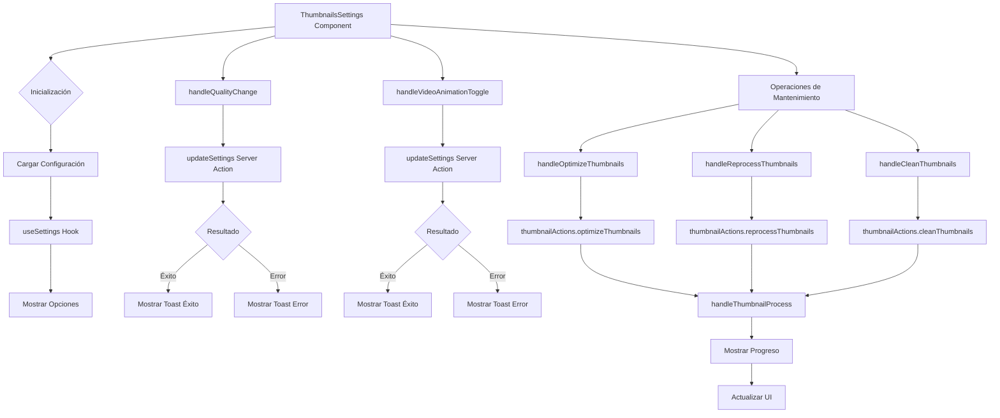

# Módulo Thumbnails Settings

## Descripción

El módulo Thumbnails Settings proporciona una interfaz para configurar y gestionar las miniaturas de imágenes en la aplicación. Permite controlar la calidad de las miniaturas, gestionar la animación de miniaturas de video, y realizar operaciones de mantenimiento como optimización, reprocesamiento y limpieza.

## Estructura de Archivos

```
src/components/settings/thumbnails/
├── thumbnails-settings.tsx   # Componente principal con la interfaz de usuario
└── README.md                 # Documentación del módulo
```

## Diagrama de Flujo



## Características

- **Configuración de Calidad**:
  - Selección del nivel de calidad de las miniaturas (baja, media, alta, original)
  - Impacto visual de cada nivel de calidad en tamaño de archivo y nitidez

- **Configuración de Animación de Videos**:
  - Activación/desactivación de animaciones en miniaturas de video
  - Mejora de rendimiento con opciones personalizables

- **Operaciones de Mantenimiento**:
  - Optimización de miniaturas existentes
  - Reprocesamiento de miniaturas
  - Limpieza de miniaturas huérfanas o dañadas

- **Monitoreo de Progreso**:
  - Visualización en tiempo real del progreso de operaciones
  - Estadísticas detalladas de la operación en curso

## Integración con la Configuración Global

El componente utiliza el hook `useSettings` para acceder y modificar la configuración global de la aplicación:

```typescript
const { settings, updateSettings } = useSettings();
```

## Ejemplo de Uso

```tsx
// En una página o layout
import { ThumbnailsSettings } from '@/components/settings/thumbnails/thumbnails-settings';

export default function ThumbnailsPage() {
  return (
    <div className="container mx-auto p-4">
      <h1 className="text-xl font-bold mb-4">Configuración de Miniaturas</h1>
      <ThumbnailsSettings />
    </div>
  );
}
```

## Servicios Utilizados

- **ToastService**: Para notificaciones de éxito/error en operaciones
- **ThumbnailActions**: Para operaciones específicas de miniaturas (optimizar, reprocesar, limpiar)
- **SettingsContext**: Para acceder y modificar la configuración global

## Acciones de Miniaturas

El componente implementa varias acciones para gestionar las miniaturas:

```typescript
// Ejemplo de acción para optimizar miniaturas
const handleOptimizeThumbnails = () =>
  handleThumbnailProcess(
    (callbacks) => thumbnailActions.optimizeThumbnails(callbacks),
    'Optimización'
  );
```

## Notas de Implementación

- Las operaciones de mantenimiento pueden ser intensivas en recursos y tomar tiempo
- El componente proporciona feedback visual durante operaciones largas
- Se implementan mecanismos para cancelar operaciones en progreso
- Los cambios en la calidad afectan a las nuevas miniaturas generadas
- El reprocesamiento regenera todas las miniaturas existentes