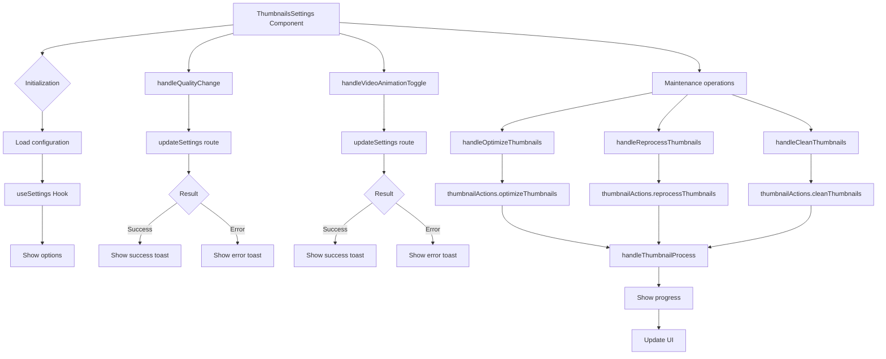

# Thumbnails settings module

## Description

The Thumbnails Settings module provides an interface that configures and manages image thumbnails.

The module controls thumbnail quality, video thumbnail animation, and maintenance operations such as optimize, reprocess, and clean.

## File structure

```
src/components/settings/thumbnails/
├── thumbnails-settings.tsx   # Main component with the user interface
└── README.md                 # Module documentation
```

## Flow diagram



## Features

The module provides the following features:

- **Quality configuration**:
  - Selection of thumbnail quality (low, medium, high, original)
  - Visual impact of each quality level on file size and sharpness

- **Video animation configuration**:
  - Enable or disable animation on video thumbnails
  - Performance improvement with customizable options

- **Maintenance operations**:
  - Optimization of existing thumbnails
  - Reprocessing of thumbnails
  - Cleanup of orphaned or damaged thumbnails

- **Progress monitoring**:
  - Real-time display of operation progress
  - Detailed statistics of the current operation

## Integration with global settings

The component uses the `useSettings` hook to access and change the global application configuration:

```typescript
const { settings, updateSettings } = useSettings();
```

## Usage example

```tsx
// In a page or layout
import { ThumbnailsSettings } from '@/components/settings/thumbnails/thumbnails-settings';

export default function ThumbnailsPage() {
	return (
		<div className="container mx-auto p-4">
			<h1 className="text-xl font-bold mb-4">Thumbnail Settings</h1>
			<ThumbnailsSettings />
		</div>
	);
}
```

## Services used

The component uses the following services:

- **ToastService**: Success and error notifications for operations
- **ThumbnailActions**: Thumbnail operations (optimize, reprocess, clean)
- **SettingsContext**: Access and change of global configuration

## Thumbnail actions

The component implements several actions that manage thumbnails:

```typescript
// Example action that optimizes thumbnails
const handleOptimizeThumbnails = () =>
	handleThumbnailProcess((callbacks) => thumbnailActions.optimizeThumbnails(callbacks), 'Optimization');
```

## Implementation notes

Maintenance operations can be resource intensive and take time.

The component provides visual feedback during long operations.

The component implements mechanisms that cancel operations in progress.

Quality changes affect newly generated thumbnails.

Reprocessing regenerates all existing thumbnails.
