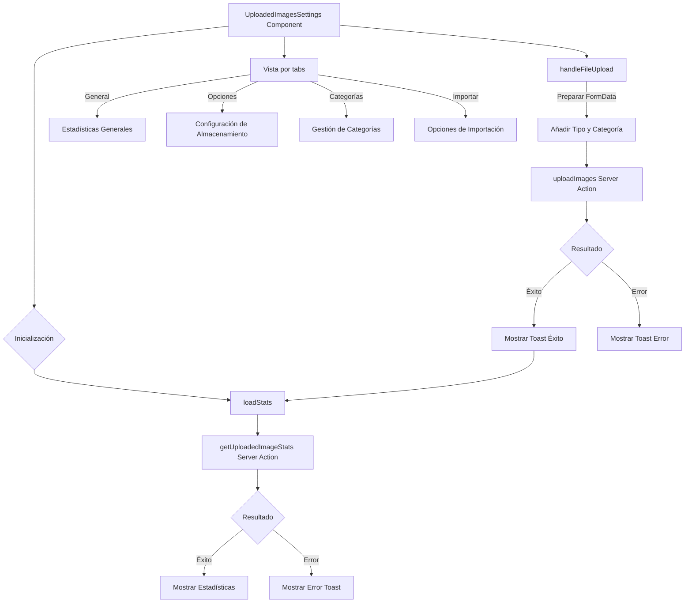

# Módulo Uploaded Images Settings

## Descripción

El módulo Uploaded Images Settings proporciona una interfaz para gestionar y configurar las imágenes subidas en la aplicación. Permite la visualización de estadísticas, carga de imágenes, configuración de opciones de almacenamiento, y gestión de categorías e importación.

## Estructura de Archivos

```
src/components/settings/uploaded-images/
├── uploaded-images-settings.tsx    # Componente principal con la interfaz de usuario
└── README.md                       # Documentación del módulo
```

## Diagrama de Flujo



## Características

- **Visualización de Estadísticas**:
  - Total de imágenes subidas
  - Espacio en disco utilizado
  - Distribución por tipo
  - Distribución por categoría

- **Gestión de Imágenes**:
  - Carga de imágenes individuales o múltiples
  - Filtros para búsqueda y visualización
  - Opciones de optimización

- **Configuración de Almacenamiento**:
  - Optimización automática
  - Conservación de metadatos
  - Formato de conversión
  - Eliminación masiva (con confirmación)

- **Importación Avanzada**:
  - Opciones de arrastrar y soltar
  - Importación desde carpeta
  - Importación desde URL
  - Configuración de tipo y categoría predeterminados

## Integración con Server Actions

El componente utiliza server actions para operaciones que requieren acceso directo a recursos del servidor:

- `getUploadedImageStats`: Obtiene estadísticas de las imágenes subidas
- `uploadImages`: Procesa y almacena las imágenes subidas por el usuario

## Ejemplo de Uso

```tsx
// En una página o layout
import { UploadedImagesSettings } from '@/components/settings/uploaded-images/uploaded-images-settings';

export default function UploadedImagesPage() {
  return (
    <div className="container mx-auto p-4">
      <h1 className="text-xl font-bold mb-4">Gestión de Imágenes Subidas</h1>
      <UploadedImagesSettings />
    </div>
  );
}
```

## Animaciones

El componente utiliza `motion/react` para animaciones suaves en la interfaz de usuario, especialmente en la apertura y cierre de los filtros y las transiciones entre tabs.

## Servicios Utilizados

- **ToastService**: Para notificaciones de éxito/error en operaciones
- **ServerLogger**: Para registro de errores y eventos en el servidor

## Notas de Implementación

- La interfaz utiliza un sistema de pestañas (tabs) para organizar la funcionalidad
- Se implementan diálogos de confirmación para operaciones destructivas
- La carga de archivos admite selección mediante diálogo o arrastrar y soltar
- Los filtros proporcionan búsqueda avanzada por nombre, tipo y otras propiedades