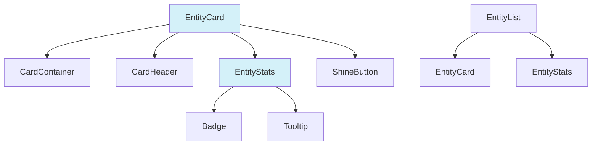
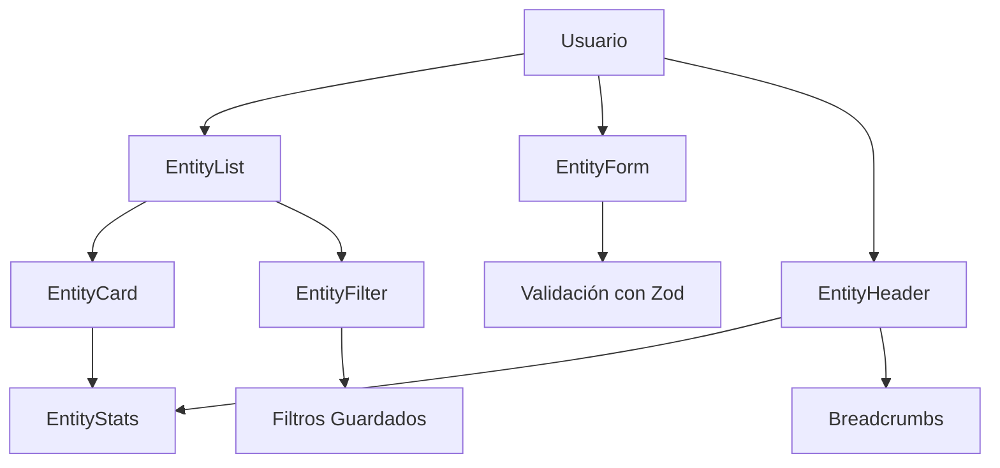

# Componentes de UI Reutilizables - Image Manager

Esta carpeta contiene los componentes de UI reutilizables que pueden ser utilizados en toda la aplicación.
Los componentes siguen un diseño moderno y coherente, utilizando Tailwind CSS y shadcn/ui como base.

## Estructura de Componentes

Los componentes están organizados de la siguiente manera:

```
ui/
  ├── [componente].tsx        # Componente individual
  ├── [componente-grupo]/     # Grupo de componentes relacionados
  |    ├── index.ts           # Exportaciones
  |    └── [sub-componente].tsx
  └── README.md               # Documentación
```

## Componentes Nuevos

### EntityStats

Un componente flexible para mostrar estadísticas relacionadas con entidades.

```tsx
import { EntityStats } from '@/components/ui/entity-stats';

// Ejemplo de uso
<EntityStats
	stats={[
		{ value: 128, label: 'imágenes', icon: <CameraIcon /> },
		{ value: 12, label: 'vídeos', icon: <FilmIcon /> },
	]}
	primaryColor="#3b82f6"
	size="md"
	animated={true}
	asBadges={false}
/>;
```

#### Props

| Prop           | Tipo                   | Default   | Descripción                           |
| -------------- | ---------------------- | --------- | ------------------------------------- |
| `stats`        | `StatItem[]`           | -         | Array de estadísticas a mostrar       |
| `primaryColor` | `string`               | '#3b82f6' | Color principal para las estadísticas |
| `size`         | `'sm' \| 'md' \| 'lg'` | 'md'      | Tamaño del componente                 |
| `animated`     | `boolean`              | `true`    | Activar animación al aparecer         |
| `asBadges`     | `boolean`              | `false`   | Mostrar como badges en lugar de lista |
| `className`    | `string`               | -         | Clases adicionales                    |

#### StatItem Interface

```ts
interface StatItem {
	value: number; // Valor numérico
	label: string; // Etiqueta descriptiva
	icon?: React.ReactNode; // Icono opcional
	color?: string; // Color personalizado
	description?: string; // Descripción para tooltip
	id?: string; // ID único para la estadística
}
```

### EntityCard

Un componente de tarjeta genérico y reutilizable para mostrar entidades del sistema.

```tsx
import { EntityCard } from '@/components/ui/entity-card';

// Ejemplo de uso básico
<EntityCard
  title="Mi carpeta"
  subtitle="Carpeta"
  description="Descripción de la carpeta"
  icon={<FolderIcon />}
  stats={stats}
  primaryColor="#10b981"
  href="/carpetas/123"
/>

// Con modo TCG y animación
<EntityCard
  title="Personaje"
  subtitle="Worldbuilding"
  description="Descripción del personaje"
  icon={<UserIcon />}
  stats={stats}
  tcgMode={true}
  animationMode="always"
  onClick={handleClick}
/>
```

#### Props

| Prop             | Tipo                            | Default   | Descripción                        |
| ---------------- | ------------------------------- | --------- | ---------------------------------- |
| `title`          | `string`                        | -         | Título de la tarjeta               |
| `subtitle`       | `string`                        | -         | Subtítulo opcional                 |
| `description`    | `string`                        | -         | Descripción corta                  |
| `icon`           | `React.ReactNode`               | -         | Icono para mostrar junto al título |
| `primaryColor`   | `string`                        | '#3b82f6' | Color principal para la tarjeta    |
| `secondaryColor` | `string`                        | -         | Color secundario para gradientes   |
| `href`           | `string`                        | -         | URL para navegación                |
| `onClick`        | `() => void`                    | -         | Función para manejar clic          |
| `stats`          | `StatItem[]`                    | -         | Estadísticas a mostrar             |
| `tcgMode`        | `boolean`                       | `false`   | Activar modo TCG                   |
| `compact`        | `boolean`                       | `false`   | Modo compacto con menos altura     |
| `interactive`    | `boolean`                       | `true`    | Si debe ser interactiva            |
| `thumbnails`     | `string[]`                      | -         | Imágenes en miniatura              |
| `className`      | `string`                        | -         | Clases adicionales                 |
| `footer`         | `React.ReactNode`               | -         | Contenido adicional para el pie    |
| `animationMode`  | `'hover' \| 'always' \| 'none'` | 'hover'   | Modo de animación                  |

### EntityList

Componente para mostrar listas de entidades con opciones avanzadas de búsqueda, filtrado, ordenación y visualización.

```jsx
<EntityList
	items={entities}
	title="Mis Imágenes"
	description="Colección de imágenes personales"
	onItemClick={(id) => handleImageClick(id)}
	categoryFilters={['Naturaleza', 'Ciudad', 'Personas']}
	tagFilters={['favorito', 'vacaciones', 'trabajo']}
	showSearch={true}
	pagination={true}
	itemsPerPage={12}
/>
```

**Props:**

| Prop                | Tipo                                                               | Default           | Descripción                                      |
| ------------------- | ------------------------------------------------------------------ | ----------------- | ------------------------------------------------ |
| `items`             | `EntityItem[]`                                                     | `[]`              | Array de entidades a mostrar                     |
| `title`             | `string`                                                           | `'Entidades'`     | Título de la lista                               |
| `description`       | `string`                                                           | `undefined`       | Descripción opcional                             |
| `emptyState`        | `ReactNode`                                                        | (predeterminado)  | Contenido personalizado para estado vacío        |
| `viewType`          | `'grid' \| 'list' \| 'compact'`                                    | `'grid'`          | Tipo de visualización inicial                    |
| `allowViewChange`   | `boolean`                                                          | `true`            | Permitir cambiar el tipo de vista                |
| `showSearch`        | `boolean`                                                          | `true`            | Mostrar barra de búsqueda                        |
| `showFilters`       | `boolean`                                                          | `true`            | Mostrar controles de filtrado                    |
| `allowSelection`    | `boolean`                                                          | `false`           | Permitir selección múltiple de ítems             |
| `onSelectionChange` | `(ids: string[]) => void`                                          | `undefined`       | Callback al cambiar la selección                 |
| `searchPlaceholder` | `string`                                                           | `'Buscar...'`     | Texto del placeholder de búsqueda                |
| `pagination`        | `boolean`                                                          | `true`            | Activar paginación                               |
| `itemsPerPage`      | `number`                                                           | `9`               | Ítems a mostrar por página                       |
| `sortOptions`       | `Array<{label: string, value: string, sortFn?: (a, b) => number}>` | (predeterminados) | Opciones de ordenación                           |
| `categoryFilters`   | `string[]`                                                         | `[]`              | Categorías disponibles para filtrar              |
| `tagFilters`        | `string[]`                                                         | `[]`              | Etiquetas disponibles para filtrar               |
| `className`         | `string`                                                           | `''`              | Clases CSS adicionales                           |
| `onItemClick`       | `(id: string) => void`                                             | `undefined`       | Función a llamar al hacer clic en un ítem        |
| `tcgMode`           | `boolean`                                                          | `false`           | Usar modo de tarjeta de trading para EntityCards |

### TagInput

Un componente avanzado para la entrada de etiquetas, con soporte para autocompletado, validación y personalización.

[Ver documentación y ejemplos de TagInput](./tag/README.md)

## Integración con Sistema de Diseño

Estos componentes se integran perfectamente con el sistema de diseño de la aplicación:

1. **Temas:** Soportan modo claro y oscuro automáticamente
2. **Responsive:** Diseñados para funcionar en todos los tamaños de pantalla
3. **Accesibilidad:** Incluyen atributos ARIA y navegación por teclado
4. **Tailwind CSS:** Utilizan clases de Tailwind CSS para estilos
5. **shadcn/ui:** Extienden componentes base de shadcn/ui

## Ejemplos de Uso

Para ver ejemplos completos y variantes, consulta:

- `src/examples/EntityCardExample.tsx` - Muestra diferentes configuraciones de tarjetas y estadísticas
- `src/examples/EntityListExample.tsx` - Muestra ejemplos de uso de EntityList

## Diagrama de Relaciones



## Modos de Visualización

### Modo TCG

El modo TCG (Trading Card Game) transforma las tarjetas para que se parezcan a cartas coleccionables:

- Bordes decorativos en las esquinas
- Efectos de brillo y animación
- Integración con ShineButton para efectos de hover
- Estilos visuales mejorados

### Modo Compacto

El modo compacto reduce la altura de las tarjetas y optimiza el contenido para espacios más pequeños:

- Altura reducida
- Descripción limitada a una sola línea
- Espaciado interno ajustado

### Modos de Animación

Los componentes soportan tres modos de animación:

- **hover:** Animación solo al pasar el cursor (por defecto)
- **always:** Animación constante para destacar elementos
- **none:** Sin animación para interfaces más sobrias

## Buenas Prácticas

Al utilizar estos componentes:

1. Proporcionar colores consistentes para las entidades
2. Utilizar iconos apropiados para cada tipo de entidad
3. Mantener descripciones concisas (idealmente <150 caracteres)
4. Limitar las estadísticas a las más relevantes (4-5 máximo)
5. Considerar el modo compacto para listas densas
6. Reservar el modo TCG para vistas especiales o destacadas

## Personalización

Ambos componentes son altamente personalizables a través de props. Para casos especiales:

- Usa `className` para añadir estilos personalizados
- Proporciona contenido personalizado a través de `footer`
- Personaliza los colores con `primaryColor` y `secondaryColor`
- Ajusta el comportamiento de interacción con `interactive` y `animationMode`

# Componentes UI Reutilizables para Entidades

Este directorio contiene componentes reutilizables para la gestión de entidades, diseñados para proporcionar una experiencia de usuario consistente en toda la aplicación.

## 📝 Índice

- [EntityCard](#entitycard) - Tarjeta para mostrar entidades
- [EntityList](#entitylist) - Lista o grid de entidades con búsqueda y filtros
- [EntityStats](#entitystats) - Mostrar estadísticas de entidades
- [EntityForm](#entityform) - Formulario dinámico para entidades
- [EntityHeader](#entityheader) - Encabezado de página para entidades
- [EntityFilter](#entityfilter) - Sistema avanzado de filtros

## Diagrama de Componentes



## Componentes

### EntityCard

Tarjeta genérica para mostrar información de entidades con soporte para diferentes modos de visualización.

**Características principales:**

- Soporte para modo compacto
- Modo TCG (Trading Card Game)
- Animaciones configurables
- Muestra de estadísticas y miniaturas

### EntityList

Componente para mostrar listas o grids de entidades con capacidades avanzadas.

**Características principales:**

- Múltiples modos de vista (grid, lista, compacto)
- Búsqueda y filtrado
- Ordenación configurable
- Selección múltiple de elementos
- Paginación

### EntityStats

Componente para mostrar estadísticas de entidades en diferentes formatos.

**Características principales:**

- Formato de badges o lista
- Animaciones de números
- Personalización de colores
- Diferentes tamaños

### EntityForm

Formulario dinámico para la creación y edición de entidades con validación avanzada.

**Características principales:**

- Generación dinámica de formularios
- Validación con Zod
- Múltiples tipos de campos
- Manejo de errores consistente
- Confirmación antes de enviar
- Integración con toast

**Tipos de campos soportados:**

- `text` - Campos de texto simples
- `textarea` - Áreas de texto
- `select` - Selector de opciones
- `multiselect` - Selector múltiple
- `switch` - Interruptor booleano
- `color` - Selector de color con picker
- `emoji` - Selector de emoji
- `tags` - Campo para etiquetas
- `date` - Selector de fecha
- `number` - Campo numérico
- `url` - Campo para URLs

**Ejemplo de uso:**

```tsx
import { EntityForm, EntityFormField } from '@/components/ui/entity-form';

// Definir campos
const fields: EntityFormField[] = [
	{
		name: 'name',
		label: 'Nombre',
		type: 'text',
		required: true,
		validation: {
			minLength: 3,
			maxLength: 50,
		},
	},
	{
		name: 'description',
		label: 'Descripción',
		type: 'textarea',
		fullWidth: true,
	},
	// ... más campos
];

// Usar en componente
function MyForm() {
	const handleSubmit = async (data) => {
		// Procesar datos
		console.log(data);
	};

	return (
		<EntityForm
			title="Crear entidad"
			description="Complete los campos para crear una nueva entidad"
			fields={fields}
			onSubmit={handleSubmit}
			initialData={{ name: 'Valor inicial' }}
		/>
	);
}
```

### EntityHeader

Componente de encabezado para páginas de entidades, que incluye título, descripción, breadcrumbs, acciones y estadísticas.

**Características principales:**

- Breadcrumbs integrados
- Acciones principales y secundarias (en menú desplegable)
- Integración con estadísticas
- Botón de favorito
- Imagen destacada
- Personalización de colores

**Ejemplo de uso:**

```tsx
import { EntityHeader } from '@/components/ui/entity-header';

function EntityDetailPage() {
	return (
		<EntityHeader
			title="Mi Entidad"
			subtitle="Categoría: General"
			description="Descripción detallada de la entidad..."
			backUrl="/entidades"
			primaryColor="#3b82f6"
			stats={[
				{ label: 'Elementos', value: 42 },
				{ label: 'Vistas', value: 1024 },
			]}
			breadcrumbItems={[
				{ label: 'Inicio', href: '/' },
				{ label: 'Entidades', href: '/entidades' },
				{ label: 'Mi Entidad' },
			]}
			actions={[
				{
					label: 'Editar',
					icon: <PencilIcon />,
					onClick: () => handleEdit(),
				},
				{
					label: 'Eliminar',
					variant: 'destructive',
					inDropdown: true,
					onClick: () => handleDelete(),
				},
			]}
		/>
	);
}
```

### EntityFilter

Componente avanzado para filtros complejos de entidades, con soporte para guardado y reutilización de filtros.

**Características principales:**

- Múltiples tipos de filtros
- Búsqueda rápida
- Guardado de filtros personalizados
- Vista de filtros activos como badges
- UI adaptable (compacta o normal)

**Tipos de filtros soportados:**

- `text` - Búsqueda por texto
- `select` - Selector de opciones
- `multiselect` - Selector múltiple
- `checkbox` - Lista de checkboxes
- `radio` - Grupo de radio buttons
- `date` - Selector de fecha
- `dateRange` - Rango de fechas
- `number` - Campo numérico
- `numberRange` - Rango numérico
- `boolean` - Filtro booleano

**Ejemplo de uso:**

```tsx
import { EntityFilter, EntityFilterDefinition } from '@/components/ui/entity-filter';

function FilteredList() {
	const [filterValues, setFilterValues] = useState({});

	// Definir filtros
	const filters: EntityFilterDefinition[] = [
		{
			id: 'category',
			label: 'Categoría',
			type: 'select',
			options: [
				{ label: 'General', value: 'general' },
				{ label: 'Técnico', value: 'technical' },
			],
		},
		{
			id: 'isActive',
			label: 'Activo',
			type: 'boolean',
		},
		// ... más filtros
	];

	return (
		<div>
			<EntityFilter filters={filters} onChange={setFilterValues} showQuickSearch={true} allowSavedFilters={true} />

			{/* Mostrar resultados filtrados */}
			<div>Resultados que coinciden con los filtros: {filterValues.toString()}</div>
		</div>
	);
}
```

## Integración entre componentes

Estos componentes están diseñados para trabajar juntos, creando una experiencia de usuario coherente:

1. `EntityList` puede usarse para mostrar una colección de `EntityCard`
2. `EntityHeader` puede usarse en la página de detalle de una entidad
3. `EntityForm` puede usarse para crear/editar la entidad
4. `EntityFilter` puede integrarse con `EntityList` para filtrado avanzado

## Personalización

Todos los componentes admiten personalización mediante:

- Props específicos para cada componente
- Tematización a través de colores
- Clases CSS adicionales usando `className`
- Uso de `cn()` para combinar clases condicionales

## Accesibilidad

Los componentes siguen las mejores prácticas de accesibilidad:

- Etiquetas adecuadas para campos de formulario
- Mensajes de error descriptivos
- Soporte para navegación por teclado
- Atributos ARIA apropiados
- Contraste adecuado de colores

## Mejoras futuras

Próximas mejoras planeadas para estos componentes:

1. **EntityForm**:
   - Soporte para validación asíncrona
   - Campos anidados y arrays
   - Más tipos de campos especializados

2. **EntityHeader**:
   - Modo compacto para espacios reducidos
   - Soporte para acciones contextuales basadas en estado

3. **EntityFilter**:
   - Filtros anidados y combinados
   - Exportación/importación de filtros
   - Previsualización de resultados
