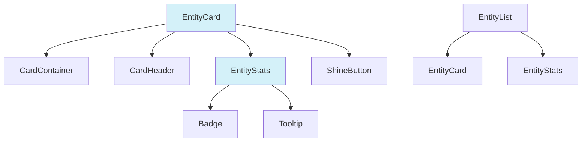
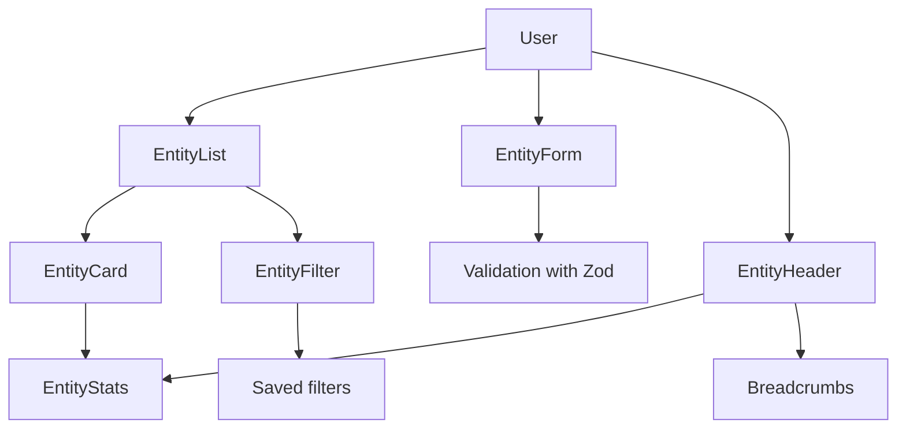

# Reusable UI components - Media Manager

This folder contains reusable UI components that you can use across the application.

The components follow a modern and coherent design.

The components use Tailwind CSS and shadcn/ui as a base.

## Component structure

The components are organized in the following way:

```
ui/
  ├── [component].tsx        # Individual component
  ├── [component-group]/     # Group of related components
  |    ├── index.ts           # Exports
  |    └── [sub-component].tsx
  └── README.md               # Documentation
```

## New components

### EntityStats

This flexible component shows statistics related to entities.

```tsx
import { EntityStats } from '@/components/ui/entity-stats';

// Usage example
<EntityStats
	stats={[
		{ value: 128, label: 'images', icon: <CameraIcon /> },
		{ value: 12, label: 'videos', icon: <FilmIcon /> },
	]}
	primaryColor="#3b82f6"
	size="md"
	animated={true}
	asBadges={false}
/>;
```

#### Props

| Prop           | Type                   | Default   | Description                           |
| -------------- | ---------------------- | --------- | ------------------------------------- |
| `stats`        | `StatItem[]`           | -         | Array of statistics to display        |
| `primaryColor` | `string`               | '#3b82f6' | Main color for the statistics         |
| `size`         | `'sm' \| 'md' \| 'lg'` | 'md'      | Size of the component                 |
| `animated`     | `boolean`              | `true`    | Enable animation on appear            |
| `asBadges`     | `boolean`              | `false`   | Show as badges instead of a list      |
| `className`    | `string`               | -         | Extra classes                         |

#### StatItem interface

```ts
interface StatItem {
	value: number; // Numeric value
	label: string; // Descriptive label
	icon?: React.ReactNode; // Optional icon
	color?: string; // Custom color
	description?: string; // Description for tooltip
	id?: string; // Unique ID for the statistic
}
```

### EntityCard

This generic reusable card component shows system entities.

```tsx
import { EntityCard } from '@/components/ui/entity-card';

// Basic usage example
<EntityCard
  title="My folder"
  subtitle="Folder"
  description="Folder description"
  icon={<FolderIcon />}
  stats={stats}
  primaryColor="#10b981"
  href="/folders/123"
/>

// With TCG mode and animation
<EntityCard
  title="Character"
  subtitle="Worldbuilding"
  description="Character description"
  icon={<UserIcon />}
  stats={stats}
  tcgMode={true}
  animationMode="always"
  onClick={handleClick}
/>
```

#### Props

| Prop             | Type                            | Default   | Description                        |
| ---------------- | ------------------------------- | --------- | ---------------------------------- |
| `title`          | `string`                        | -         | Card title                         |
| `subtitle`       | `string`                        | -         | Optional subtitle                  |
| `description`    | `string`                        | -         | Short description                  |
| `icon`           | `React.ReactNode`               | -         | Icon to show next to the title     |
| `primaryColor`   | `string`                        | '#3b82f6' | Main color for the card            |
| `secondaryColor` | `string`                        | -         | Secondary color for gradients      |
| `href`           | `string`                        | -         | URL for navigation                 |
| `onClick`        | `() => void`                    | -         | Function that handles a click      |
| `stats`          | `StatItem[]`                    | -         | Statistics to display              |
| `tcgMode`        | `boolean`                       | `false`   | Enable TCG mode                    |
| `compact`        | `boolean`                       | `false`   | Compact mode with less height      |
| `interactive`    | `boolean`                       | `true`    | Whether the card must be interactive |
| `thumbnails`     | `string[]`                      | -         | Thumbnail images                   |
| `className`      | `string`                        | -         | Extra classes                      |
| `footer`         | `React.ReactNode`               | -         | Extra content for the footer       |
| `animationMode`  | `'hover' \| 'always' \| 'none'` | 'hover'   | Animation mode                     |

### EntityList

This component shows entity lists with advanced search, filter, sort, and display options.

```jsx
<EntityList
	items={entities}
	title="My Images"
	description="Personal image collection"
	onItemClick={(id) => handleImageClick(id)}
	categoryFilters={['Nature', 'City', 'People']}
	tagFilters={['favorite', 'vacation', 'work']}
	showSearch={true}
	pagination={true}
	itemsPerPage={12}
/>
```

**Props:**

| Prop                | Type                                                               | Default           | Description                                      |
| ------------------- | ------------------------------------------------------------------ | ----------------- | ------------------------------------------------ |
| `items`             | `EntityItem[]`                                                     | `[]`              | Array of entities to display                     |
| `title`             | `string`                                                           | `'Entities'`      | List title                                       |
| `description`       | `string`                                                           | `undefined`       | Optional description                             |
| `emptyState`        | `ReactNode`                                                        | (default)         | Custom content for the empty state               |
| `viewType`          | `'grid' \| 'list' \| 'compact'`                                    | `'grid'`          | Initial display type                             |
| `allowViewChange`   | `boolean`                                                          | `true`            | Allow change of the view type                    |
| `showSearch`        | `boolean`                                                          | `true`            | Show the search bar                              |
| `showFilters`       | `boolean`                                                          | `true`            | Show filter controls                             |
| `allowSelection`    | `boolean`                                                          | `false`           | Allow multi-select of items                      |
| `onSelectionChange` | `(ids: string[]) => void`                                          | `undefined`       | Callback when the selection changes              |
| `searchPlaceholder` | `string`                                                           | `'Search...'`     | Search placeholder text                          |
| `pagination`        | `boolean`                                                          | `true`            | Enable pagination                                |
| `itemsPerPage`      | `number`                                                           | `9`               | Items to show per page                           |
| `sortOptions`       | `Array<{label: string, value: string, sortFn?: (a, b) => number}>` | (defaults)        | Sort options                                     |
| `categoryFilters`   | `string[]`                                                         | `[]`              | Categories available for filter                  |
| `tagFilters`        | `string[]`                                                         | `[]`              | Tags available for filter                        |
| `className`         | `string`                                                           | `''`              | Extra CSS classes                                |
| `onItemClick`       | `(id: string) => void`                                             | `undefined`       | Function that runs on a click on an item         |
| `tcgMode`           | `boolean`                                                          | `false`           | Use trading-card mode for EntityCards            |

### TagInput

This advanced component supports Tag entry with autocomplete, validation, and customization.

[See TagInput documentation and examples](./tag/README.md)

## Integration with the design system

These components integrate with the application design system.

The integration includes the following points:

1. **Themes:** Support light and dark mode automatically
2. **Responsive:** Designed to work on all screen sizes
3. **Accessibility:** Include ARIA attributes and keyboard navigation
4. **Tailwind CSS:** Use Tailwind CSS classes for styles
5. **shadcn/ui:** Extend base shadcn/ui components

## Usage examples

For complete examples and variants, see the following files:

- `src/examples/EntityCardExample.tsx` - Shows different card and statistics configurations
- `src/examples/EntityListExample.tsx` - Shows EntityList usage examples

## Relation diagram



## Display modes

### TCG mode

TCG (Trading Card Game) mode transforms cards so that they look like collectible cards.

The mode includes the following elements:

- Decorative borders on the corners
- Glow and animation effects
- Integration with ShineButton for hover effects
- Enhanced visual styles

### Compact mode

Compact mode reduces card height and optimizes content for smaller spaces.

The mode includes the following changes:

- Reduced height
- Description limited to a single line
- Adjusted internal spacing

### Animation modes

The components support three animation modes.

The modes are the following:

- **hover:** Animation only on hover (default)
- **always:** Constant animation to highlight elements
- **none:** No animation for quieter interfaces

## Good practices

When you use these components, follow these practices.

Provide consistent colors for entities.

Use appropriate icons for each entity type.

Keep descriptions concise. Keep them under 150 characters.

Limit statistics to the most relevant items. Use 4 or 5 at most.

Use compact mode for dense lists.

Reserve TCG mode for special or featured views.

## Customization

Both components are highly customizable through props.

For special cases, use the following options:

- Use `className` to add custom styles
- Provide custom content through `footer`
- Customize colors with `primaryColor` and `secondaryColor`
- Adjust interaction behavior with `interactive` and `animationMode`

# Reusable UI components for entities

This directory contains reusable components for entity management.

The components provide a consistent user experience across the application.

## Index

The directory includes the following components:

- [EntityCard](#entitycard) - Card that shows entities
- [EntityList](#entitylist) - Entity list or grid with search and filters
- [EntityStats](#entitystats) - Display of entity statistics
- [EntityForm](#entityform) - Dynamic form for entities
- [EntityHeader](#entityheader) - Page header for entities
- [EntityFilter](#entityfilter) - Advanced filter system

## Component diagram



## Components

### EntityCard

This generic card shows entity information with support for different display modes.

**Main features:**

The card provides the following features:

- Support for compact mode
- TCG (Trading Card Game) mode
- Configurable animations
- Display of statistics and thumbnails

### EntityList

This component shows entity lists or grids with advanced capabilities.

**Main features:**

The list provides the following features:

- Multiple view modes (grid, list, compact)
- Search and filter
- Configurable sort
- Multi-select of items
- Pagination

### EntityStats

This component shows entity statistics in different formats.

**Main features:**

The component provides the following features:

- Badge or list format
- Number animations
- Color customization
- Different sizes

### EntityForm

This dynamic form creates and edits entities with advanced validation.

**Main features:**

The form provides the following features:

- Dynamic form generation
- Validation with Zod
- Multiple field types
- Consistent error handling
- Confirmation before submit
- Integration with toast

**Supported field types:**

The form supports the following field types:

- `text` - Simple text fields
- `textarea` - Text areas
- `select` - Option selector
- `multiselect` - Multi selector
- `switch` - Boolean switch
- `color` - Color selector with picker
- `emoji` - Emoji selector
- `tags` - Field for Tags
- `date` - Date selector
- `number` - Numeric field
- `url` - Field for URLs

**Usage example:**

```tsx
import { EntityForm, EntityFormField } from '@/components/ui/entity-form';

// Define fields
const fields: EntityFormField[] = [
	{
		name: 'name',
		label: 'Name',
		type: 'text',
		required: true,
		validation: {
			minLength: 3,
			maxLength: 50,
		},
	},
	{
		name: 'description',
		label: 'Description',
		type: 'textarea',
		fullWidth: true,
	},
	// ... more fields
];

// Use in a component
function MyForm() {
	const handleSubmit = async (data) => {
		// Process data
		console.log(data);
	};

	return (
		<EntityForm
			title="Create entity"
			description="Fill in the fields to create a new entity"
			fields={fields}
			onSubmit={handleSubmit}
			initialData={{ name: 'Initial value' }}
		/>
	);
}
```

### EntityHeader

This header component for entity pages includes title, description, breadcrumbs, actions, and statistics.

**Main features:**

The header provides the following features:

- Integrated breadcrumbs
- Primary and secondary actions (in a dropdown menu)
- Integration with statistics
- Favorite button
- Featured image
- Color customization

**Usage example:**

```tsx
import { EntityHeader } from '@/components/ui/entity-header';

function EntityDetailPage() {
	return (
		<EntityHeader
			title="My Entity"
			subtitle="Category: General"
			description="Detailed description of the entity..."
			backUrl="/entities"
			primaryColor="#3b82f6"
			stats={[
				{ label: 'Items', value: 42 },
				{ label: 'Views', value: 1024 },
			]}
			breadcrumbItems={[
				{ label: 'Home', href: '/' },
				{ label: 'Entities', href: '/entities' },
				{ label: 'My Entity' },
			]}
			actions={[
				{
					label: 'Edit',
					icon: <PencilIcon />,
					onClick: () => handleEdit(),
				},
				{
					label: 'Delete',
					variant: 'destructive',
					inDropdown: true,
					onClick: () => handleDelete(),
				},
			]}
		/>
	);
}
```

### EntityFilter

This advanced component supports complex entity filters with save and reuse of filters.

**Main features:**

The filter provides the following features:

- Multiple filter types
- Quick search
- Save of custom filters
- View of active filters as badges
- Adaptive UI (compact or normal)

**Supported filter types:**

The filter supports the following types:

- `text` - Search by text
- `select` - Option selector
- `multiselect` - Multi selector
- `checkbox` - Checkbox list
- `radio` - Radio button group
- `date` - Date selector
- `dateRange` - Date range
- `number` - Numeric field
- `numberRange` - Numeric range
- `boolean` - Boolean filter

**Usage example:**

```tsx
import { EntityFilter, EntityFilterDefinition } from '@/components/ui/entity-filter';

function FilteredList() {
	const [filterValues, setFilterValues] = useState({});

	// Define filters
	const filters: EntityFilterDefinition[] = [
		{
			id: 'category',
			label: 'Category',
			type: 'select',
			options: [
				{ label: 'General', value: 'general' },
				{ label: 'Technical', value: 'technical' },
			],
		},
		{
			id: 'isActive',
			label: 'Active',
			type: 'boolean',
		},
		// ... more filters
	];

	return (
		<div>
			<EntityFilter filters={filters} onChange={setFilterValues} showQuickSearch={true} allowSavedFilters={true} />

			{/* Show filtered results */}
			<div>Results that match the filters: {filterValues.toString()}</div>
		</div>
	);
}
```

## Integration between components

These components are designed to work together and create a coherent user experience.

The integration includes the following uses:

1. `EntityList` can show a collection of `EntityCard`
2. `EntityHeader` can be used on the detail page of an entity
3. `EntityForm` can create or edit the entity
4. `EntityFilter` can integrate with `EntityList` for advanced filtering

## Customization

All components support customization through the following options:

- Props specific to each component
- Theming through colors
- Extra CSS classes with `className`
- Use of `cn()` to combine conditional classes

## Accessibility

The components follow accessibility practices.

The practices include the following:

- Adequate labels for form fields
- Descriptive error messages
- Support for keyboard navigation
- Appropriate ARIA attributes
- Adequate color contrast

## Future improvements

The following improvements are planned for these components:

1. **EntityForm**:
   - Support for asynchronous validation
   - Nested fields and arrays
   - More specialized field types

2. **EntityHeader**:
   - Compact mode for reduced spaces
   - Support for contextual actions based on state

3. **EntityFilter**:
   - Nested and combined filters
   - Export and import of filters
   - Result preview
