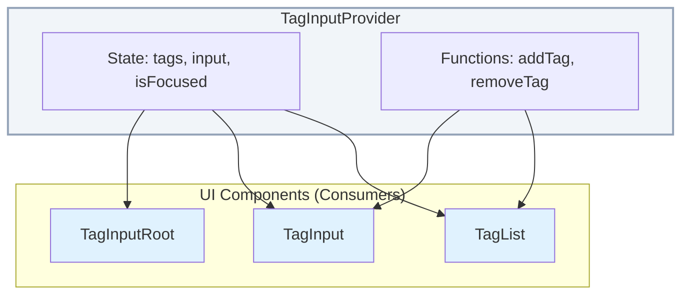

# TagInput Component

El componente `TagInput` permite a los usuarios introducir y gestionar una lista de etiquetas. Está construido con un patrón de proveedor de contexto para una máxima flexibilidad y composición.

## Anatomía del Componente

```
<TagInputProvider>
  <TagInputRoot>
    <TagList />
    <TagInput />
  </TagInputRoot>
</TagInputProvider>
```

## Componentes y Hooks

### `TagInputProvider`

Es el componente raíz que envuelve toda la lógica y el estado. Debe ser el padre de cualquier componente de `TagInput`.

**Props**

| Prop           | Tipo                       | Default     | Descripción                                           |
| -------------- | -------------------------- | ----------- | ----------------------------------------------------- |
| `value`        | `string[]`                 | `[]`        | Valor controlado para las etiquetas.                  |
| `defaultValue` | `string[]`                 | `[]`        | Valor inicial para las etiquetas (no controlado).     |
| `onChange`     | `(tags: string[]) => void` | `undefined` | Callback que se ejecuta cuando las etiquetas cambian. |
| `disabled`     | `boolean`                  | `false`     | Si el componente está deshabilitado.                  |
| `children`     | `React.ReactNode`          | `required`  | Los componentes hijos.                                |

### `useTagInput`

Un hook de React que proporciona acceso al contexto del `TagInput`. Debe ser utilizado dentro de un `TagInputProvider`.

**Retorna**

| Prop                 | Tipo                                                 | Descripción                                       |
| -------------------- | ---------------------------------------------------- | ------------------------------------------------- |
| `tags`               | `string[]`                                           | La lista actual de etiquetas.                     |
| `input`              | `string`                                             | El valor actual del campo de entrada.             |
| `isFocused`          | `boolean`                                            | Si el campo de entrada está enfocado.             |
| `addTag`             | `(tag: string) => void`                              | Función para agregar una nueva etiqueta.          |
| `removeTag`          | `(index: number) => void`                            | Función para eliminar una etiqueta por su índice. |
| `handleInputChange`  | `(e: React.ChangeEvent<HTMLInputElement>) => void`   | Manejador para el evento `onChange` del input.    |
| `handleInputKeyDown` | `(e: React.KeyboardEvent<HTMLInputElement>) => void` | Manejador para el evento `onKeyDown` del input.   |
| `handleInputFocus`   | `() => void`                                         | Manejador para el evento `onFocus` del input.     |
| `handleInputBlur`    | `() => void`                                         | Manejador para el evento `onBlur` del input.      |
| `disabled`           | `boolean`                                            | Si el componente está deshabilitado.              |

### `TagInputRoot`

El contenedor principal para los elementos del `TagInput`. Controla el estado de foco y la apariencia general. Se renderiza como un `div`.

### `TagList`

Componente que renderiza la lista de etiquetas. Utiliza el componente `Badge` para cada etiqueta.

### `TagInput`

El campo de entrada de texto para agregar nuevas etiquetas. Se renderiza como un `Input`.

## Ejemplo de Uso

```tsx
import { TagInput, TagInputProvider, TagInputRoot, TagList } from '@/components/ui/tag';
import * as React from 'react';

export function TagInputExample() {
	const [tags, setTags] = React.useState(['React', 'TypeScript']);

	return (
		<TagInputProvider value={tags} onChange={setTags}>
			<TagInputRoot>
				<TagList />
				<TagInput placeholder="Agrega un nuevo tag..." />
			</TagInputRoot>
		</TagInputProvider>
	);
}
```

## Diagrama de Flujo


