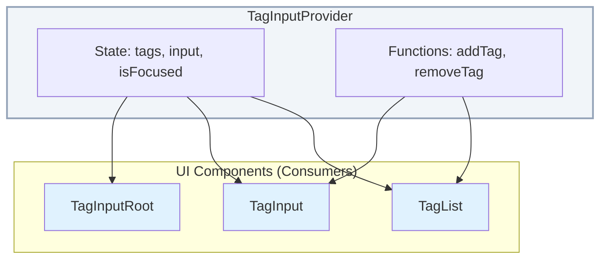

# TagInput component

The `TagInput` component lets users enter and manage a list of Tags.

The component uses a context-provider pattern for flexibility and composition.

## Component anatomy

```
<TagInputProvider>
  <TagInputRoot>
    <TagList />
    <TagInput />
  </TagInputRoot>
</TagInputProvider>
```

## Components and hooks

### `TagInputProvider`

This root component wraps the logic and state.

`TagInputProvider` must be the parent of any `TagInput` component.

**Props**

| Prop           | Type                       | Default     | Description                                |
| -------------- | -------------------------- | ----------- | ------------------------------------------ |
| `value`        | `string[]`                 | `[]`        | Controlled value for the Tags.             |
| `defaultValue` | `string[]`                 | `[]`        | Initial value for the Tags (uncontrolled). |
| `onChange`     | `(tags: string[]) => void` | `undefined` | Callback that runs when the Tags change.   |
| `disabled`     | `boolean`                  | `false`     | Whether the component is disabled.         |
| `children`     | `React.ReactNode`          | `required`  | The child components.                      |

### `useTagInput`

This React hook provides access to the `TagInput` context.

Use this hook inside a `TagInputProvider`.

**Returns**

| Prop                 | Type                                                 | Description                              |
| -------------------- | ---------------------------------------------------- | ---------------------------------------- |
| `tags`               | `string[]`                                           | The current list of Tags.                |
| `input`              | `string`                                             | The current value of the input field.    |
| `isFocused`          | `boolean`                                            | Whether the input field is focused.      |
| `addTag`             | `(tag: string) => void`                              | Function that adds a new Tag.            |
| `removeTag`          | `(index: number) => void`                            | Function that removes a Tag by index.    |
| `handleInputChange`  | `(e: React.ChangeEvent<HTMLInputElement>) => void`   | Handler for the input `onChange` event.  |
| `handleInputKeyDown` | `(e: React.KeyboardEvent<HTMLInputElement>) => void` | Handler for the input `onKeyDown` event. |
| `handleInputFocus`   | `() => void`                                         | Handler for the input `onFocus` event.   |
| `handleInputBlur`    | `() => void`                                         | Handler for the input `onBlur` event.    |
| `disabled`           | `boolean`                                            | Whether the component is disabled.       |

### `TagInputRoot`

This is the main container for `TagInput` elements.

The container controls focus state and overall appearance.

The container renders as a `div`.

### `TagList`

This component renders the list of Tags.

The list uses the `Badge` component for each Tag.

### `TagInput`

This is the text input field for new Tags.

The field renders as an `Input`.

## Usage example

```tsx
import { TagInput, TagInputProvider, TagInputRoot, TagList } from '@/components/ui/tag';
import * as React from 'react';

export function TagInputExample() {
	const [tags, setTags] = React.useState(['React', 'TypeScript']);

	return (
		<TagInputProvider value={tags} onChange={setTags}>
			<TagInputRoot>
				<TagList />
				<TagInput placeholder="Add a new tag..." />
			</TagInputRoot>
		</TagInputProvider>
	);
}
```

## Flow diagram


