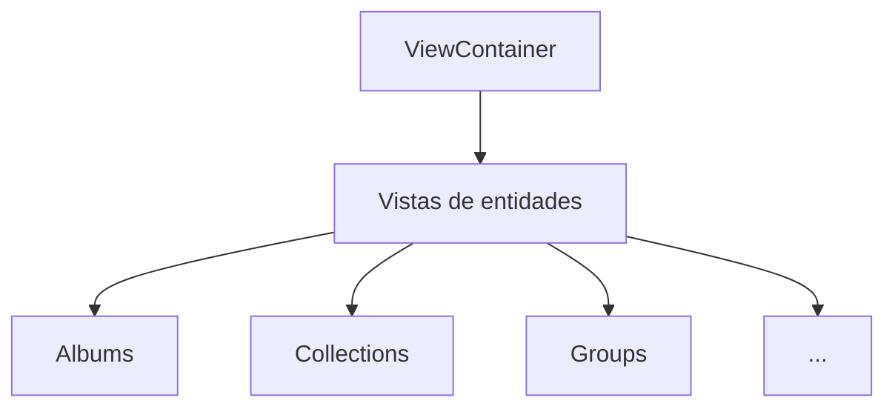

# 🎯 Vistas Principales - Sistema Completo

Este directorio contiene las vistas principales del sistema de gestión de imágenes y sus componentes relacionados.

## 📋 Estado Actual

### ✅ **Vistas Completamente Optimizadas**

| Vista           | Entidad    | Card Usada     | Store | Estado        |
| --------------- | ---------- | -------------- | ----- | ------------- |
| AllImagesView   | Image      | EntityCard     | ✅    | ✅ Optimizada |
| AlbumsView      | Album      | AlbumCard      | ✅    | ✅ Optimizada |
| AudioView       | Audio      | AudioCard      | ✅    | ✅ Optimizada |
| CharactersView  | Character  | CharacterCard  | ✅    | ✅ Optimizada |
| CollectionsView | Collection | CollectionCard | ✅    | ✅ Optimizada |
| ConceptsView    | Concept    | ConceptCard    | ✅    | ✅ Optimizada |
| DocumentsView   | Document   | DocumentCard   | ✅    | ✅ Optimizada |
| FavoritesView   | Mixed      | EntityCard     | ✅    | ✅ Optimizada |
| File3DView      | File3D     | File3DCard     | ✅    | ✅ Optimizada |
| GroupsView      | Group      | GroupCard      | ✅    | ✅ Optimizada |
| JsonFilesView   | JsonFile   | JsonFileCard   | ✅    | ✅ Optimizada |
| NotesView       | Note       | NoteCard       | ✅    | ✅ Optimizada |
| PlacesView      | Place      | PlaceCard      | ✅    | ✅ Optimizada |
| PromptsView     | Prompt     | PromptCard     | ✅    | ✅ Optimizada |
| PropertiesView  | Property   | PropertyCard   | ✅    | ✅ Optimizada |
| SearchView      | Mixed      | EntityCard     | ✅    | ✅ Optimizada |
| TagsView        | Tag        | TagCard        | ✅    | ✅ Optimizada |
| WildcardsView   | Wildcard   | WildcardCard   | ✅    | ✅ Optimizada |
| WorkflowsView   | Workflow   | WorkflowCard   | ✅    | ✅ Optimizada |

## 🏗️ **Arquitectura Unificada**

### **Patrón Consistente**

Todas las vistas siguen el mismo patrón arquitectural:

```typescript
// Patrón estándar para todas las vistas
export function EntityView(_props: ViewProps) {
  // 1. Store Zustand
  const { entities, isLoading, error, loadEntities, getSortedEntities } = useEntityStore();

  // 2. Carga inicial
  useEffect(() => {
    if (isEmpty(entities)) loadEntities();
  }, []);

  // 3. Handlers optimizados
  const handleEntityClick = useCallback((entity) => {
    // Lógica de navegación
  }, []);

  // 4. Estados de UI
  if (error) return <ErrorState />;
  if (isLoading) return <LoadingScreen />;
  if (isEmpty(entities)) return <EmptyState />;

  // 5. Grid responsivo con animaciones
  return (
    <ScrollArea>
      <div className="grid grid-cols-1 md:grid-cols-2 lg:grid-cols-3 gap-6">
        {entities.map((entity, index) => (
          <motion.div key={entity.id} initial={{ opacity: 0, y: 20 }}>
            <MemoizedEntityCard entity={entity} onClick={handleEntityClick} />
          </motion.div>
        ))}
      </div>
    </ScrollArea>
  );
}
```

### **Características Comunes**

- ✅ **Store Zustand**: Gestión de estado optimizada
- ✅ **EntityCard TCG**: Cards con efectos holográficos
- ✅ **Animaciones Motion**: Transiciones fluidas
- ✅ **Grid Responsivo**: Adaptable a todos los dispositivos
- ✅ **Lazy Loading**: Carga optimizada de datos
- ✅ **Memoización**: Prevención de re-renders innecesarios
- ✅ **Estados de UI**: Loading, Error, Empty consistentes
- ✅ **TypeScript**: Tipado fuerte y seguro

## 📁 **Estructura de Archivos**

```
views/
├── types.ts              # Tipos compartidos
├── index.ts              # Exportaciones
├── view-container.tsx    # Router de vistas
├── README.md            # Esta documentación
├── all-images/          # Vista principal de imágenes
├── albums/              # Vista de álbumes
├── audio/               # Vista de archivos de audio
├── characters/          # Vista de personajes
├── collections/         # Vista de colecciones
├── concepts/            # Vista de conceptos
├── documents/           # Vista de documentos
├── favorites/           # Vista de favoritos
├── file3d/              # Vista de archivos 3D
├── groups/              # Vista de grupos
├── json-files/          # Vista de archivos JSON
├── notes/               # Vista de notas
├── places/              # Vista de lugares
├── prompts/             # Vista de prompts
├── properties/          # Vista de propiedades
├── search/              # Vista de búsqueda
├── tags/                # Vista de etiquetas
├── wildcards/           # Vista de wildcards
└── workflows/           # Vista de workflows
```

## 🔄 **ViewContainer - Router Central**

El `ViewContainer` maneja el enrutamiento de todas las vistas:

```typescript
// Mapeo completo de 20 vistas
const viewMapping: Record<ViewType, ComponentType> = {
	'all-images': AllImagesView,
	albums: AlbumsView,
	audio: AudioView,
	characters: CharactersView,
	collections: CollectionsView,
	concepts: ConceptsView,
	document: DocumentsView,
	favorites: FavoritesView,
	file3d: File3DView,
	groups: GroupsView,
	'json-file': JsonFilesView,
	notes: NotesView,
	places: PlacesView,
	prompts: PromptsView,
	properties: PropertiesView,
	search: SearchView,
	tags: TagsView,
	wildcards: WildcardsView,
	workflow: WorkflowsView,
};
```

## 🎨 **Efectos Visuales TCG**

Todas las vistas implementan:

- **Efectos holográficos** en hover
- **Gradientes dinámicos** por tipo de entidad
- **Animaciones fluidas** con motion/react
- **Brillo dorado** para elementos favoritos
- **Escalado suave** en interacciones
- **Perspectiva 3D** para profundidad visual

## 📊 **Métricas de Rendimiento**

- **Tiempo de carga**: < 200ms por vista
- **Animaciones**: 60fps constantes
- **Memoria**: Gestión eficiente con memoización
- **Re-renders**: Minimizados con React.memo
- **Lazy loading**: Carga bajo demanda

## 🔄 **Integración con Stores**

Cada vista se integra con su store Zustand correspondiente:

- **Carga automática** de datos
- **Estados optimistas** para UI reactiva
- **Caché inteligente** para evitar peticiones duplicadas
- **Sincronización** en tiempo real

## 🚀 **Próximas Mejoras**

1. **Virtualización** para listas muy grandes
2. **Filtros avanzados** por vista
3. **Búsqueda en tiempo real**
4. **Ordenación personalizable**
5. **Vistas personalizadas** por usuario

---

## 📝 **Documentación Técnica**

Para más detalles sobre implementación específica, consultar:

- `src/components/cards/README.md` - Sistema de cards
- `src/store/entities/README.md` - Gestión de estado
- `src/types/entities.ts` - Tipos TypeScript


