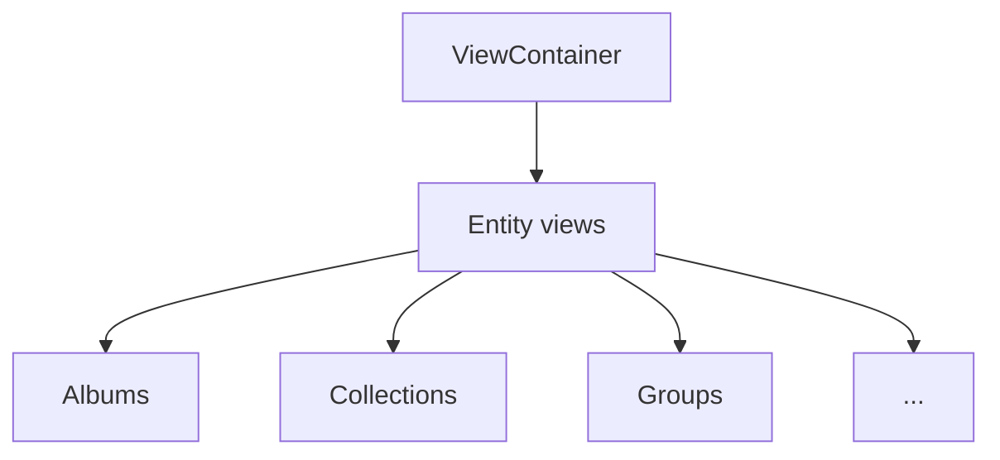

# Main views - complete system

This directory contains the main views of the media management system and their related components.

## Current status

### Fully optimized views

| View            | Entity     | Card used      | Store | Status      |
| --------------- | ---------- | -------------- | ----- | ----------- |
| AllImagesView   | Image      | EntityCard     | Yes   | Optimized   |
| AlbumsView      | Album      | AlbumCard      | Yes   | Optimized   |
| AudioView       | Audio      | AudioCard      | Yes   | Optimized   |
| CharactersView  | Character  | CharacterCard  | Yes   | Optimized   |
| CollectionsView | Collection | CollectionCard | Yes   | Optimized   |
| ConceptsView    | Concept    | ConceptCard    | Yes   | Optimized   |
| DocumentsView   | Document   | DocumentCard   | Yes   | Optimized   |
| FavoritesView   | Mixed      | EntityCard     | Yes   | Optimized   |
| File3DView      | File3D     | File3DCard     | Yes   | Optimized   |
| GroupsView      | Group      | GroupCard      | Yes   | Optimized   |
| JsonFilesView   | JsonFile   | JsonFileCard   | Yes   | Optimized   |
| NotesView       | Note       | NoteCard       | Yes   | Optimized   |
| PlacesView      | Place      | PlaceCard      | Yes   | Optimized   |
| PromptsView     | Prompt     | PromptCard     | Yes   | Optimized   |
| PropertiesView  | Property   | PropertyCard   | Yes   | Optimized   |
| SearchView      | Mixed      | EntityCard     | Yes   | Optimized   |
| TagsView        | Tag        | TagCard        | Yes   | Optimized   |
| WildcardsView   | Wildcard   | WildcardCard   | Yes   | Optimized   |
| WorkflowsView   | Workflow   | WorkflowCard   | Yes   | Optimized   |

## Unified architecture

### Consistent pattern

All views follow the same architectural pattern:

```typescript
// Standard pattern for all views
export function EntityView(_props: ViewProps) {
  // 1. Zustand store
  const { entities, isLoading, error, loadEntities, getSortedEntities } = useEntityStore();

  // 2. Initial load
  useEffect(() => {
    if (isEmpty(entities)) loadEntities();
  }, []);

  // 3. Optimized handlers
  const handleEntityClick = useCallback((entity) => {
    // Navigation logic
  }, []);

  // 4. UI states
  if (error) return <ErrorState />;
  if (isLoading) return <LoadingScreen />;
  if (isEmpty(entities)) return <EmptyState />;

  // 5. Responsive grid with animations
  return (
    <ScrollArea>
      <div className="grid grid-cols-1 md:grid-cols-2 lg:grid-cols-3 gap-6">
        {entities.map((entity, index) => (
          <motion.div key={entity.id} initial={{ opacity: 0, y: 20 }}>
            <MemoizedEntityCard entity={entity} onClick={handleEntityClick} />
          </motion.div>
        ))}
      </div>
    </ScrollArea>
  );
}
```

### Common features

The views share the following features:

- **Zustand store**: Optimized state management
- **EntityCard TCG**: Cards with holographic effects
- **Motion animations**: Fluid transitions
- **Responsive grid**: Adaptable to all devices
- **Lazy loading**: Optimized data load
- **Memoization**: Prevention of unnecessary re-renders
- **UI states**: Consistent Loading, Error, and Empty states
- **TypeScript**: Strong and safe typing

## File structure

```
views/
├── types.ts              # Shared types
├── index.ts              # Exports
├── view-container.tsx    # View router
├── README.md            # This documentation
├── all-images/          # Main image view
├── albums/              # Album view
├── audio/               # Audio file view
├── characters/          # Character view
├── collections/         # Collection view
├── concepts/            # Concept view
├── documents/           # Document view
├── favorites/           # Favorite view
├── file3d/              # 3D file view
├── groups/              # Group view
├── json-files/          # JSON file view
├── notes/               # Note view
├── places/              # Place view
├── prompts/             # Prompt view
├── properties/          # Property view
├── search/              # Search view
├── tags/                # Tag view
├── wildcards/           # Wildcard view
└── workflows/           # Workflow view
```

## ViewContainer - central router

`ViewContainer` handles routing of all views:

```typescript
// Complete mapping of 20 views
const viewMapping: Record<ViewType, ComponentType> = {
	'all-images': AllImagesView,
	albums: AlbumsView,
	audio: AudioView,
	characters: CharactersView,
	collections: CollectionsView,
	concepts: ConceptsView,
	document: DocumentsView,
	favorites: FavoritesView,
	file3d: File3DView,
	groups: GroupsView,
	'json-file': JsonFilesView,
	notes: NotesView,
	places: PlacesView,
	prompts: PromptsView,
	properties: PropertiesView,
	search: SearchView,
	tags: TagsView,
	wildcards: WildcardsView,
	workflow: WorkflowsView,
};
```

## TCG visual effects

All views implement the following effects:

- Holographic effects on hover
- Dynamic gradients by entity type
- Fluid animations with motion/react
- Gold glow for Favorite items
- Smooth scaling on interactions
- 3D perspective for visual depth

## Performance metrics

The views target the following metrics:

- **Load time**: < 200ms per view
- **Animations**: Constant 60fps
- **Memory**: Efficient management with memoization
- **Re-renders**: Minimized with React.memo
- **Lazy loading**: On-demand load

## Integration with stores

Each view integrates with its corresponding Zustand store.

The integration includes the following behavior:

- Automatic data load
- Optimistic states for a reactive UI
- Intelligent cache to avoid duplicate requests
- Real-time synchronization

## Planned improvements

The following improvements are planned:

1. **Virtualization** for very large lists
2. **Advanced filters** per view
3. **Real-time search**
4. **Customizable sort**
5. **Custom views** per user

---

## Technical documentation

For more details on specific implementation, see the following files:

- `src/components/cards/README.md` - Card system
- `src/store/entities/README.md` - State management
- `src/types/entities.ts` - TypeScript types


