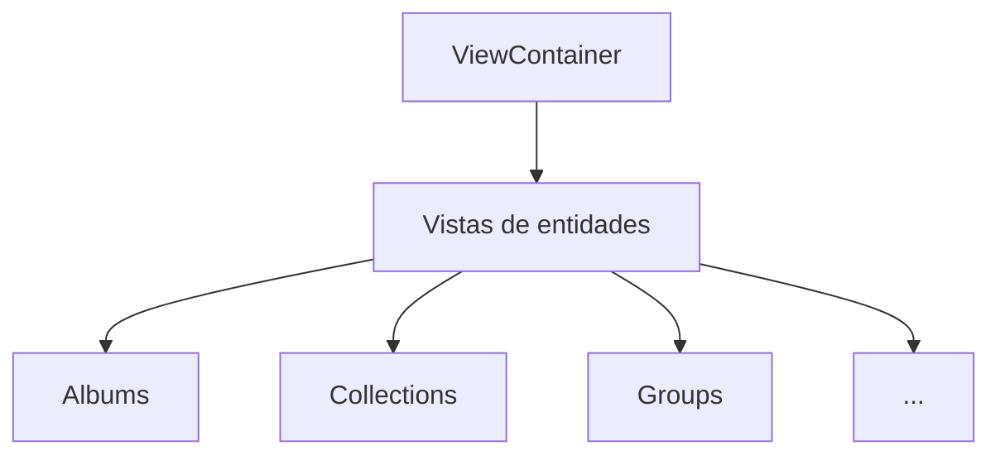

# Vistas Principales

Este directorio agrupa las vistas de cada entidad y se conecta con el `ViewContainer` para el enrutamiento interno.

## Archivos

- **view-container.tsx**: Componente que decide qué vista mostrar según el estado.
- **types.ts**: Tipos y enumeraciones usados por las vistas.
- **index.ts**: Archivo de exportación.

### Subcarpetas destacadas

- `albums/`, `collections/`, `groups/`, etc.: Cada carpeta implementa su propia vista y contenido.
- `development/`: Panel de desarrollo con documentación específica.

