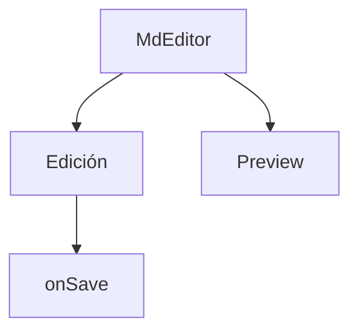

# Editor Markdown minimalista

Esta vista permite editar y previsualizar archivos Markdown usando `@uiw/react-md-editor`.

## Características

- Edición WYSIWYG y preview en vivo.
- Botón de guardar (puede conectarse a persistencia real).
- Import dinámico para compatibilidad SSR.

## Ejemplo de uso

```tsx
<MdEditor initialValue={"# Título\nTexto"} onSave={console.log} />
```

## Dependencias

- `@uiw/react-md-editor` (agregar con `pnpm add @uiw/react-md-editor`)

## Extensiones futuras

- Soporte para imágenes, tablas y shortcuts.
- Integración con persistencia y control de versiones.

---


