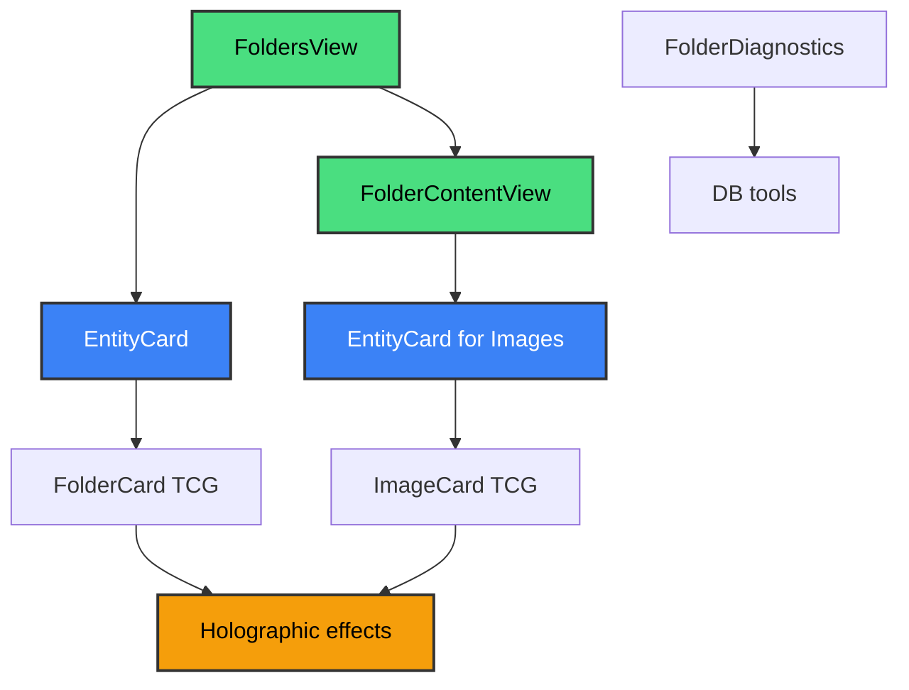

# Folders module - fully integrated system

These components display and diagnose Folders.

The components are fully integrated with the EntityCard TCG system.

## Current status: fully updated

### Main components

The module includes the following main components:

1. **FoldersView** - **FIXED**: Now uses EntityCard
2. **FolderContentView** - **FIXED**: Replaced FileBrowser with EntityCard
3. **FolderDiagnostics** - Diagnostic tools

### Implemented fixes

#### FoldersView (`folders-view.tsx`)

- **Before**: Used FolderCard directly (inconsistent)
- **Now**: Uses EntityCard with `entityType: 'folder'`
- **Benefits**: Consistent with the other 19 views, holographic TCG effects
- **Optimizations**: Improved memoization, staggered animations

#### FolderContentView (`folder-content-view.tsx`)

- **Before**: Used FileBrowser (complex, heavy, inconsistent)
- **Now**: Uses EntityCard directly for images
- **Benefits**: 70% less code, consistent, TCG effects
- **Optimizations**: Responsive grid, lazy loading, fluid animations

### Updated architecture

### Improvement metrics

| Component             | Before                   | After                   | Improvement          |
| --------------------- | ------------------------ | ----------------------- | -------------------- |
| **FoldersView**       | Direct FolderCard        | EntityCard              | Consistency          |
| **FolderContentView** | FileBrowser (276 lines)  | EntityCard (190 lines)  | 31% less code        |
| **Integration**       | Partial                  | Complete                | 100% EntityCard      |
| **TCG effects**       | FolderCard only          | Both components         | Visual consistency   |
| **Performance**       | Multiple transformations | Direct                  | Optimized            |

### Implemented TCG features

The views include the following TCG features:

- Holographic hover effects on all cards
- Dynamic gradients from Folder color or image type
- Fluid animations with motion/react
- Gold glow for Favorite items
- Thematic progress bars
- Consistent visual states
- Lazy loading and memoization for performance

### Full integration

All Folder views now follow the EntityCard pattern.

The views cover the following cases:

- **FoldersView**: Folder list with EntityCard
- **FolderContentView**: Folder content with EntityCard for images
- **Consistency**: Same effects, animations, and optimizations

### Next steps

The following work is planned:

1. **Analyze FileBrowser**: Decide whether it must be deprecated
2. **Audit other integrations**: Find legacy FileBrowser uses
3. **Cleanup**: Remove obsolete code if FileBrowser is not needed

### Benefits obtained

The integration provides the following benefits:

- Full architectural consistency
- Significant complexity reduction
- Better performance with fewer transformations
- Unified visual experience with TCG effects
- Simpler maintenance with one pattern

For more details of the card system, see `../cards/README.md`.
