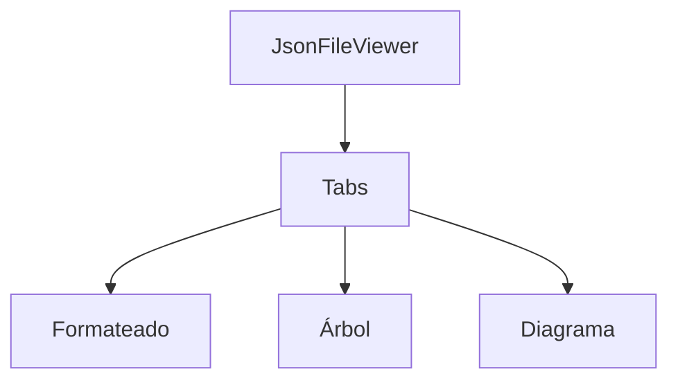

# Visor avanzado de archivos JSON

Esta vista permite visualizar archivos JSON en tres modos:

- **Formateado**: Muestra el JSON con indentación y permite copiar al portapapeles.
- **Objeto (árbol)**: Usa `react-json-view-lite` para explorar el JSON como árbol interactivo, también con opción de copiar.
- **Diagrama**: Genera un string mermaid básico a partir del objeto (extensible a renderizado real).

## Ejemplo de uso

```tsx
<JsonFileViewer name="config.json" json={{ foo: 'bar', arr: [1,2,3] }} />
```

## Dependencias

- `react-json-view-lite` (agregar con `pnpm add react-json-view-lite`)

## Extensiones futuras

- Renderizado real de mermaid para diagramas.
- Edición y validación de JSON.

---


