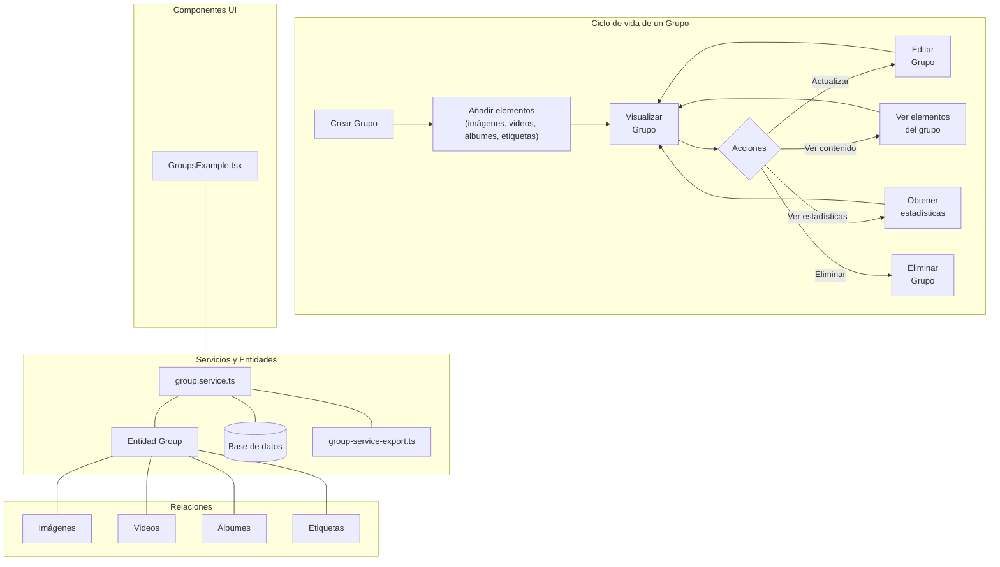

# Group - Documentación

## Descripción

Los Grupos (Groups) son entidades que permiten organizar y categorizar distintos tipos de contenido multimedia como imágenes, videos, álbumes y etiquetas. Proporcionan una forma flexible de agrupar elementos relacionados bajo un mismo identificador visual y conceptual.

## Diagrama de Flujo



## Estructura de Archivos

```
src/
├── types/
│   └── entities/
│       └── group.ts            # Definiciones de tipos para Group
├── services/
│   ├── group.service.ts        # Servicio principal para operaciones CRUD
│   └── group-service-export.ts # Exportación de funciones del servicio
├── components/
│   └── examples/
│       └── GroupsExample.tsx   # Componente de ejemplo para Grupos
└── docs/
    └── Group.md                # Esta documentación
```

### Descripción de los Archivos Principales

#### 1. `types/entities/group.ts`

Define los tipos de datos para la entidad Group y sus operaciones:

- `Group`: Entidad básica
- `GroupComplete`: Entidad con relaciones completas
- `GroupWithStats`: Entidad con estadísticas de elementos relacionados
- `CreateGroupData`: Datos para crear un nuevo grupo
- `UpdateGroupData`: Datos para actualizar un grupo existente
- `SearchGroupFilters`: Filtros para búsqueda de grupos

#### 2. `services/group.service.ts`

Implementa todas las operaciones CRUD para grupos:

- `create()`: Crear un nuevo grupo
- `get()`: Obtener un grupo por su ID
- `update()`: Actualizar un grupo existente
- `delete()`: Eliminar un grupo
- `search()`: Buscar grupos con filtros y paginación
- `getStats()`: Obtener estadísticas de un grupo

#### 3. `services/group-service-export.ts`

Exporta todas las funciones y constantes del servicio para facilitar su uso en la aplicación.

#### 4. `components/examples/GroupsExample.tsx`

Componente de ejemplo que muestra cómo utilizar el servicio de grupos en una interfaz de usuario interactiva.

## Propiedades de un Grupo

| Propiedad    | Tipo     | Descripción                                  | Requerido |
|--------------|----------|----------------------------------------------|-----------|
| id           | string   | Identificador único                          | Auto      |
| name         | string   | Nombre del grupo                             | Sí        |
| description  | string   | Descripción del propósito del grupo          | No        |
| emoji        | string   | Emoji representativo                         | Sí        |
| color        | string   | Color hexadecimal representativo             | Sí        |
| category     | string   | Categoría del grupo                          | No        |
| isFavorite   | boolean  | Indica si está marcado como favorito         | No        |
| createdAt    | Date     | Fecha de creación                            | Auto      |
| updatedAt    | Date     | Fecha de última actualización                | Auto      |

## Relaciones

Un grupo puede estar relacionado con:

- **Imágenes**: Múltiples imágenes pueden pertenecer a un grupo
- **Videos**: Múltiples videos pueden pertenecer a un grupo
- **Álbumes**: Múltiples álbumes pueden pertenecer a un grupo
- **Etiquetas**: Múltiples etiquetas pueden pertenecer a un grupo

## Ejemplos de Uso

### 1. Crear un nuevo grupo

```typescript
import { groupService } from '@/services/group-service-export';

async function createNewGroup() {
  try {
    const newGroup = await groupService.create({
      name: 'Vacaciones 2023',
      emoji: '🏖️',
      color: '#f59e0b',
      description: 'Fotos y videos de las vacaciones familiares',
      category: 'personal',
      isFavorite: true
    });

    console.log('Grupo creado:', newGroup);
    return newGroup;
  } catch (error) {
    console.error('Error al crear grupo:', error);
    throw error;
  }
}
```

### 2. Buscar grupos por filtros

```typescript
import { groupService } from '@/services/group-service-export';

async function searchGroups() {
  try {
    // Buscar grupos favoritos en la categoría 'personal'
    const result = await groupService.search(
      {
        isFavorite: true,
        category: 'personal'
      },
      {
        page: 1,
        pageSize: 10,
        sortBy: 'updatedAt',
        sortOrder: 'desc'
      }
    );

    console.log(`Se encontraron ${result.totalItems} grupos`);
    console.log('Grupos:', result.items);
    return result;
  } catch (error) {
    console.error('Error al buscar grupos:', error);
    throw error;
  }
}
```

### 3. Obtener estadísticas de un grupo

```typescript
import { groupService } from '@/services/group-service-export';

async function getGroupStats(groupId: string) {
  try {
    const stats = await groupService.getStats(groupId);

    console.log(`Grupo con ID ${groupId} contiene:`);
    console.log(`- ${stats._count.images} imágenes`);
    console.log(`- ${stats._count.videos} videos`);
    console.log(`- ${stats._count.albums} álbumes`);
    console.log(`- ${stats._count.tags} etiquetas`);
    console.log(`Total: ${stats.totalEntities} elementos`);

    return stats;
  } catch (error) {
    console.error('Error al obtener estadísticas:', error);
    throw error;
  }
}
```

### 4. Actualizar un grupo existente

```typescript
import { groupService } from '@/services/group-service-export';

async function updateGroup(groupId: string) {
  try {
    const updatedGroup = await groupService.update(groupId, {
      name: 'Vacaciones 2023 (Actualizado)',
      description: 'Fotos y videos actualizados de las vacaciones familiares',
      isFavorite: true
    });

    console.log('Grupo actualizado:', updatedGroup);
    return updatedGroup;
  } catch (error) {
    console.error('Error al actualizar grupo:', error);
    throw error;
  }
}
```

### 5. Eliminar un grupo

```typescript
import { groupService } from '@/services/group-service-export';

async function deleteGroup(groupId: string) {
  try {
    await groupService.delete(groupId);
    console.log(`Grupo con ID ${groupId} eliminado correctamente`);
    return true;
  } catch (error) {
    console.error('Error al eliminar grupo:', error);
    throw error;
  }
}
```

## Uso en Componentes

El componente `GroupsExample.tsx` proporciona un ejemplo completo de cómo implementar una interfaz de usuario para gestionar grupos, incluyendo:

1. Listado de grupos con paginación
2. Visualización de detalles de un grupo
3. Creación de nuevos grupos
4. Edición de grupos existentes
5. Eliminación de grupos
6. Visualización de estadísticas

Para utilizar este componente, simplemente impórtalo y añádelo a tu página:

```tsx
import GroupsExample from '@/components/examples/GroupsExample';

export default function GroupsPage() {
  return (
    <div>
      <h1>Gestión de Grupos</h1>
      <GroupsExample />
    </div>
  );
}
```

## Códigos de Error

El servicio de grupos puede devolver varios códigos de error específicos:

- `GROUP_NOT_FOUND`: El grupo especificado no existe
- `INVALID_GROUP_DATA`: Los datos proporcionados para crear/actualizar el grupo son inválidos
- `GROUP_NAME_REQUIRED`: El nombre del grupo es obligatorio
- `GROUP_NAME_EXISTS`: Ya existe un grupo con ese nombre

## Buenas Prácticas

1. **Nombres descriptivos**: Utiliza nombres descriptivos para los grupos que indiquen claramente su propósito.
2. **Emojis relevantes**: Elige emojis que representen visualmente el contenido del grupo.
3. **Colores consistentes**: Mantén una paleta de colores coherente para categorías similares.
4. **Categorización**: Utiliza la propiedad `category` para organizar grupos relacionados.
5. **Favoritos moderados**: Marca como favoritos solo los grupos más importantes para mantener la utilidad de esta característica.

## Consideraciones Técnicas

- La eliminación de un grupo no elimina los elementos contenidos en él, solo la relación.
- Las operaciones de búsqueda son optimizadas y paginadas para mejorar el rendimiento.
- Las estadísticas de grupos se calculan en tiempo real y pueden afectar al rendimiento con grupos muy grandes.