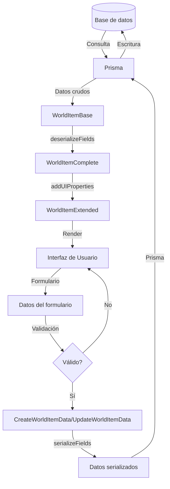

# Flujo de Datos y Sistema de Tipos

Este documento explica el flujo de datos y el sistema de tipos utilizado en la aplicación de gestión de imágenes, enfocándose en cómo los datos se transforman desde la base de datos hasta la interfaz de usuario y viceversa.

## Estructura de Tipos

Nuestro sistema utiliza una jerarquía de tipos para representar las entidades en diferentes etapas del flujo de datos:

### 1. Tipos Base

Los tipos base representan la estructura de datos tal como está almacenada en la base de datos. Estos tipos reflejan directamente las definiciones del esquema de Prisma.

```typescript
export interface WorldItemBase {
  id: string;
  name: string;
  // ...
  attributes: string;       // Almacenado como JSON string en la BD
  effects: string;          // Almacenado como JSON string en la BD
  stats: string;            // Almacenado como JSON string en la BD
  // ...
}
```

### 2. Tipos Complete (Con Campos Deserializados)

Estos tipos representan los datos después de que los campos JSON han sido deserializados a sus tipos correspondientes (arrays, objetos, etc.).

```typescript
export interface WorldItemComplete {
  id: string;
  name: string;
  // ...
  attributes: string[];     // Deserializado de JSON string a array
  effects: string[];        // Deserializado de JSON string a array
  stats: Record<string, any>; // Deserializado de JSON string a objeto
  // ...
}
```

### 3. Tipos Extended (Con Propiedades UI y Datos Calculados)

Estos tipos extienden los tipos Complete y añaden propiedades adicionales utilizadas por la interfaz de usuario o calculadas a partir de los datos base.

```typescript
export interface WorldItemExtended extends WorldItemComplete {
  // Propiedades calculadas
  displayRarity: string;
  rarityClass: string;
  isNew?: boolean;

  // Estado UI
  isSelected?: boolean;
  isExpanded?: boolean;
  // ...
}
```

### 4. Tipos para Operaciones CRUD

Tipos específicos para crear o actualizar entidades, con campos opcionales y validaciones.

```typescript
export interface CreateWorldItemData {
  name: string;
  attributes?: string[] | string;  // Acepta tanto arrays como strings JSON
  // ...
}

export interface UpdateWorldItemData {
  name?: string;
  attributes?: string[] | string;
  // ...
}
```

## Diagrama de Flujo de Datos



## Proceso de Serialización/Deserialización

### Deserialización (Base → Complete)

Cuando los datos se obtienen de la base de datos, pasan por un proceso de deserialización:

1. Se recuperan los datos mediante Prisma (tipo `WorldItemBase`)
2. Se aplica `toExtendedWorldItem` o la función equivalente para la entidad
3. Los campos JSON almacenados como strings se convierten a sus tipos correspondientes
4. Se devuelve un objeto de tipo `WorldItemExtended`

```typescript
// Ejemplo de deserialización
function getWorldItem(id: string) {
  const item = await prisma.worldItem.findUnique({ where: { id } });
  return toExtendedWorldItem(item);
}
```

### Serialización (Complete → Base)

Cuando los datos se envían a la base de datos, pasan por un proceso de serialización:

1. Se reciben datos del usuario (tipo `CreateWorldItemData` o `UpdateWorldItemData`)
2. Se aplica `fromExtendedWorldItem` o la función equivalente para la entidad
3. Los campos de tipos complejos (arrays, objetos) se convierten a strings JSON
4. Se envía el objeto serializado a Prisma para su almacenamiento

```typescript
// Ejemplo de serialización
function createWorldItem(data: CreateWorldItemData) {
  const serializedData = fromExtendedWorldItem(data);
  return prisma.worldItem.create({ data: serializedData });
}
```

## Convenciones de Nombrado

- **Base**: Entidades tal como se almacenan en la base de datos
- **Complete**: Entidades con campos JSON deserializados
- **Extended**: Entidades completas con propiedades UI adicionales
- **WithRelations**: Entidades que incluyen sus relaciones cargadas
- **WithStats**: Entidades que incluyen contadores y estadísticas

## Patrones de Transformación

### toEntityComplete

Convierte una entidad base a su versión con campos deserializados:

```typescript
export function toWorldItemComplete(worldItem: WorldItemBase): WorldItemComplete {
  return {
    ...worldItem,
    attributes: deserializeWorldItemAttributes(worldItem.attributes),
    effects: deserializeWorldItemEffects(worldItem.effects),
    // ...
  };
}
```

### fromEntityComplete

Convierte una entidad con campos deserializados a su versión base con campos serializados:

```typescript
export function fromWorldItemComplete(item: Partial<WorldItemComplete>): Partial<WorldItemBase> {
  return {
    ...item,
    attributes: item.attributes ? serializeWorldItemAttributes(item.attributes) : undefined,
    effects: item.effects ? serializeWorldItemEffects(item.effects) : undefined,
    // ...
  };
}
```

## Migración a Drizzle

En el proceso de migración de Prisma a Drizzle, estamos siguiendo el mismo patrón de tipos, pero añadiendo transformadores específicos:

```typescript
// Transformador Prisma → Drizzle
export function prismaWorldItemToDrizzle(item: WorldItemBase): DrizzleWorldItem {
  return {
    ...item,
    // Mapeo de campos específico de Drizzle si es necesario
  };
}

// Transformador Drizzle → Prisma
export function drizzleWorldItemToPrisma(item: DrizzleWorldItem): WorldItemBase {
  return {
    ...item,
    // Mapeo de campos específico de Prisma si es necesario
  };
}
```

## Conclusiones y Mejores Prácticas

1. **Usar los serializadores adecuados**: Siempre utilizar las funciones `toEntityComplete` y `fromEntityComplete` para transformar datos.

2. **Asumir campos JSON**: Todos los campos como `attributes`, `effects`, etc. deben tratarse como strings JSON en la base de datos.

3. **Validación de datos**: Validar los datos antes de serializarlos para evitar errores durante el guardado.

4. **Campos opcionales**: Utilizar interfaces con campos opcionales para actualizaciones parciales.

5. **Tipos importados**: Utilizar siempre tipos importados de sus respectivos módulos para mantener consistencia.

6. **Pruebas de transformación**: Siempre escribir pruebas para los transformadores de cada entidad.