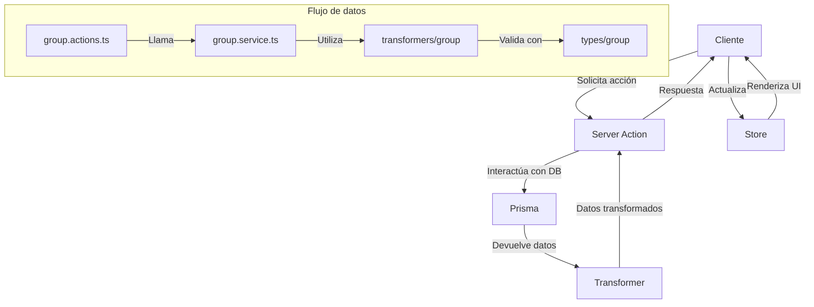

# Entidad Group

## Descripción

La entidad `Group` en el sistema de gestión de imágenes permite organizar y categorizar diferentes tipos de contenido bajo una estructura común. Los grupos funcionan como contenedores flexibles que pueden agrupar imágenes, videos, álbumes, colecciones, tags y otros elementos.

## Características principales

- **Identificación visual**: Cada grupo tiene un emoji y un color personalizable
- **Personalización**: Nombre, descripción y categoría configurables
- **Favoritos**: Marcado opcional como favorito para acceso rápido
- **Estadísticas**: Seguimiento de elementos asociados por tipo
- **Flexibilidad**: Soporte para múltiples tipos de entidades relacionadas

## Estructura de datos

### Modelo base (GroupBase)

```typescript
export interface GroupBase extends BaseEntity {
  id: string;
  name: string;
  emoji: string;
  color: string;
  description?: string | null;
  shortcut?: string | null;
  category?: string | null;
  sortBy: string;
  filters: string;
  featuredImage?: string | null;
  isFavorite: boolean;
  createdAt: Date;
  updatedAt: Date;
}
```

### Estadísticas (GroupWithStats)

```typescript
export interface GroupWithStats extends GroupBase {
  _count: GroupCount;
  totalEntities: number;
  lastUpdated: Date;
}
```

### Relaciones (GroupRelations)

```typescript
export interface GroupRelations {
  images?: { id: string }[];
  videos?: { id: string }[];
  albums?: { id: string }[];
  collections?: { id: string }[];
  tags?: { id: string }[];
  characters?: { id: string }[];
  places?: { id: string }[];
  worldItems?: { id: string }[];
  concepts?: { id: string }[];
  prompts?: { id: string }[];
  notes?: { id: string }[];
  wildcards?: { id: string }[];
  properties?: { id: string }[];
}
```

## Arquitectura

La implementación de `Group` sigue la arquitectura general del sistema con:

### 1. Types

Ubicados en `src/types/entities/group/types.ts`, definen la estructura de datos con interfaces y types TypeScript.

### 2. Transformers

En `src/transformers/group/`, contienen funciones para:
- Transformar datos de Prisma a objetos de dominio
- Calcular estadísticas
- Validar y serializar información

### 3. Store (Zustand)

Implementado en `src/store/entities/group/`, gestiona el estado con tres slices:
- **Core**: Almacenamiento y operaciones CRUD
- **UI**: Estado visual (selección, expansión, arrastrar/soltar)
- **Filters**: Filtrado y ordenación

### 4. Services

En `src/services/group.service.ts`, proporciona funciones para:
- Operaciones CRUD con manejo de errores
- Cálculo de estadísticas
- Gestión de relaciones
- Notificación de eventos

### 5. Actions (Server)

En `src/app/actions/groups/group.actions.ts`, implementa acciones del servidor para:
- Consultas a la base de datos
- Operaciones de creación/actualización/eliminación
- Revalidación de caché

## Diagrama de flujo



## Ejemplo de uso

### Componente de ejemplo

El componente `GroupsExampleEnhanced` en `src/examples/GroupsExampleEnhanced.tsx` demuestra el uso completo de la entidad Group, incluyendo:

- CRUD completo de grupos
- Visualización en diferentes modos (grid, lista, tabla)
- Filtrado y búsqueda
- Estadísticas detalladas
- Integración con el store Zustand

## Server Actions

Las acciones del servidor para grupos están en `src/app/actions/groups/group.actions.ts`:

- `getGroups()`: Obtiene todos los grupos con estadísticas
- `getGroup(id)`: Obtiene un grupo específico
- `createGroup(data)`: Crea un nuevo grupo
- `updateGroup(id, data)`: Actualiza un grupo existente
- `deleteGroup(id)`: Elimina un grupo
- `toggleGroupFavorite(id)`: Cambia el estado de favorito

## Servicios

El servicio `group.service.ts` proporciona funcionalidades avanzadas:

- `getGroupService(id)`: Obtiene un grupo por ID
- `getGroupsByIdsService(ids)`: Obtiene múltiples grupos por IDs
- `searchGroupsService(filters, options)`: Búsqueda avanzada
- `createGroupService(data)`: Crea un grupo con validaciones
- `updateGroupService(id, data)`: Actualiza con validaciones
- `deleteGroupService(id)`: Elimina un grupo y actualiza relaciones
- `getGroupStatsService(id)`: Obtiene estadísticas detalladas
- `addItemToGroupService(groupId, itemId, itemType)`: Añade un elemento al grupo
- `removeItemFromGroupService(groupId, itemId, itemType)`: Elimina un elemento del grupo

## Transformadores

Los transformadores principales en `src/transformers/group/transformer.ts`:

- `transformGroup(group)`: Transformador principal para un grupo
- `transformGroups(groups)`: Transforma múltiples grupos
- `transformGroupToExtended(group, options)`: Versión extendida para UI
- `transformGroupToWithStats(group)`: Versión con estadísticas calculadas

## Best Practices

1. **Uso del Store**: Utilizar el store para manipulaciones de estado
```typescript
const groupStore = useGroupStore();
groupStore.addGroup(newGroup);
```

2. **Transformación de Datos**: Usar transformadores para normalizar datos
```typescript
const groupWithStats = transformGroupToWithStats(group);
```

3. **Operaciones en Servidor**: Preferir server actions para operaciones CRUD
```typescript
const updatedGroup = await updateGroup(id, data);
```

4. **Manejo de Estadísticas**: Utilizar campo `_count` para estadísticas
```typescript
const totalImages = group._count?.images || 0;
```