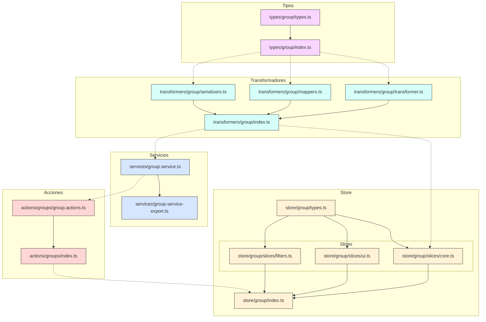
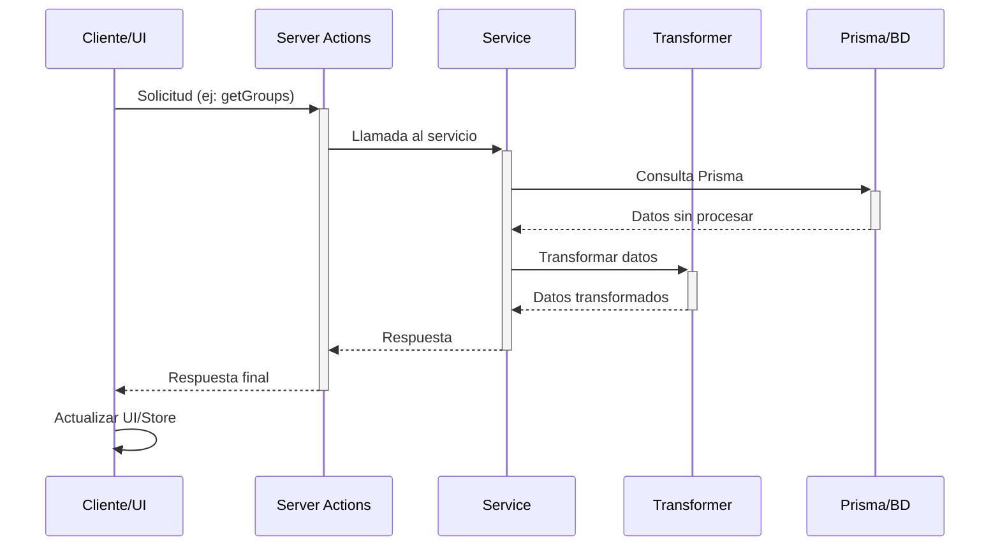
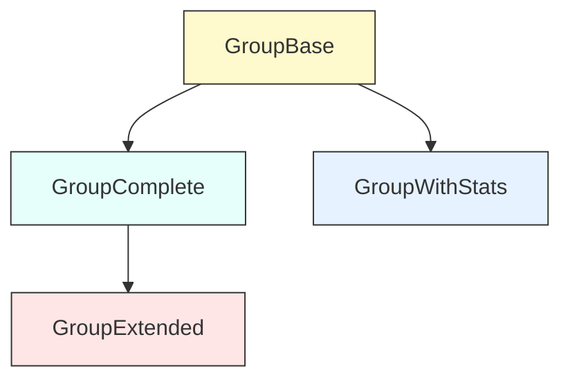

# Estructura de la Entidad Group

Este documento detalla la arquitectura y estructura de la entidad Group en el sistema.

## Organización de carpetas

```
src/
├── types/
│   └── entities/
│       └── group/
│           ├── index.ts           # Exportaciones de tipos
│           └── types.ts           # Definición de tipos
│
├── transformers/
│   └── group/
│       ├── index.ts               # Exportación principal
│       ├── transformer.ts         # Transformadores principales
│       ├── mappers.ts             # Mapeo de datos
│       └── serializers.ts         # Serialización
│
├── store/
│   └── entities/
│       └── group/
│           ├── index.ts           # Exportación del store
│           ├── types.ts           # Tipos del store
│           └── slices/
│               ├── core.ts        # Slice de operaciones CRUD
│               ├── ui.ts          # Slice de interfaz de usuario
│               └── filters.ts     # Slice de filtros y ordenación
│
├── services/
│   ├── group.service.ts           # Servicio principal
│   └── group-service-export.ts    # Exportación del servicio
│
└── app/
    └── actions/
        └── groups/
            ├── index.ts           # Exportación de acciones
            └── group.actions.ts   # Acciones del servidor
```

## Diagrama de componentes



## Flujo de operaciones



## Modelo de datos (Prisma)

```prisma
model Group {
  id          String   @id @default(cuid())
  name        String
  emoji       String   @default("👥")
  color       String   @default("#8B5CF6")
  description String?
  shortcut    String?
  category    String?
  sortBy      String   @default("name:asc")
  filters     String   @default("{}")
  isFavorite  Boolean  @default(false)
  featuredImage String?
  createdAt   DateTime @default(now())
  updatedAt   DateTime @updatedAt

  // Relaciones
  images      Image[]
  videos      Video[]
  albums      Album[]
  collections Collection[]
  tags        Tag[]
  characters  Character[]
  places      Place[]
  worldItems  WorldItem[]
  concepts    Concept[]
  prompts     Prompt[]
  notes       Note[]
  wildcards   Wildcard[]
  properties  Property[]
}
```

## Jerarquía de tipos



## Tipado de transformadores

```typescript
// Transformador principal
export function transformGroup(group: any): GroupComplete

// Transforma múltiples grupos
export function transformGroups(groups: any[]): GroupComplete[]

// Versión extendida para UI
export function transformGroupToExtended(
  group: Group | GroupComplete,
  options?: {
    isSelected?: boolean;
    isHighlighted?: boolean;
    isEditing?: boolean;
    isExpanded?: boolean;
    isLoading?: boolean;
    hasError?: boolean;
    isDragging?: boolean;
    isDropTarget?: boolean;
  }
): GroupExtended

// Versión con estadísticas
export function transformGroupToWithStats(
  group: Group | GroupComplete
): GroupWithStats
```

## Implementación del Store

```typescript
// Creación del store
export const useGroupStore = create<GroupStore>()(
  devtools(
    persist(
      (set, get, ...rest) => ({
        ...initialState,
        ...createGroupCoreSlice(set, get, ...rest),
        ...createGroupUISlice(set, get, ...rest),
        ...createGroupFiltersSlice(set, get, ...rest),
      }),
      {
        name: 'group-store',
        partialize: (state) => ({
          ui: {
            viewMode: state.ui.viewMode,
            expandedIds: state.ui.expandedIds,
          },
          filters: {
            sortBy: state.filters.sortBy,
          },
        }),
      }
    ),
    { name: 'GroupStore' }
  )
)
```

## Funciones clave del servicio

```typescript
// Búsqueda avanzada
export const searchGroupsService = async (
  filters: Record<string, any> = {},
  options: {
    page?: number;
    pageSize?: number;
    sortBy?: string;
    sortOrder?: 'asc' | 'desc';
    includeInactive?: boolean;
  } = {}
): Promise<GroupSearchResult>

// Obtener estadísticas
export const getGroupStatsService = async (
  id: string
): Promise<GroupWithStats>

// Añadir item al grupo
export const addItemToGroupService = async (
  groupId: string,
  itemId: string,
  itemType: keyof GroupRelations
): Promise<void>
```