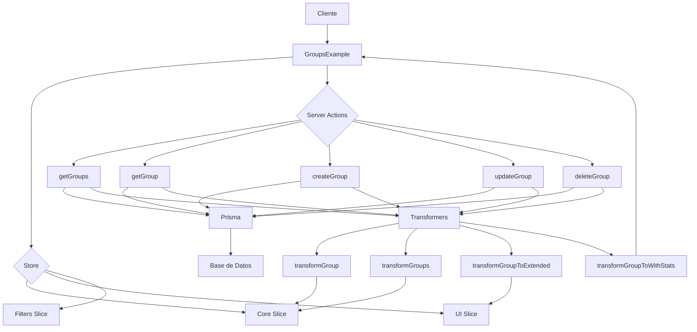

# Documentación del Componente Group

## Descripción General

El componente Group es una entidad central en el sistema de organización de contenido. Permite agrupar diferentes tipos de elementos (imágenes, videos, álbumes, colecciones, etc.) bajo una estructura común.

## Estructura de Archivos

```
src/
├── types/entities/group/     # Tipos y definiciones
│   ├── index.ts              # Exportaciones principales
│   ├── types.ts              # Definiciones básicas de tipos
│   └── schema.ts             # Esquemas de validación
├── transformers/group/       # Transformadores
│   ├── index.ts              # Exportaciones de transformers
│   ├── transformer.ts        # Transformador principal
│   ├── mappers.ts            # Mapeo entre formatos
│   └── serializers.ts        # Serialización para Prisma
├── store/entities/group/     # Gestión de estado
│   ├── index.ts              # Store principal
│   ├── types.ts              # Tipos del store
│   └── slices/               # Slices de Zustand
│       ├── core.ts           # Operaciones CRUD
│       ├── ui.ts             # Estado de UI
│       └── filters.ts        # Filtrado y ordenación
├── services/                 # Servicios
│   ├── group.service.ts      # Servicio principal
│   └── group-service-export.ts # Exportaciones del servicio
└── app/actions/groups/       # Acciones del servidor
    ├── index.ts              # Exportaciones de acciones
    └── group.actions.ts      # Implementación de acciones
```

## Diagrama de Flujo



## Tipos Principales

### GroupBase

Representa las propiedades básicas de un grupo.

```typescript
interface GroupBase extends BaseEntity {
  id: string;
  name: string;
  emoji: string;
  color: string;
  description?: string | null;
  shortcut?: string | null;
  category?: string | null;
  sortBy: string;
  filters: string;
  featuredImage?: string | null;
  isFavorite: boolean;
  createdAt: Date;
  updatedAt: Date;
}
```

### GroupRelations

Define las relaciones entre un grupo y otras entidades del sistema.

```typescript
interface GroupRelations {
  images?: { id: string }[];
  videos?: { id: string }[];
  albums?: { id: string }[];
  collections?: { id: string }[];
  tags?: { id: string }[];
  characters?: { id: string }[];
  places?: { id: string }[];
  worldItems?: { id: string }[];
  concepts?: { id: string }[];
  prompts?: { id: string }[];
  notes?: { id: string }[];
  wildcards?: { id: string }[];
  properties?: { id: string }[];
}
```

### GroupComplete

Combina las propiedades base y las relaciones en un objeto completo.

```typescript
interface GroupComplete extends GroupBase, GroupRelations {
  _count?: Partial<GroupCount>;
}
```

### GroupWithStats

Extiende el grupo completo con estadísticas adicionales.

```typescript
interface GroupWithStats extends GroupComplete {
  stats: {
    totalItems: number;
    totalImages: number;
    totalVideos: number;
    totalAlbums: number;
    totalCollections: number;
    totalTags: number;
    totalCharacters: number;
    totalPlaces: number;
    totalWorldItems: number;
    totalConcepts: number;
    totalPrompts: number;
    totalNotes: number;
    totalWildcards: number;
    totalProperties: number;
    lastUpdated: Date;
  };
}
```

## Transformadores

### transformGroup

Función principal para transformar objetos Group desde cualquier formato a GroupComplete.

```typescript
function transformGroup(group: any): GroupComplete
```

### transformGroups

Transforma un array de grupos.

```typescript
function transformGroups(groups: any[]): GroupComplete[]
```

### transformGroupToExtended

Transforma un grupo a su versión extendida con propiedades de UI.

```typescript
function transformGroupToExtended(
  group: Group | GroupComplete,
  options: UIOptions = {}
): GroupExtended
```

### transformGroupToWithStats

Transforma un grupo a su versión con estadísticas.

```typescript
function transformGroupToWithStats(
  group: Group | GroupComplete
): GroupWithStats
```

## Store

El store de grupos utiliza Zustand con el patrón de slices para separar preocupaciones:

### Core Slice

Maneja las operaciones CRUD básicas:

- `getGroup(id)`: Obtiene un grupo por ID
- `getGroups()`: Obtiene todos los grupos
- `addGroup(group)`: Añade un grupo
- `updateGroup(id, data)`: Actualiza un grupo
- `deleteGroup(id)`: Elimina un grupo

### UI Slice

Gestiona el estado de la interfaz de usuario:

- `selectGroup(id)`: Selecciona un grupo
- `deselectGroup(id)`: Deselecciona un grupo
- `setHighlightedId(id)`: Destaca un grupo
- `setViewMode(mode)`: Cambia el modo de visualización

### Filters Slice

Maneja el filtrado y ordenación:

- `setSortBy(criteria)`: Establece criterio de ordenación
- `setSearchQuery(query)`: Establece término de búsqueda
- `setFilterByType(type)`: Filtra por tipo
- `getFilteredGroups()`: Obtiene grupos filtrados

## Server Actions

Las acciones del servidor para grupos incluyen:

- `getGroups()`: Obtiene todos los grupos
- `getGroup(id)`: Obtiene un grupo específico
- `createGroup(data)`: Crea un nuevo grupo
- `updateGroup(id, data)`: Actualiza un grupo existente
- `deleteGroup(id)`: Elimina un grupo
- `toggleGroupFavorite(id)`: Cambia el estado de favorito

## Ejemplos de Uso

### Crear un nuevo grupo

```typescript
import { createGroup } from '@/app/actions/groups/group.actions';

await createGroup({
  name: 'Mi Grupo',
  emoji: '🚀',
  color: '#FF5733',
  description: 'Descripción del grupo',
  isFavorite: false
});
```

### Añadir imágenes a un grupo

```typescript
import { groupService } from '@/services/group-service-export';

await groupService.addItem(groupId, imageId, 'image');
```

### Obtener grupos filtrados

```typescript
import { useGroupStore } from '@/store/entities/group';

const GroupList = () => {
  const { getFilteredGroups, setSearchQuery, setSortBy } = useGroupStore();

  // Establecer filtros
  setSearchQuery('paisajes');
  setSortBy('date_created:desc');

  // Obtener grupos filtrados
  const filteredGroups = getFilteredGroups();

  return (
    <div>
      {filteredGroups.map(group => (
        <div key={group.id}>{group.name}</div>
      ))}
    </div>
  );
};
```

## Comportamientos Especiales

### Favoritos

Los grupos pueden marcarse como favoritos para facilitar su acceso:

```typescript
import { toggleGroupFavorite } from '@/app/actions/groups/group.actions';

await toggleGroupFavorite(groupId);
```

### Estadísticas

Las estadísticas de un grupo proporcionan información sobre los elementos contenidos:

```typescript
import { transformGroupToWithStats } from '@/transformers/group';

const groupWithStats = transformGroupToWithStats(group);
console.log(`Total de elementos: ${groupWithStats.stats.totalItems}`);
```

## Mejores Prácticas

1. **Transformación Consistente**: Siempre usar los transformadores para asegurar datos consistentes.
2. **Manejo de Errores**: Implementar try/catch en operaciones asíncronas.
3. **Validación**: Validar los datos antes de enviarlos al servidor.
4. **Revalidación**: Utilizar `revalidatePath` después de mutaciones para actualizar la caché.
5. **Organización**: Mantener la estructura de slices para separar preocupaciones en el store.

## Desafíos Conocidos

- La sincronización entre el store local y el servidor puede requerir atención adicional.
- Las operaciones de reordenamiento de grandes conjuntos de datos pueden ser costosas.
- Los filtros complejos pueden afectar al rendimiento en colecciones grandes.

---

Esta documentación proporciona una visión general del componente Group y su implementación. Consulta el código fuente para detalles específicos de implementación.