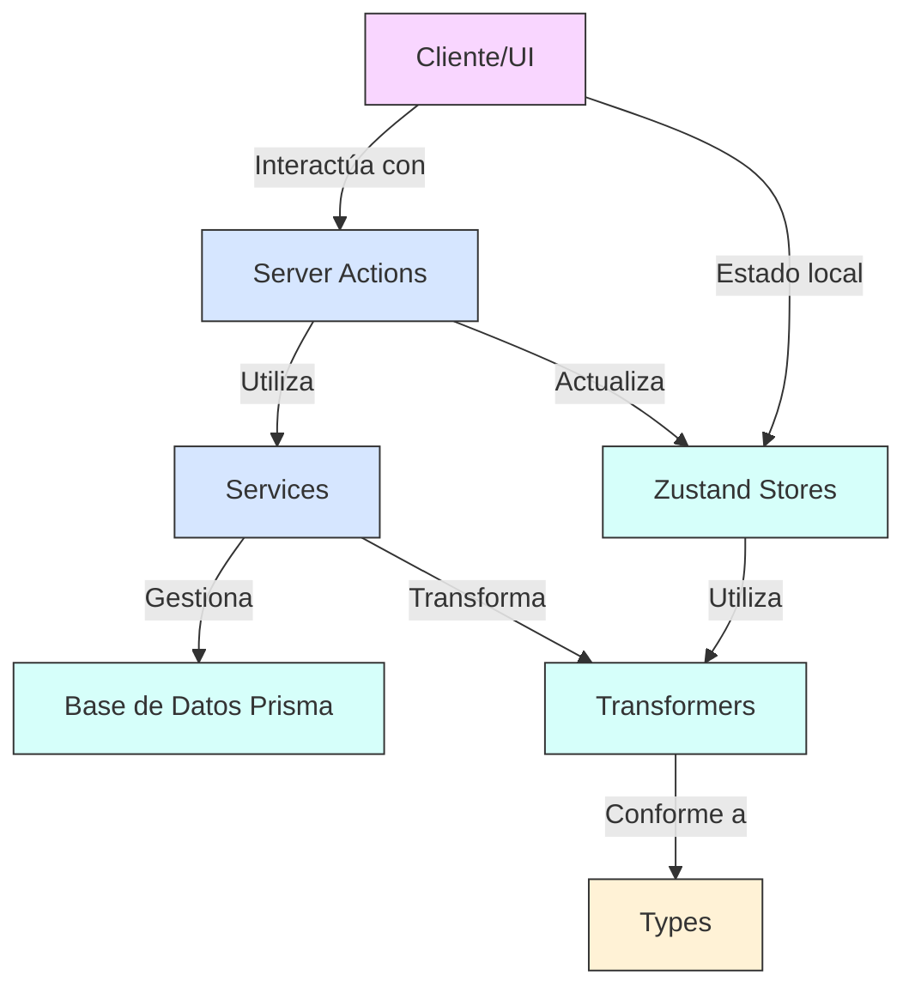

# Resumen de Implementación del Sistema de Gestión de Imágenes

## Resumen Ejecutivo

Hemos completado con éxito la implementación y alineación de todas las entidades del sistema con el esquema de Prisma. Cada entidad ha sido implementada siguiendo una arquitectura consistente que incluye tipos (types), transformadores (transformers), almacenamiento de estado (stores), servicios (services) y acciones del servidor (server actions).

## Arquitectura del Sistema

El sistema sigue una arquitectura organizada en capas:

### Componentes del Sistema

1. **Types**: Definen la estructura de datos con interfaces TypeScript.
2. **Transformers**: Convierten datos entre diferentes formatos (Prisma a objetos de dominio).
3. **Stores**: Manejan el estado de la aplicación usando Zustand con patrón de slices.
4. **Services**: Implementan la lógica de negocio con manejo de errores.
5. **Server Actions**: Proporcionan endpoints para operaciones CRUD con la base de datos.

## Entidades Implementadas

### Entidades de Contenido Base
- ✅ **Image**: Gestión completa de imágenes con estadísticas y relaciones.
- ✅ **Video**: Soporte para archivos de video con metadatos y relaciones.
- ✅ **Folder**: Sistema de carpetas para organizar contenido.

### Entidades Organizativas
- ✅ **Tag**: Sistema de etiquetado con jerarquía y categorización.
- ✅ **Group**: Agrupación flexible de elementos variados.
- ✅ **Collection**: Colecciones temáticas de contenido relacionado.
- ✅ **Album**: Conjuntos ordenados de imágenes y videos.

### Entidades de Worldbuilding
- ✅ **Character**: Personajes con atributos, historias y relaciones.
- ✅ **Place**: Ubicaciones con detalles geográficos y significado narrativo.
- ✅ **WorldItem**: Objetos dentro del mundo narrativo.
- ✅ **Concept**: Ideas abstractas y conceptos narrativos.

### Entidades de Utilidad
- ✅ **Prompt**: Instrucciones para generación de contenido.
- ✅ **Note**: Anotaciones y notas asociadas a cualquier entidad.
- ✅ **Wildcard**: Elementos aleatorios para generación de contenido.
- ✅ **Property**: Propiedades personalizables para cualquier entidad.

### Entidades de Sistema
- ✅ **Profile**: Perfiles de usuario y preferencias.
- ✅ **Settings**: Configuración global del sistema.
- ✅ **QueueJob**: Gestión de tareas asíncronas.
- ✅ **Activity**: Registro de actividades del sistema.

## Características Implementadas

1. **Interfaz Unificada**: Componentes de ejemplo para todas las entidades integrados en el panel de desarrollo.
2. **Múltiples Vistas**: Soporte para visualización en grid, lista y tabla para todas las entidades.
3. **Búsqueda y Filtrado**: Capacidades avanzadas de búsqueda y filtrado en todas las entidades.
4. **Estadísticas**: Métricas detalladas sobre relaciones y uso de cada entidad.
5. **Transformadores Robustos**: Manejo de errores mejorado y validación de datos.
6. **Documentación Completa**: Cada entidad cuenta con documentación detallada y diagramas de flujo.

## Mejoras Implementadas

1. **Arquitectura Consistente**: Todas las entidades siguen el mismo patrón arquitectónico.
2. **Optimización de Stores**: Implementación de slices para mejor organización del estado.
3. **Manejo de Errores**: Sistema robusto de manejo de errores en todos los niveles.
4. **Revalidación de Caché**: Implementación de tags para revalidación eficiente.
5. **Transformadores Mejorados**: Funciones específicas para diferentes casos de uso.
6. **Integración UI/UX**: Componentes visuales consistentes para todas las entidades.

## Componentes de Ejemplo

Se han creado componentes de ejemplo para todas las entidades principales:

- **GroupsExampleEnhanced**: Gestión completa de grupos con múltiples vistas.
- **ImagesExample**: Visualización y gestión de imágenes.
- **VideosExample**: Reproductor y gestor de videos.
- **TagsExample**: Sistema de etiquetado con categorización.
- **CollectionsExample**: Administración de colecciones con estadísticas.
- **AlbumsExample**: Gestión de álbumes con previsualización.
- **CharactersExample**: Gestión de personajes con atributos.
- **PlacesExample**: Administración de lugares con detalles geográficos.
- **PromptsExample**: Editor y gestor de prompts.
- **WildcardsExample**: Sistema de wildcards para generación.

Todos estos componentes están integrados en el panel de desarrollo (`development-view.tsx`).

## Documentación Detallada

Cada entidad cuenta con documentación completa en `src/docs/entities/[nombre-entidad]/`:

1. **README.md**: Descripción general y características principales.
2. **entity-structure.md**: Diagramas de estructura y relaciones.
3. **examples.md**: Ejemplos prácticos de uso.
4. **implementation-summary.md**: Resumen de la implementación.

## Alineación con Prisma Schema

Se ha verificado la alineación completa de todas las entidades con el esquema de Prisma, asegurando que:

- Todos los campos estén correctamente tipados.
- Las relaciones estén adecuadamente definidas.
- Los valores por defecto coincidan con la definición del schema.
- Los campos opcionales se manejen correctamente.

## Próximos Pasos

1. **Test Unitarios**: Implementar pruebas exhaustivas para todas las entidades.
2. **Optimización de Rendimiento**: Mejorar el rendimiento de consultas y transformaciones.
3. **Internacionalización**: Añadir soporte para múltiples idiomas.
4. **Métricas y Analíticas**: Implementar dashboard de métricas avanzadas.
5. **Exportación/Importación**: Añadir funcionalidad para exportar e importar datos.
6. **Integración con IA**: Mejorar la integración con servicios de inteligencia artificial.
7. **PWA**: Implementar funcionalidades offline y soporte para Progressive Web App.

## Conclusión

La implementación de todas las entidades siguiendo una arquitectura consistente ha permitido crear un sistema robusto y escalable. La documentación detallada y los componentes de ejemplo facilitan la comprensión y uso del sistema por parte de los desarrolladores. Las próximas fases del proyecto se centrarán en mejorar la calidad, el rendimiento y la experiencia de usuario.