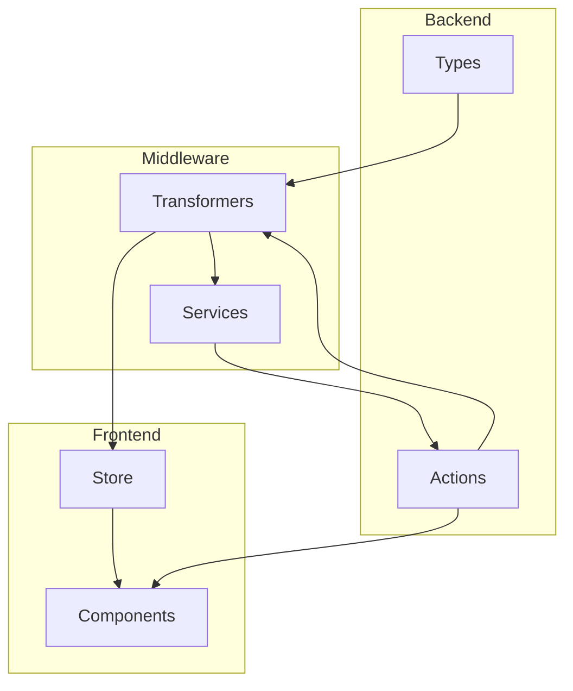

# Documentación del Componente Tag

## Descripción General

El componente Tag representa una entidad para etiquetar y organizar contenido dentro de la aplicación. Las etiquetas permiten categorizar y buscar rápidamente imágenes, videos, álbumes y otros elementos.

## Estructura del Componente



## Tipos de Datos

La entidad Tag tiene una estructura jerárquica de tipos:

- `TagBase`: Tipos base derivados directamente del modelo Prisma
- `TagComplete`: Versión completa con todas las relaciones y campos deserializados
- `TagExtended`: Versión extendida con propiedades UI para la interacción
- `TagWithStats`: Versión con estadísticas adicionales

### Jerarquía de Tipos

```
TagBase (Prisma) → TagComplete → TagExtended → TagWithRelationsExtended
```

## Transformadores

Los transformadores convierten datos entre diferentes formatos:

- `transformTag`: Transformador principal que convierte cualquier objeto Tag a TagComplete
- `transformTagToExtended`: Transforma a versión con propiedades UI
- `transformTagToWithStats`: Transforma a versión con estadísticas
- `transformTags`: Transforma arrays de tags de manera segura

### Funciones Auxiliares

- `mapTagToComplete`: Convierte datos a formato completo
- `mapCompleteToTag`: Extrae campos básicos
- `tagToDisplayObject`: Formatea tags para mostrar en UI

## Store (Zustand)

El store de Tag utiliza el patrón de slices para separar preocupaciones:

### Slices

1. **Core**: Gestión de datos y operaciones CRUD
   - `loadTags()`: Carga etiquetas desde servidor
   - `refreshTags()`: Recarga forzando una nueva petición
   - `createTag()`: Crea nueva etiqueta
   - `updateTag()`: Actualiza etiqueta existente
   - `deleteTag()`: Elimina etiqueta

2. **UI**: Estado de la interfaz de usuario
   - `selectTag()`: Selecciona etiqueta
   - `clearSelection()`: Limpia selección
   - `startEditing()`: Inicia edición
   - `openCreateModal()`: Abre modal de crear

3. **Filters**: Filtrado y ordenación
   - `updateFilters()`: Actualiza criterios
   - `clearFilters()`: Limpia filtros
   - `getFilteredTags()`: Obtiene etiquetas filtradas
   - `getSortedTags()`: Obtiene etiquetas ordenadas

### Selectores Optimizados

- `useFilteredTags()`: Tags filtrados por término/categoría
- `useFilteredAndSortedTags()`: Tags filtrados y ordenados
- `useTagsGroupedByCategory()`: Tags agrupados por categoría
- `useTagCategories()`: Categorías disponibles
- `useFavoriteTags()`: Tags favoritos
- `useTagsStats()`: Estadísticas generales

## Servicio

El servicio de Tag proporciona funciones para interactuar con las etiquetas:

- `getTags()`: Obtiene todas las etiquetas
- `createTag()`: Crea nueva etiqueta
- `updateTag()`: Actualiza etiqueta existente
- `deleteTag()`: Elimina etiqueta

### Sistema de Eventos

El servicio emite eventos que pueden ser escuchados:

- `TAG_EVENTS.CREATED`: Cuando se crea una etiqueta
- `TAG_EVENTS.UPDATED`: Cuando se actualiza
- `TAG_EVENTS.DELETED`: Cuando se elimina
- `TAG_EVENTS.ERROR`: Cuando ocurre un error
- `TAG_EVENTS.STATS`: Información estadística

## Acciones del Servidor

Las acciones del servidor están organizadas en tres categorías:

1. **CRUD** (crud.actions.ts)
   - `createTag`: Crea etiqueta
   - `updateTag`: Actualiza etiqueta
   - `deleteTag`: Elimina etiqueta

2. **Consultas** (query.actions.ts)
   - `getTags`: Obtiene todas las etiquetas
   - `getTagById`: Obtiene etiqueta por ID
   - `searchTags`: Busca etiquetas por criterios

3. **Relaciones** (relation.actions.ts)
   - `addTagToImage`: Asocia etiqueta a imagen
   - `removeTagFromImage`: Desasocia etiqueta de imagen
   - `getTagsForEntity`: Obtiene etiquetas para una entidad

## Componentes UI

### TagsExample

Componente de ejemplo que demuestra:
- Listado y visualización de tags
- Creación de nuevos tags
- Eliminación de tags
- Actualización de favoritos
- Diferentes vistas (lista, cuadrícula)

## Flujo de Datos

1. El usuario interactúa con el componente UI
2. El componente dispara acciones del store
3. El store actualiza su estado o llama al servicio
4. El servicio utiliza transformadores para procesar datos
5. El servicio llama a acciones del servidor
6. Las acciones actualizan la base de datos y revalidan cache
7. Los cambios se propagan de vuelta a través de eventos

## Ejemplos de Uso

### Cargar y Mostrar Tags

```tsx
'use client';

import { useTagStore } from '@/store/entities/tag';
import { useEffect } from 'react';

export function TagList() {
  const { items: tags, loadTags } = useTagStore();

  useEffect(() => {
    loadTags();
  }, [loadTags]);

  return (
    <div>
      {tags.map(tag => (
        <div key={tag.id}>
          <span>{tag.emoji}</span> {tag.name}
        </div>
      ))}
    </div>
  );
}
```

### Crear un Nuevo Tag

```tsx
'use client';

import { Button } from '@/components/ui/button';
import { Input } from '@/components/ui/input';
import { createTag } from '@/transformers/tag';
import { useState } from 'react';

export function CreateTagForm() {
  const [name, setName] = useState('');
  const [emoji, setEmoji] = useState('🏷️');

  const handleSubmit = async (e) => {
    e.preventDefault();
    try {
      await createTag({ name, emoji });
      setName('');
      setEmoji('🏷️');
      alert('Etiqueta creada correctamente');
    } catch (error) {
      console.error(error);
      alert('Error al crear la etiqueta');
    }
  };

  return (
    <form onSubmit={handleSubmit}>
      <Input
        value={name}
        onChange={(e) => setName(e.target.value)}
        placeholder="Nombre de la etiqueta"
      />
      <Input
        value={emoji}
        onChange={(e) => setEmoji(e.target.value)}
        placeholder="Emoji"
      />
      <Button type="submit">Crear</Button>
    </form>
  );
}
```

## Buenas Prácticas

1. **Uso del Store**
   - Usar selectores optimizados para mejor rendimiento
   - Preferir selectores a acceso directo al estado
   - Memoizar valores derivados en componentes

2. **Manejo de Errores**
   - Capturar y manejar errores de manera consistente
   - Utilizar toast o notificaciones para informar al usuario
   - Registrar errores para depuración

3. **Transformadores**
   - Siempre usar transformadores para datos de la API
   - Manejar casos donde los datos puedan ser parciales
   - Validar datos de entrada antes de operaciones

4. **Optimización de Rendimiento**
   - Evitar recálculos innecesarios con useMemo
   - Usar paginación para conjuntos grandes de datos
   - Implementar estrategias de caché para datos estáticos