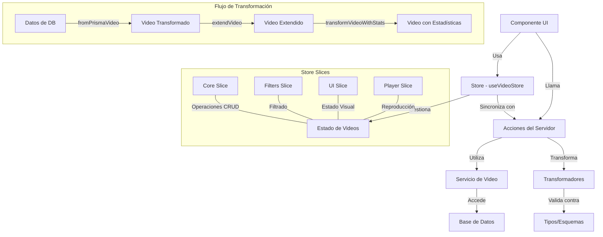

# Documentación del Componente Video

## Descripción General

El componente Video proporciona una implementación completa para gestionar archivos de video en la aplicación, incluyendo:

- Tipos de datos robustos con interfaces para diferentes niveles de complejidad
- Transformadores para convertir datos entre diferentes formatos
- Store con Zustand utilizando el patrón de slices para separar funcionalidades
- Acciones del servidor para operaciones CRUD
- Componente de ejemplo para probar la funcionalidad

## Estructura de Archivos

```
src/
├── types/
│   └── entities/
│       └── video/
│           ├── enums.ts         # Enumeraciones para videos
│           ├── index.ts         # Exportaciones
│           ├── schema.ts        # Esquema Zod para validación
│           └── types.ts         # Interfaces y tipos
│
├── transformers/
│   └── video/
│       ├── index.ts            # Punto de entrada de transformadores
│       ├── mappers.ts          # Funciones para mapeo de datos
│       └── serializers.ts      # Funciones para serialización
│
├── store/
│   └── entities/
│       └── video/
│           ├── index.ts         # Store principal
│           ├── types.ts         # Tipos para el store
│           └── slices/
│               ├── core.ts      # Slice para CRUD
│               ├── filters.ts   # Slice para filtros
│               ├── player.ts    # Slice para reproducción
│               └── ui.ts        # Slice para UI
│
├── app/
│   └── actions/
│       └── videos/
│           ├── index.ts         # Exportaciones
│           ├── stats.actions.ts # Acciones para estadísticas
│           └── video.actions.ts # Acciones CRUD
│
└── components/
    └── examples/
        └── videos-example.tsx  # Componente de ejemplo
```

## Flujo de Datos



## Tipos Principales

- **VideoBase**: Propiedades básicas del video (id, name, path, etc.)
- **VideoRelations**: Relaciones con otras entidades (folder, tags, etc.)
- **VideoCounts**: Conteos de relaciones
- **VideoUI**: Propiedades específicas de UI
- **VideoComplete**: Combinación de todos los tipos anteriores
- **VideoStats**: Estadísticas calculadas (duración formateada, aspectRatio, etc.)

## Transformadores

Los transformadores convierten datos entre diferentes formatos:

1. **fromPrismaVideo**: Convierte un video de Prisma a formato interno
2. **extendVideo**: Añade propiedades adicionales a un video base
3. **transformVideoWithStats**: Añade estadísticas calculadas
4. **transformVideos**: Transforma múltiples videos

## Store (Zustand)

El store utiliza el patrón de slices para separar responsabilidades:

1. **Core Slice**: Operaciones CRUD básicas y selectores
2. **UI Slice**: Estado visual (selección, modo vista, etc.)
3. **Filters Slice**: Filtros y ordenación
4. **Player Slice**: Estado del reproductor

## Selectores Principales

- **selectVideos**: Selecciona videos con filtros y ordenación
- **selectVideosByFolder**: Selecciona videos por carpeta
- **selectVideoById**: Selecciona un video específico con estadísticas

## Acciones del Servidor

- **findVideos**: Búsqueda paginada con filtros
- **getVideo**: Obtener un video específico
- **createVideo**: Crear un nuevo video
- **updateVideo**: Actualizar un video existente
- **deleteVideo**: Eliminar un video
- **toggleVideoFavorite**: Marcar/desmarcar como favorito
- **setVideoVisibility**: Cambiar visibilidad pública
- **moveVideoToFolder**: Mover a otra carpeta
- **getVideoStats**: Obtener estadísticas

## Ejemplo de Uso

```tsx
// Obtener selectores del store
const selectVideos = useVideoStore(state => state.selectVideos);

// Seleccionar videos con filtros
const filteredVideos = selectVideos({
  withStats: true,
  filters: {
    search: "ejemplo",
    isFavorite: true,
    duration: { min: 60, max: 300 }
  },
  sortBy: "updatedAt",
  sortDirection: "desc"
});

// Llamar acciones del servidor
const handleToggleFavorite = async (videoId, isFavorite) => {
  const result = await toggleVideoFavorite(videoId, !isFavorite);
  if (result) {
    // Actualizar store
    updateVideo(videoId, { isFavorite: !isFavorite });
  }
};
```

## Componente de Ejemplo

El componente `VideosExample` muestra:

1. Filtrado de videos
2. Ordenación
3. Visualización en tarjetas con miniaturas
4. Vista detallada de un video seleccionado
5. Acciones como marcar/desmarcar favoritos

## Mejoras Implementadas

1. **Transformadores Robustos**:
   - Manejo de errores mejorado
   - Soporte para transformar arrays
   - Opciones de personalización

2. **Selectores Optimizados**:
   - Filtrado y ordenación en el cliente
   - Integración con estadísticas
   - Soporte para relaciones

3. **Mejor Integración con Folder**:
   - Filtros específicos para carpetas
   - Mejoras en la navegación

4. **Estadísticas Avanzadas**:
   - Cálculo de relación de aspecto
   - Formateo de duración y tamaño
   - Detección de resolución