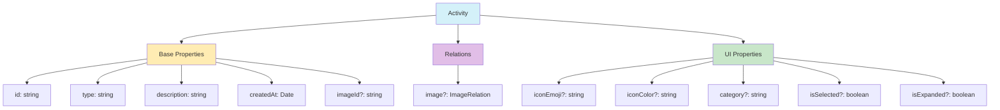

# Entidad Activity

## Descripción

La entidad `Activity` representa eventos o acciones realizadas en el sistema. Permite registrar un historial de acciones como subir imágenes, crear carpetas, actualizar contenido y otras operaciones relevantes.

## Estructura de la entidad



## Tipos principales

### Activity

```typescript
export interface Activity {
  id: string;
  type: string;
  description: string;
  imageId?: string | null;
  createdAt: Date | string;

  // Relaciones
  image?: {
    id: string;
    name: string;
    path: string;
    thumbnail?: string | null;
  } | null;

  // Propiedades UI
  iconEmoji?: string;
  iconColor?: string;
  category?: string;
  isSelected?: boolean;
  isExpanded?: boolean;
}
```

### ActivityType (Enum)

Los tipos de actividad están organizados por categorías:

```typescript
export enum ActivityType {
  // Actividades de imágenes
  IMAGE_UPLOAD = 'image_upload',
  IMAGE_UPDATE = 'image_update',
  IMAGE_DELETE = 'image_delete',
  // ... más tipos

  // Actividades de sistema
  SYSTEM_ERROR = 'system_error',
  SYSTEM_WARNING = 'system_warning',
  SYSTEM_INFO = 'system_info',
  // ... más tipos
}
```

## Flujo de datos

El flujo de datos para actividades sigue este patrón:

1. Se genera una actividad desde una acción del usuario o sistema
2. Se valida con el esquema apropiado
3. Se transforma a formato de Prisma y se guarda en la base de datos
4. Al recuperar, se transforma de nuevo al formato de la aplicación
5. Se puede mostrar en la interfaz o procesar en background

## Servicios disponibles

```typescript
interface ActivityService {
  create(data: CreateActivityData): Promise<Activity>;
  findById(id: string): Promise<Activity | null>;
  list(filters?: ActivityFilters): Promise<ActivityListResponse>;
  delete(id: string): Promise<boolean>;
  clearAll(filters?: ActivityFilters): Promise<number>;
}
```

## Ejemplos de uso

### Crear una actividad

```typescript
// 1. Importar dependencias
import { getActivityService } from '../services/activity.service';
import { ActivityType } from '../types/entities/activity';

// 2. Obtener servicio
const activityService = getActivityService();

// 3. Crear actividad
await activityService.create({
  type: ActivityType.IMAGE_UPLOAD,
  description: 'Imagen "vacaciones.jpg" subida',
  imageId: 'img_123456'
});
```

### Listar actividades

```typescript
// Listar actividades con filtros
const result = await activityService.list({
  types: [ActivityType.IMAGE_UPLOAD, ActivityType.IMAGE_DELETE],
  startDate: new Date('2023-01-01'),
  limit: 20,
  offset: 0
});

// Resultado
console.log(`Total: ${result.totalCount}`);
console.log(`Tiene más: ${result.hasMore}`);
result.activities.forEach(activity => {
  console.log(`${activity.createdAt}: ${activity.description}`);
});
```

## Validación

La entidad incluye validadores mediante Zod:

```typescript
import { validateCreateActivityData } from '../transformers/activity';

const result = validateCreateActivityData({
  type: 'image_upload',
  description: 'Nueva imagen'
});

if (result.success) {
  // Continuar con datos validados
} else {
  console.error(`Error: ${result.error}`);
}
```

## Serializadores

Permiten transformar para API o almacenamiento:

```typescript
import { serializeActivity } from '../transformers/activity';

const serialized = serializeActivity(activity);
// Enviar a API o almacenar
```

## Integración con otras entidades

La entidad Activity se relaciona principalmente con:

- **Image**: Para registrar acciones sobre imágenes
- **Folder**: Para acciones sobre carpetas
- **Album/Collection**: Para acciones sobre agrupaciones

## Consideraciones técnicas

- Las actividades son inmutables una vez creadas
- Se recomienda usar los tipos enumerados para garantizar consistencia
- Los filtros permiten búsquedas eficientes por tipo, rango de fechas o entidad relacionada