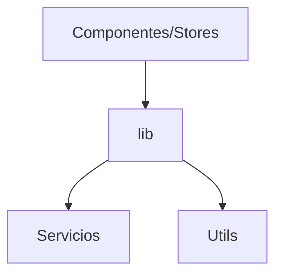

# Biblioteca de utilidades (`src/lib`)

Contiene funciones y clases compartidas en todo el proyecto. Aquí se encuentran:

- Utilidades de caché como `folder-cache.ts` y `cache.ts`.
- Helpers de configuración (`config/*`).
- Manejadores de logs (`logger/*`).
- Validaciones y tipos auxiliares.



Ejemplo de uso:

```ts
import { folderResponseCache } from '@/lib/folder-cache';
folderResponseCache.set('folder:1', { id: '1' });
```
