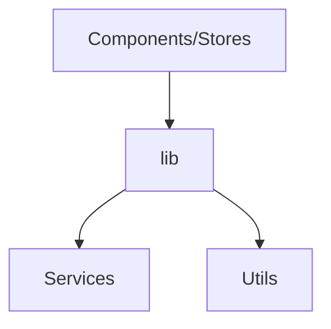

# Utility library (`src/lib`)

This directory holds functions and classes that the project shares.

The library includes the following modules:

- Cache utilities such as `folder-cache.ts` and `cache.ts`.
- Configuration helpers (`config/*`).
- Log handlers (`logger/*`).
- Validation helpers and supporting types.



The following example writes a folder payload to the cache:

```ts
import { folderResponseCache } from '@/lib/folder-cache';
folderResponseCache.set('folder:1', { id: '1' });
```
