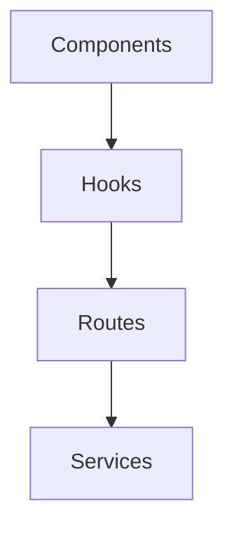

# Custom hooks

This directory collects React hooks that the application uses.

The hooks fall into the following groups:

- **entities/**: Entity-specific hooks for notes or concepts.
- **folder/**: Folder navigation and load logic.
- Utility hooks such as `useMobile`, `useSettings`, or `useProfileTheme`.

Most of these hooks consume HTTP routes or services.

The hooks use React Query for asynchronous data.



```tsx
import { useFolderImages } from '@/lib/hooks/files/use-folder-images';

const { data, isLoading } = useFolderImages('folderId');
```
