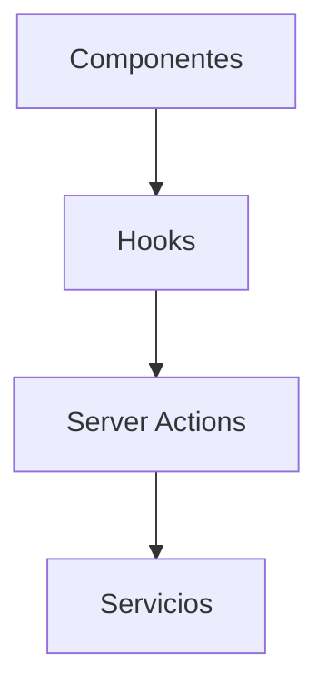

# Hooks personalizados

Este directorio reúne los hooks de React utilizados en toda la aplicación. Se dividen en:

- **entities/**: hooks específicos de entidades (por ejemplo, notas o conceptos).
- **folder/**: lógica relacionada con la navegación y carga de carpetas.
- Hooks utilitarios como `useMobile`, `useSettings` o `useProfileTheme`.

La mayoría de estos hooks consumen _Server Actions_ o servicios y aprovechan React Query para el manejo de datos asíncronos.



```tsx
import { useFolderImages } from '@/lib/hooks/files/use-folder-images';

const { data, isLoading } = useFolderImages('folderId');
```
